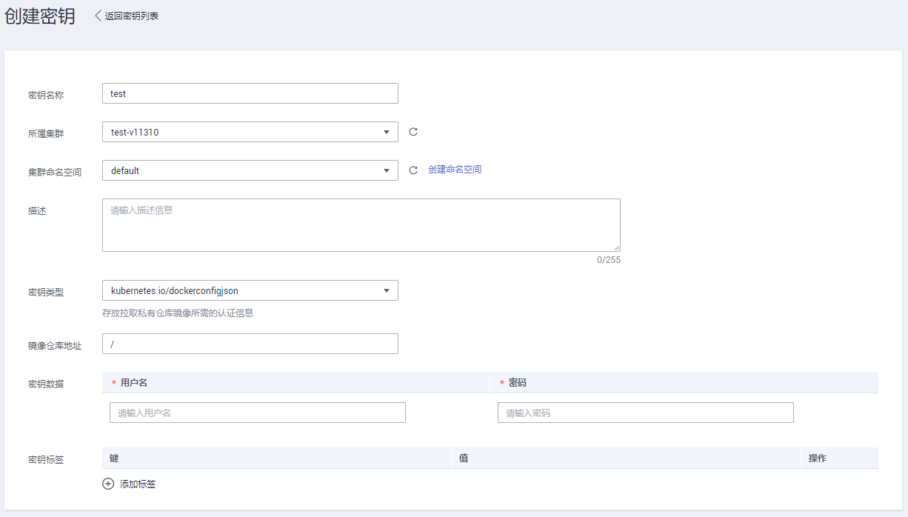
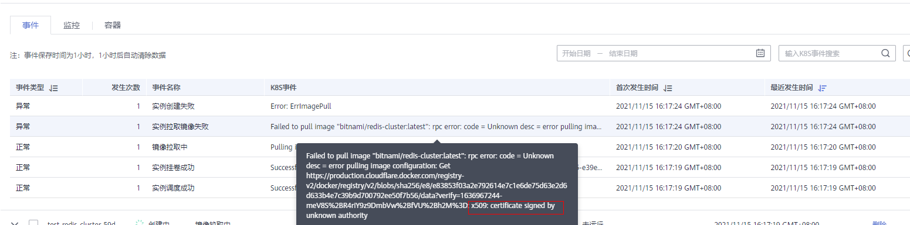

# 如何使用第三方镜像<a name="cce_01_0009"></a>

## 操作场景<a name="section96721544452"></a>

CCE支持拉取第三方镜像仓库的镜像来创建工作负载。

通常第三方镜像仓库必须经过认证（帐号密码）才能访问，而CCE中容器拉取镜像是使用密钥认证方式，这就要求在拉取镜像前先创建镜像仓库的密钥。

## 前提条件<a name="section14876601632"></a>

使用第三方镜像时，请确保工作负载运行的节点可访问公网。您可以通过[负载均衡\(LoadBalancer\)](负载均衡(LoadBalancer)-72.md)、[DNAT网关\(DNAT\)](DNAT网关(DNAT)-73.md)方式访问公网。

## 通过界面操作<a name="section0402183334411"></a>

1.  <a name="li16481144064414"></a>创建第三方镜像仓库的密钥。

    单击左侧导航栏的“配置中心  \>  密钥 Secret“，单击“添加密钥“，密钥类型必须选择为kubernetes.io/dockerconfigjson，如下图所示。详细操作请参见[创建密钥](创建密钥-146.md)。

    此处的“用户名“和“密码“请填写第三方镜像仓库的帐号密码。

    **图 1**  添加密钥<a name="fig83432413351"></a>  
    

2.  参照[创建无状态负载\(Deployment\)](创建无状态负载(Deployment)-40.md)或[创建有状态负载\(StatefulSet\)](创建有状态负载(StatefulSet)-41.md)，选择第三方镜像时，请执行如下操作。
    1.  密钥认证：是。
    2.  选择密钥：选择[1](#li16481144064414)中创建的密钥。
    3.  镜像地址：输入镜像地址。

3.  单击“创建“。

## 使用kubectl创建第三方镜像仓库的密钥<a name="section18217101117197"></a>

1.  请参见[通过kubectl连接集群](通过kubectl连接集群-7.md)，使用kubectl连接集群。
2.  通过kubectl创建认证密钥 ，该密钥类型为dockercfg类型。

    ```
    kubectl create secret docker-registry myregistrykey --docker-server=DOCKER_REGISTRY_SERVER --docker-username=DOCKER_USER --docker-password=DOCKER_PASSWORD --docker-email=DOCKER_EMAIL
    ```

    其中，myregistrykey为密钥名称，其余参数如下所示。

    -   DOCKER\_REGISTRY\_SERVER：第三方镜像仓库的地址，如“www.3rdregistry.com“或“10.10.10.10:443“。
    -   DOCKER\_USER：第三方镜像仓库的帐号。
    -   DOCKER\_PASSWORD：第三方镜像仓库的密码。
    -   DOCKER\_EMAIL：第三方镜像仓库的邮箱。

3.  创建工作负载时使用第三方镜像，具体步骤请参见如下。

    dockecfg类型的密钥作为私有镜像获取的认证方式，以Pod为例，创建的myregistrykey作为镜像的认证方式。

    ```
    apiVersion: v1
    kind: Pod
    metadata:
      name: foo
      namespace: default
    spec:
      containers:
        - name: foo
          image: www.3rdregistry.com/janedoe/awesomeapp:v1
      imagePullSecrets:
        - name: myregistrykey              #使用上面创建的密钥
    ```


## 常见问题：远程镜像仓库使用非知名或不安全的证书<a name="section341515341596"></a>

从第三方仓库下载镜像时，若第三方仓库使用了非知名或者不安全的证书，节点上会拉取镜像失败，Pod事件列表中有“实例拉取镜像失败”事件，报错原因为"x509: certificate signed by unknown authority"，如下图。



> **说明：** 
>当前EulerOS 2.9镜像中有进行安全增强，移除系统中部分非安全或过期知名证书配置，部分第三方镜像在其他类型节点上未报错，在EulerOS 2.9系统报此错误属正常现象，也可通过下述解决方案进行处理。

**解决方案**：

1.  确认报错unknown authority的第三方镜像服务器地址和端口。

    从"实例拉取镜像失败"事件信息中能够直接看到报错的第三方镜像服务器地址和端口，如上图中错误信息为：

    ```
    Failed to pull image "bitnami/redis-cluster:latest": rpc error: code = Unknown desc = error pulling image configuration: Get https://production.cloudflare.docker.com/registry-v2/docker/registry/v2/blobs/sha256/e8/e83853f03a2e792614e7c1e6de75d63e2d6d633b4e7c39b9d700792ee50f7b56/data?verify=1636972064-AQbl5RActnudDZV%2F3EShZwnqOe8%3D: x509: certificate signed by unknown authority
    ```

    对应的第三方镜像服务器地址为  _production.cloudflare.docker.com_，端口为https默认端口_443_。

2.  在需要下载第三方镜像的节点上加载第三方镜像服务器的根证书。

    EulerOS, CentOS节点执行如下命令，\{server\_url\}:\{server\_port\}需替换成步骤1中地址和端口，如 production.cloudflare.docker.com:443。

    若节点的容器引擎为containterd，最后一步“systemctl restart docker”命令替换为"systemctl restart containerd"。

    ```
    openssl s_client -showcerts -connect {server_url}:{server_port} < /dev/null | sed -ne '/-BEGIN CERTIFICATE-/,/-END CERTIFICATE-/p' > /etc/pki/ca-trust/source/anchors/tmp_ca.crt
    update-ca-trust
    systemctl restart docker
    ```

    ubuntu节点执行如下命令。

    ```
    openssl s_client -showcerts -connect {server_url}:{server_port} < /dev/null | sed -ne '/-BEGIN CERTIFICATE-/,/-END CERTIFICATE-/p' > /usr/local/share/ca-certificates/tmp_ca.crt
    update-ca-trust
    systemctl restart docker
    ```


