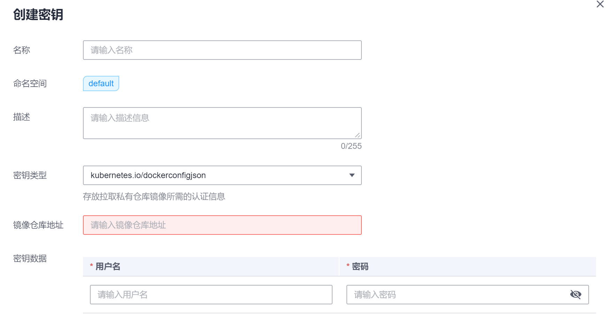

# 如何使用第三方镜像<a name="cce_01_0009"></a>

CCE支持拉取第三方镜像仓库（即SWR容器镜像仓库与Dockerhub之外的镜像仓库）的镜像创建工作负载。

通常第三方镜像仓库都必须经过认证（帐号密码）才能访问，而CCE中容器拉取镜像是使用密钥认证方式，这就要求在拉取镜像前先创建镜像仓库的密钥。

## 前提条件<a name="section14876601632"></a>

使用第三方镜像时，请确保工作负载运行的节点可访问公网。您可以通过[弹性IP](null.md)、[NAT网关](DNAT网关-(-DNAT-).md)方式访问公网。

## 通过界面操作<a name="section0402183334411"></a>

1.  <a name="li16481144064414"></a>创建第三方镜像仓库的密钥。

    单击左侧导航栏的“配置中心  \>  密钥“，单击“添加密钥“，密钥类型必须选择为dockerconfigjson，单击“添加密钥”，如下图所示。详细操作请参见[创建密钥](创建密钥.md)。

    此处的“用户名“和“密码“请填写第三方镜像仓库的帐号密码。

    **图 1**  添加密钥<a name="fig83432413351"></a>  
    

2.  参照[创建无状态工作负载](创建无状态工作负载.md)或[创建有状态工作负载](创建有状态工作负载.md)，选择第三方镜像时，请执行如下操作。
    1.  密钥认证：是。
    2.  选择密钥：选择[1](#li16481144064414)中创建的密钥。
    3.  镜像地址：输入镜像地址。

3.  单击“确定“。

## 使用kubectl创建第三方镜像仓库的密钥<a name="section18217101117197"></a>

1.  请参见[通过Kubectl连接集群](通过Kubectl连接集群.md)配置kubectl命令。
2.  登录已配置好kubectl命令的弹性云服务器。
3.  通过kubectl创建认证密钥 ，该密钥类型为dockercfg类型。

    ```
    kubectl create secret docker-registry myregistrykey --docker-server=DOCKER_REGISTRY_SERVER --docker-username=DOCKER_USER --docker-password=DOCKER_PASSWORD --docker-email=DOCKER_EMAIL
    ```

    其中，myregistrykey为密钥名称，其余参数如下所示。

    -   DOCKER\_REGISTRY\_SERVER：第三方镜像仓库的地址，如“www.3rdregistry.com“或“10.10.10.10:443“。
    -   DOCKER\_USER：第三方镜像仓库的帐号
    -   DOCKER\_PASSWORD：第三方镜像仓库的密码
    -   DOCKER\_EMAIL：第三方镜像仓库的邮箱

4.  创建工作负载时使用第三方镜像，具体步骤请参见如下。

    dockecfg类型的密钥作为私有镜像获取的认证方式，以Pod为例，创建的myregistrykey作为镜像的认证方式。

    ```
    apiVersion: v1
    kind: Pod
    metadata:
      name: foo
      namespace: default
    spec:
      containers:
        - name: foo
          image: www.3rdregistry.com/janedoe/awesomeapp:v1
      imagePullSecrets:
        - name: myregistrykey              #使用上面创建的密钥
    ```


