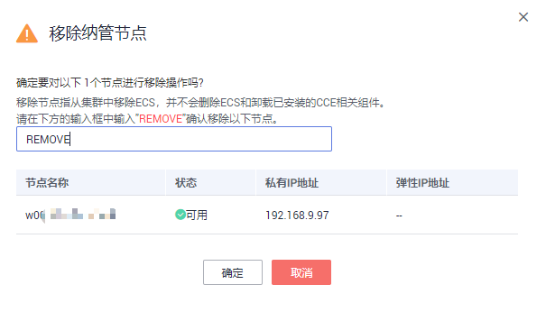
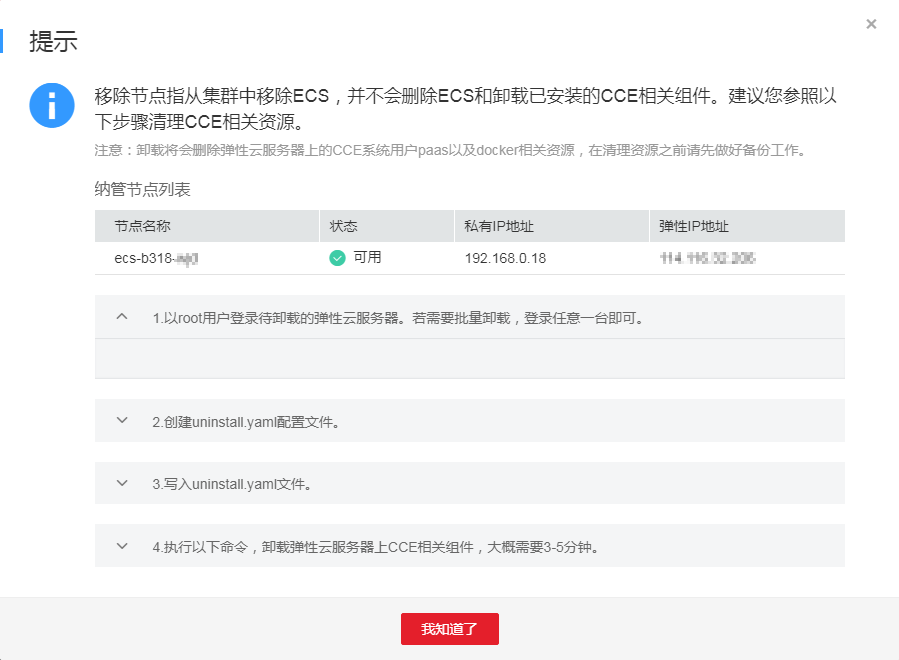

# 如何快速清理已删除节点上的CCE组件？

## 使用场景

若集群中包含包周期节点或纳管节点，删除对应集群和节点不会删除对应的ECS，此时请按照界面提示清理节点上CCE组件。若未按照提示清理节点组件，后续需要清理ECS时，可按照如下操作进行清理。

> **注意：**   
>卸载将会删除弹性云服务器上的CCE系统用户paas以及docker相关资源，执行清理操作前，若有关键数据需要保留，请提前备份或[提交工单](https://console.huaweicloud.com/ticket/?locale=zh-cn#/ticketindex/createIndex)联系客服咨询。  

## 操作步骤

1.  登录CCE控制台，单击左侧导航栏中的“集群管理 \> 节点管理“，在右侧的节点列表中找到要清理组件的纳管节点，在节点的“操作“区域下单击“移除“。

    **图 1**  移除纳管节点  
    

2.  在弹出的“移除纳管节点“对话框中输入"REMOVE"确认移除节点，单击“确认“。

    **图 2**  确认移除纳管节点  
    

3.  认真阅读弹出的“提示“页面内容，按照步骤清理CCE相关资源。

    **图 3**  清理CCE节点组件步骤  
    

