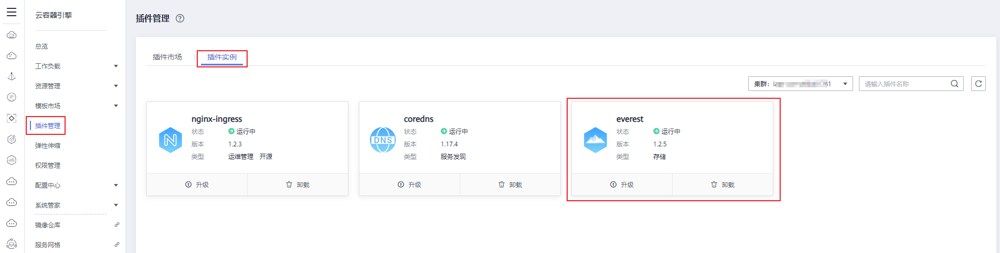

# 存储CSI概述

容器存储是为容器工作负载提供存储的组件，支持多种类型的存储，同一个工作负载（pod\)可以使用任意数量的存储。

云容器引擎CCE的容器存储功能基于Kubernetes存储系统，并深度融合华为云存储服务，完全兼容Kubernetes原生的存储服务，例如EmptyDir、HostPath、Secret、ConfigMap等存储。CCE基于Kubernetes社区容器存储接口（CSI，即Container Storage Interface）实现了华为云存储服务接入能力，旨在能为容器编排引擎和存储系统间建立一套标准的存储调用接口，通过该接口能为容器编排引擎提供存储服务。

**在CCE集群中的CSI容器存储插件名为[Everest](Everest（系统资源插件-必装）.md)**，集群版本为Kubernetes 1.15及以上时默认安装该插件。

本文介绍CCE容器存储CSI概览、CSI版本说明、CSI和Flexvolume存储插件的区别等。

## CCE容器存储概览

CCE支持工作负载Pod绑定[存储卷类型说明](存储基础知识.md#section16559121287)中的多种本地磁盘存储和云存储，每种存储卷的主要特点及应用场景如下表：

**图 1**  CCE支持的存储类型  

**表 1**  网络存储对比

<table><thead align="left"><tr id="row681972410017"><th class="cellrowborder" valign="top" width="12.2%" id="mcps1.2.6.1.1">
对比维度

</th>
<th class="cellrowborder" valign="top" width="21.95%" id="mcps1.2.6.1.2">
云硬盘EVS

</th>
<th class="cellrowborder" valign="top" width="21.95%" id="mcps1.2.6.1.3">
弹性文件服务SFS

</th>
<th class="cellrowborder" valign="top" width="21.95%" id="mcps1.2.6.1.4">
对象存储OBS

</th>
<th class="cellrowborder" valign="top" width="21.95%" id="mcps1.2.6.1.5">
极速文件存储SFS Turbo

</th>
</tr>
</thead>
<tbody><tr id="row753513520417"><td class="cellrowborder" valign="top" width="12.2%" headers="mcps1.2.6.1.1 ">
概念

</td>
<td class="cellrowborder" valign="top" width="21.95%" headers="mcps1.2.6.1.2 ">
云硬盘（Elastic Volume Service）可以为云服务器提供高可靠、高性能、规格丰富并且可弹性扩展的块存储服务，可满足不同场景的业务需求，适用于分布式文件系统、开发测试、数据仓库以及高性能计算等场景。

</td>
<td class="cellrowborder" valign="top" width="21.95%" headers="mcps1.2.6.1.3 ">
SFS为用户提供一个完全托管的共享文件存储，能够弹性伸缩至PB规模，具备高可用性和持久性，为海量数据、高带宽型应用提供有力支持。适用于多种应用场景，包括HPC、媒体处理、文件共享、内容管理和Web服务等。

</td>
<td class="cellrowborder" valign="top" width="21.95%" headers="mcps1.2.6.1.4 ">
对象存储服务（Object Storage Service，OBS）提供海量、安全、高可靠、低成本的数据存储能力，可供用户存储任意类型和大小的数据。适合企业备份/归档、视频点播、视频监控等多种数据存储场景。

</td>
<td class="cellrowborder" valign="top" width="21.95%" headers="mcps1.2.6.1.5 ">
SFS Turbo为用户提供一个完全托管的共享文件存储，能够弹性伸缩至320TB规模，具备高可用性和持久性，为海量的小文件、低延迟高IOPS型应用提供有力支持。适用于多种应用场景，包括高性能网站、日志存储、压缩解压、DevOps、企业办公、容器应用等。

</td>
</tr>
<tr id="row107852010714"><td class="cellrowborder" valign="top" width="12.2%" headers="mcps1.2.6.1.1 ">
存储数据的逻辑

</td>
<td class="cellrowborder" valign="top" width="21.95%" headers="mcps1.2.6.1.2 ">
存放的是二进制数据，无法直接存放文件，如果需要存放文件，需要先格式化文件系统后使用。

</td>
<td class="cellrowborder" valign="top" width="21.95%" headers="mcps1.2.6.1.3 ">
存放的是文件，会以文件和文件夹的层次结构来整理和呈现数据。

</td>
<td class="cellrowborder" valign="top" width="21.95%" headers="mcps1.2.6.1.4 ">
存放的是对象，可以直接存放文件，文件会自动产生对应的系统元数据，用户也可以自定义文件的元数据。

</td>
<td class="cellrowborder" valign="top" width="21.95%" headers="mcps1.2.6.1.5 ">
存放的是文件，会以文件和文件夹的层次结构来整理和呈现数据。

</td>
</tr>
<tr id="row285818816813"><td class="cellrowborder" valign="top" width="12.2%" headers="mcps1.2.6.1.1 ">
访问方式

</td>
<td class="cellrowborder" valign="top" width="21.95%" headers="mcps1.2.6.1.2 ">
只能在ECS/BMS中挂载使用，不能被操作系统应用直接访问，需要格式化成文件系统进行访问。

</td>
<td class="cellrowborder" valign="top" width="21.95%" headers="mcps1.2.6.1.3 ">
在ECS/BMS中通过网络协议挂载使用。需要指定网络地址进行访问，也可以将网络地址映射为本地目录后进行访问。

</td>
<td class="cellrowborder" valign="top" width="21.95%" headers="mcps1.2.6.1.4 ">
可以通过互联网或专线访问。需要指定桶地址进行访问，使用的是HTTP和HTTPS等传输协议。

</td>
<td class="cellrowborder" valign="top" width="21.95%" headers="mcps1.2.6.1.5 ">
提供标准的文件访问协议NFS（仅支持NFSv3），用户可以将现有应用和工具与SFS Turbo无缝集成。

</td>
</tr>
<tr id="row1762415820302"><td class="cellrowborder" valign="top" width="12.2%" headers="mcps1.2.6.1.1 ">
静态数据卷

</td>
<td class="cellrowborder" valign="top" width="21.95%" headers="mcps1.2.6.1.2 ">
支持

</td>
<td class="cellrowborder" valign="top" width="21.95%" headers="mcps1.2.6.1.3 ">
支持

</td>
<td class="cellrowborder" valign="top" width="21.95%" headers="mcps1.2.6.1.4 ">
支持

</td>
<td class="cellrowborder" valign="top" width="21.95%" headers="mcps1.2.6.1.5 ">
支持

</td>
</tr>
<tr id="row118192240012"><td class="cellrowborder" valign="top" width="12.2%" headers="mcps1.2.6.1.1 ">
动态数据卷

</td>
<td class="cellrowborder" valign="top" width="21.95%" headers="mcps1.2.6.1.2 ">
支持

</td>
<td class="cellrowborder" valign="top" width="21.95%" headers="mcps1.2.6.1.3 ">
支持

</td>
<td class="cellrowborder" valign="top" width="21.95%" headers="mcps1.2.6.1.4 ">
支持

</td>
<td class="cellrowborder" valign="top" width="21.95%" headers="mcps1.2.6.1.5 ">
不支持

</td>
</tr>
<tr id="row178196241102"><td class="cellrowborder" valign="top" width="12.2%" headers="mcps1.2.6.1.1 ">
主要特点

</td>
<td class="cellrowborder" valign="top" width="21.95%" headers="mcps1.2.6.1.2 ">
非共享存储，每个云盘只能在单个节点挂载。

</td>
<td class="cellrowborder" valign="top" width="21.95%" headers="mcps1.2.6.1.3 ">
共享存储，可提供高性能、高吞吐存储服务。

</td>
<td class="cellrowborder" valign="top" width="21.95%" headers="mcps1.2.6.1.4 ">
共享存储，用户态文件系统。

</td>
<td class="cellrowborder" valign="top" width="21.95%" headers="mcps1.2.6.1.5 ">
高性能、高带宽、共享存储。

</td>
</tr>
<tr id="row20738549306"><td class="cellrowborder" valign="top" width="12.2%" headers="mcps1.2.6.1.1 ">
应用场景

</td>
<td class="cellrowborder" valign="top" width="21.95%" headers="mcps1.2.6.1.2 ">
HPC高性能计算、企业核心集群应用、企业应用系统和开发测试等。

 说明： 

高性能计算：主要是高速率、高IOPS的需求，用于作为高性能存储，比如工业设计、能源勘探等。

更多信息，请参见<a href="云硬盘存储卷概述.md">云硬盘存储卷概述</a>。

</td>
<td class="cellrowborder" valign="top" width="21.95%" headers="mcps1.2.6.1.3 ">
HPC高性能计算、媒体处理、内容管理和Web服务、大数据和分析应用程序等。

 说明： 

高性能计算：主要是高带宽的需求，用于共享文件存储，比如基因测序、图片渲染等。

更多信息，请参见<a href="文件存储卷概述.md">文件存储卷概述</a>。

</td>
<td class="cellrowborder" valign="top" width="21.95%" headers="mcps1.2.6.1.4 ">
大数据分析、静态网站托管、在线视频点播、基因测序、智能视频监控、备份归档、企业云盘（网盘）等。

更多信息，请参见<a href="对象存储卷概述.md">对象存储卷概述</a>。

</td>
<td class="cellrowborder" valign="top" width="21.95%" headers="mcps1.2.6.1.5 ">
高性能网站、日志存储、DevOps、企业办公等。

更多信息，请参见<a href="极速文件存储卷概述.md">极速文件存储卷概述</a>。

</td>
</tr>
<tr id="row795117183197"><td class="cellrowborder" valign="top" width="12.2%" headers="mcps1.2.6.1.1 ">
容量

</td>
<td class="cellrowborder" valign="top" width="21.95%" headers="mcps1.2.6.1.2 ">
TB级别

</td>
<td class="cellrowborder" valign="top" width="21.95%" headers="mcps1.2.6.1.3 ">
PB级别

</td>
<td class="cellrowborder" valign="top" width="21.95%" headers="mcps1.2.6.1.4 ">
EB级别

</td>
<td class="cellrowborder" valign="top" width="21.95%" headers="mcps1.2.6.1.5 ">
TB级别

</td>
</tr>
<tr id="row2051631112018"><td class="cellrowborder" valign="top" width="12.2%" headers="mcps1.2.6.1.1 ">
时延

</td>
<td class="cellrowborder" valign="top" width="21.95%" headers="mcps1.2.6.1.2 ">
1~2ms

</td>
<td class="cellrowborder" valign="top" width="21.95%" headers="mcps1.2.6.1.3 ">
3~10ms

</td>
<td class="cellrowborder" valign="top" width="21.95%" headers="mcps1.2.6.1.4 ">
10ms

</td>
<td class="cellrowborder" valign="top" width="21.95%" headers="mcps1.2.6.1.5 ">
1~2ms

</td>
</tr>
<tr id="row81345119220"><td class="cellrowborder" valign="top" width="12.2%" headers="mcps1.2.6.1.1 ">
IOPS/TPS

</td>
<td class="cellrowborder" valign="top" width="21.95%" headers="mcps1.2.6.1.2 ">
单盘 33K

</td>
<td class="cellrowborder" valign="top" width="21.95%" headers="mcps1.2.6.1.3 ">
单文件系统 10K

</td>
<td class="cellrowborder" valign="top" width="21.95%" headers="mcps1.2.6.1.4 ">
千万级

</td>
<td class="cellrowborder" valign="top" width="21.95%" headers="mcps1.2.6.1.5 ">
100K

</td>
</tr>
<tr id="row16110165119224"><td class="cellrowborder" valign="top" width="12.2%" headers="mcps1.2.6.1.1 ">
带宽

</td>
<td class="cellrowborder" valign="top" width="21.95%" headers="mcps1.2.6.1.2 ">
MB/s级别

</td>
<td class="cellrowborder" valign="top" width="21.95%" headers="mcps1.2.6.1.3 ">
GB/s级别

</td>
<td class="cellrowborder" valign="top" width="21.95%" headers="mcps1.2.6.1.4 ">
TB/s级别

</td>
<td class="cellrowborder" valign="top" width="21.95%" headers="mcps1.2.6.1.5 ">
GB/s级别

</td>
</tr>
</tbody>
</table>

## 插件使用推荐

-   使用CSI插件（[Everest](Everest（系统资源插件-必装）.md)）要求Kubernetes版本需为**1.15及以上**，v1.15及以上版本的集群在创建时将默认安装本插件，v1.13及以下版本集群创建时默认安装Flexvolume插件（[storage-driver](storage-driver（系统资源插件-必装）.md)）。
-   集群版本由v1.13升级到v1.15后，v1.13版本集群中的Flexvolume容器存储插件（[storage-driver](storage-driver（系统资源插件-必装）.md)）能力将由v1.15的CSI插件（Everest，插件版本v1.1.6及以上）接管，接管后原有功能保持不变。
-   插件版本为1.2.0的Everest优化了使用OBS存储时的**密钥认证功能**，低于该版本的Everest插件在升级完成后，需要重启集群中使用OBS存储的全部工作负载，否则工作负载使用存储的能力将受影响！

## CSI插件安装与升级

关于CSI存储插件的安装与升级，请参见[Everest](Everest（系统资源插件-必装）.md)。

## CSI和Flexvolume存储插件的区别

**表 2**  CSI与Flexvolume

<table><thead align="left"><tr id="row1757135413114"><th class="cellrowborder" valign="top" width="16.520000000000003%" id="mcps1.2.5.1.1">
Kubernetes插件方案

</th>
<th class="cellrowborder" valign="top" width="13.450000000000001%" id="mcps1.2.5.1.2">
CCE插件名称

</th>
<th class="cellrowborder" valign="top" width="38.57%" id="mcps1.2.5.1.3">
插件特性

</th>
<th class="cellrowborder" valign="top" width="31.46%" id="mcps1.2.5.1.4">
使用推荐

</th>
</tr>
</thead>
<tbody><tr id="row5119842113215"><td class="cellrowborder" valign="top" width="16.520000000000003%" headers="mcps1.2.5.1.1 ">
CSI

</td>
<td class="cellrowborder" valign="top" width="13.450000000000001%" headers="mcps1.2.5.1.2 ">
Everest

</td>
<td class="cellrowborder" valign="top" width="38.57%" headers="mcps1.2.5.1.3 ">
CSI插件是kubernetes社区推荐的存储插件机制。CCE发布的kubernetes1.15版本及以上版本默认安装CSI插件Everest，并用于对接华为云块存储、文件存储、对象存储、极速文件存储等Iaas存储服务。

Everest插件包含两部分：

<ul id="ul6619114334611"><li>Everest-csi-controller：提供存储卷的创建、删除、扩容、云盘快照等功能；</li><li>Everest-csi-driver：提供存储卷在node上的挂载、卸载、格式化等功能。</li></ul>

详情请参见<a href="Everest（系统资源插件-必装）.md">Everest</a>

</td>
<td class="cellrowborder" valign="top" width="31.46%" headers="mcps1.2.5.1.4 ">
针对<strong id="b6889332175813">1.15及以上</strong>版本的集群，在创建时将默认安装CSI插件（<a href="Everest（系统资源插件-必装）.md">Everest</a>）。CCE会跟随社区持续更新CSI插件的各种能力。

</td>
</tr>
<tr id="row4757195473110"><td class="cellrowborder" valign="top" width="16.520000000000003%" headers="mcps1.2.5.1.1 ">
Flexvolume

</td>
<td class="cellrowborder" valign="top" width="13.450000000000001%" headers="mcps1.2.5.1.2 ">
storage-driver

</td>
<td class="cellrowborder" valign="top" width="38.57%" headers="mcps1.2.5.1.3 ">
Flexvolume插件是kubernetes社区早期实现的存储卷插件机制。自CCE上线伊始，提供的就是Flexvolume数据卷服务。CCE发布的kubernetes 1.13及以下版本安装的插件是“storage-driver”，并用于对接华为云块存储、文件存储、对象存储、极速文件存储等Iaas存储服务。

详情请参见<a href="storage-driver（系统资源插件-必装）.md">storage-driver</a>

</td>
<td class="cellrowborder" valign="top" width="31.46%" headers="mcps1.2.5.1.4 ">
针对已经创建的<strong id="b149171340145819">1.13及以下</strong>版本的集群，仍然使用已经安装的Flexvolume存储插件（<a href="storage-driver（系统资源插件-必装）.md">storage-driver</a>），CCE已停止更新该插件，您可以<a href="升级集群（1-13及以下版本）.md">升级集群版本</a>。

</td>
</tr>
</tbody>
</table>

> **说明：** 
>-   不支持CSI和Flexvolume插件在同一个集群中使用。
>-   不支持将v1.13及以下版本集群的Flexvolume插件转变到CSI插件，v1.13版本的集群可以通过升级集群版本切换为CSI插件，详情请参见[大版本升级说明](集群升级概述.md#section16738338445)。

## 如何判断集群的存储插件模式

1.  登录CCE控制台。
2.  在控制台左侧栏目树中，单击“插件管理“。
3.  在右侧的插件管理列表中，单击“插件实例“页签。
4.  在插件实例页面下，选择右上方的集群后，可以看到创建该集群时默认安装的存储插件，如下图：

    **图 2**  确认存储插件  
    

