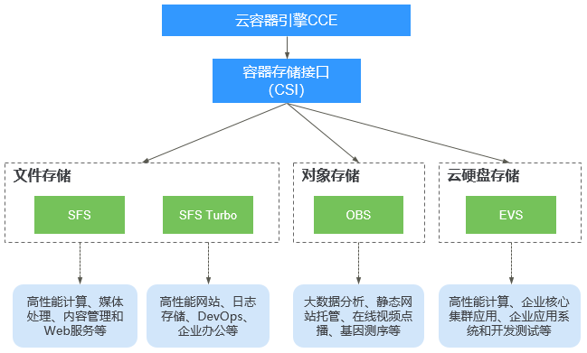

# 存储概述<a name="cce_01_0307"></a>

## Volume（存储卷）<a name="cce_10_0307_section5296105719142"></a>

容器中的文件在磁盘上是临时存放的，当容器重建时，容器中的文件将会丢失，另外当在一个Pod中同时运行多个容器时，常常需要在这些容器之间共享文件，这也是容器不好解决的问题。 Kubernetes抽象出了Volume来解决这两个问题，也就是存储卷，Kubernetes的Volume是Pod的一部分，Volume不是单独的对象，不能独立创建，只能在Pod中定义。

Pod中的所有容器都可以访问Volume，但必须要挂载，且可以挂载到容器中任何目录。

实际中使用容器存储如下图所示，将容器的内容挂载到Volume中，通过Volume两个容器间实现了存储共享。


Volume的生命周期与挂载它的Pod相同，但是Volume里面的文件可能在Volume消失后仍然存在，这取决于Volume的类型。

## 存储卷类型说明<a name="cce_10_0307_section16559121287"></a>

Volume可分为本地磁盘存储和云存储两大类。

-   本地磁盘存储

    本地磁盘存储可以使用如下几种类型，具体使用请参见[本地磁盘存储](本地磁盘存储-90.md)。

    -   emptyDir：一种简单的空目录，主要用于临时存储。
    -   hostPath：将主机（节点）某个目录挂载到容器中，适用于读取主机上的数据。
    -   ConfigMap：特殊类型，将Kubernetes特定的对象类型挂载到容器。
    -   Secret：特殊类型，将Kubernetes特定的对象类型挂载到容器。
    -   LocalPV：本地持久卷，直接使用节点的本地磁盘，持久化存储容器数据。

-   云存储：

    CCE支持使用云存储有如下几种。

    -   云硬盘EVS
    -   极速文件存储SFS Turbo
    -   对象存储OBS


## CSI<a name="cce_10_0307_section187922219447"></a>

Kubernetes提供了CSI接口（Container Storage Interface，容器存储接口），基于CSI这套接口，可以开发定制出CSI插件，从而支持特定的存储，达到解耦的目的。

CCE开发了存储插件[Everest](Everest（系统资源插件-必装）.md)，在创建集群时必须安装，安装了插件就可以使用的EVS、OBS等云存储。

## PV与PVC<a name="cce_10_0307_section1181185971610"></a>

Kubernetes抽象了PV（PersistentVolume）和PVC（PersistentVolumeClaim）来定义和使用存储，从而让使用者不用关心具体的基础设施，当需要存储资源的时候，只要像CPU和内存一样，声明要多少即可。

-   PV：PV描述的是一个集群里的持久化存储卷，和节点一样，属于集群级别资源。在新版控制台（需要将集群升级到1.19.10并且everest存储插件升级到1.2.10）PV资源已经正式开放给用户管理；旧版控制台仍保持导入使用或者是通过动态创建方式进行创建，用户无法通过控制台对PV资源进行生命周期管理。
-   PVC：PVC描述的是负载对存储的申领，PVC的申领会消耗集群中存量的PV资源，若集群中无存量PV资源，会动态创建底层存储及PV资源；创建PVC时，需描述请求的持久化存储的属性，比如，Volume存储的大小、可读写权限等等。

在Pod中可以使用Volume关联PVC，即可让Pod使用到存储资源，它们之间的关系如下图所示。

**图 1**  PVC绑定PV<a name="cce_10_0307_fig149881117222"></a>  


通常在使用时，可以使用PV描述已有的存储资源，然后创建PVC使用存储。具体使用可参见后续各章节中使用kubectl对接存储资源的内容。

而新创建存储资源时，可以使用一种更为方便的方法，可以跳过PV直接使用PVC，这就是[StorageClass](#cce_10_0307_section19926174743310)。

## StorageClass<a name="cce_10_0307_section19926174743310"></a>

StorageClass描述了集群中的存储类型“分类”，在创建PVC/PV均需要指定StorageClass。目前CCE默认提供csi-disk、csi-nas、csi-obs等StorageClass，在声明PVC时使用对应StorageClassName，就可以创建对应类型PV，并自动创建底层的存储资源。

执行如下命令即可查询CCE提供的默认StorageClass。您可以使用CCE提供的CSI插件自定义创建StorageClass，但从功能角度与CCE提供的默认StorageClass并无区别，这里不做过多描述。

```
# kubectl get sc
NAME                PROVISIONER                     AGE
csi-disk            everest-csi-provisioner         17d          # 云硬盘 StorageClass
csi-disk-topology   everest-csi-provisioner         17d          # 延迟绑定的云硬盘 StorageClass
csi-nas             everest-csi-provisioner         17d          # 文件存储 StorageClass
csi-obs             everest-csi-provisioner         17d          # 对象存储 StorageClass
csi-sfsturbo        everest-csi-provisioner         17d          # 极速文件存储 StorageClass
csi-local-topology  everest-csi-provisioner         17d          # 本地持久卷
```

定义了StorageClass后，就可以减少创建并维护PV的工作，PV变成了自动创建，作为使用者，只需要在声明PVC时指定StorageClassName即可，这就大大减少工作量。

> **说明：** 
>当前SFS文件存储处于售罄状态，暂时无法使用存储类csi-nas自动创建。

## CCE容器存储概览<a name="cce_10_0307_section326216625217"></a>

CCE支持工作负载Pod绑定[存储卷类型说明](#cce_10_0307_section16559121287)中的多种本地磁盘存储和云存储，每种存储卷的主要特点及应用场景如下表：

**图 2**  CCE支持的存储类型<a name="cce_10_0307_fig128444399616"></a>  


**表 1**  网络存储对比

<a name="cce_10_0307_table1381911241505"></a>
<table><thead align="left"><tr id="cce_10_0307_row681972410017"><th class="cellrowborder" valign="top" width="12.2%" id="mcps1.2.6.1.1"><p id="cce_10_0307_p1182114718218"><a name="cce_10_0307_p1182114718218"></a><a name="cce_10_0307_p1182114718218"></a>对比维度</p>
</th>
<th class="cellrowborder" valign="top" width="21.95%" id="mcps1.2.6.1.2"><p id="cce_10_0307_p8821971729"><a name="cce_10_0307_p8821971729"></a><a name="cce_10_0307_p8821971729"></a>云硬盘EVS</p>
</th>
<th class="cellrowborder" valign="top" width="21.95%" id="mcps1.2.6.1.3"><p id="cce_10_0307_p68211275218"><a name="cce_10_0307_p68211275218"></a><a name="cce_10_0307_p68211275218"></a>弹性文件服务SFS</p>
</th>
<th class="cellrowborder" valign="top" width="21.95%" id="mcps1.2.6.1.4"><p id="cce_10_0307_p882187327"><a name="cce_10_0307_p882187327"></a><a name="cce_10_0307_p882187327"></a>对象存储OBS</p>
</th>
<th class="cellrowborder" valign="top" width="21.95%" id="mcps1.2.6.1.5"><p id="cce_10_0307_p18211714216"><a name="cce_10_0307_p18211714216"></a><a name="cce_10_0307_p18211714216"></a>极速文件存储SFS Turbo</p>
</th>
</tr>
</thead>
<tbody><tr id="cce_10_0307_row753513520417"><td class="cellrowborder" valign="top" width="12.2%" headers="mcps1.2.6.1.1 "><p id="cce_10_0307_p853513528414"><a name="cce_10_0307_p853513528414"></a><a name="cce_10_0307_p853513528414"></a>概念</p>
</td>
<td class="cellrowborder" valign="top" width="21.95%" headers="mcps1.2.6.1.2 "><p id="cce_10_0307_p105361652941"><a name="cce_10_0307_p105361652941"></a><a name="cce_10_0307_p105361652941"></a>云硬盘（Elastic Volume Service）可以为云服务器提供高可靠、高性能、规格丰富并且可弹性扩展的块存储服务，可满足不同场景的业务需求，适用于分布式文件系统、开发测试、数据仓库以及高性能计算等场景。</p>
</td>
<td class="cellrowborder" valign="top" width="21.95%" headers="mcps1.2.6.1.3 "><p id="cce_10_0307_p15606133319315"><a name="cce_10_0307_p15606133319315"></a><a name="cce_10_0307_p15606133319315"></a>SFS为用户提供一个完全托管的共享文件存储，能够弹性伸缩至PB规模，具备高可用性和持久性，为海量数据、高带宽型应用提供有力支持。适用于多种应用场景，包括HPC、媒体处理、文件共享、内容管理和Web服务等。</p>
<p id="cce_10_0307_p1560663343117"><a name="cce_10_0307_p1560663343117"></a><a name="cce_10_0307_p1560663343117"></a></p>
</td>
<td class="cellrowborder" valign="top" width="21.95%" headers="mcps1.2.6.1.4 "><p id="cce_10_0307_p107261619142811"><a name="cce_10_0307_p107261619142811"></a><a name="cce_10_0307_p107261619142811"></a>对象存储服务（Object Storage Service，OBS）提供海量、安全、高可靠、低成本的数据存储能力，可供用户存储任意类型和大小的数据。适合企业备份/归档、视频点播、视频监控等多种数据存储场景。</p>
</td>
<td class="cellrowborder" valign="top" width="21.95%" headers="mcps1.2.6.1.5 "><p id="cce_10_0307_p91731911183120"><a name="cce_10_0307_p91731911183120"></a><a name="cce_10_0307_p91731911183120"></a>SFS Turbo为用户提供一个完全托管的共享文件存储，能够弹性伸缩至320TB规模，具备高可用性和持久性，为海量的小文件、低延迟高IOPS型应用提供有力支持。适用于多种应用场景，包括高性能网站、日志存储、压缩解压、DevOps、企业办公、容器应用等。</p>
</td>
</tr>
<tr id="cce_10_0307_row107852010714"><td class="cellrowborder" valign="top" width="12.2%" headers="mcps1.2.6.1.1 "><p id="cce_10_0307_p1178122018714"><a name="cce_10_0307_p1178122018714"></a><a name="cce_10_0307_p1178122018714"></a>存储数据的逻辑</p>
</td>
<td class="cellrowborder" valign="top" width="21.95%" headers="mcps1.2.6.1.2 "><p id="cce_10_0307_p187812201879"><a name="cce_10_0307_p187812201879"></a><a name="cce_10_0307_p187812201879"></a>存放的是二进制数据，无法直接存放文件，如果需要存放文件，需要先格式化文件系统后使用。</p>
</td>
<td class="cellrowborder" valign="top" width="21.95%" headers="mcps1.2.6.1.3 "><p id="cce_10_0307_p77852011712"><a name="cce_10_0307_p77852011712"></a><a name="cce_10_0307_p77852011712"></a>存放的是文件，会以文件和文件夹的层次结构来整理和呈现数据。</p>
</td>
<td class="cellrowborder" valign="top" width="21.95%" headers="mcps1.2.6.1.4 "><p id="cce_10_0307_p178420475"><a name="cce_10_0307_p178420475"></a><a name="cce_10_0307_p178420475"></a>存放的是对象，可以直接存放文件，文件会自动产生对应的系统元数据，用户也可以自定义文件的元数据。</p>
</td>
<td class="cellrowborder" valign="top" width="21.95%" headers="mcps1.2.6.1.5 "><p id="cce_10_0307_p107819201277"><a name="cce_10_0307_p107819201277"></a><a name="cce_10_0307_p107819201277"></a>存放的是文件，会以文件和文件夹的层次结构来整理和呈现数据。</p>
</td>
</tr>
<tr id="cce_10_0307_row285818816813"><td class="cellrowborder" valign="top" width="12.2%" headers="mcps1.2.6.1.1 "><p id="cce_10_0307_p15858186817"><a name="cce_10_0307_p15858186817"></a><a name="cce_10_0307_p15858186817"></a>访问方式</p>
</td>
<td class="cellrowborder" valign="top" width="21.95%" headers="mcps1.2.6.1.2 "><p id="cce_10_0307_p085813810814"><a name="cce_10_0307_p085813810814"></a><a name="cce_10_0307_p085813810814"></a>只能在ECS/BMS中挂载使用，不能被操作系统应用直接访问，需要格式化成文件系统进行访问。</p>
</td>
<td class="cellrowborder" valign="top" width="21.95%" headers="mcps1.2.6.1.3 "><p id="cce_10_0307_p98591186815"><a name="cce_10_0307_p98591186815"></a><a name="cce_10_0307_p98591186815"></a>在ECS/BMS中通过网络协议挂载使用。需要指定网络地址进行访问，也可以将网络地址映射为本地目录后进行访问。</p>
</td>
<td class="cellrowborder" valign="top" width="21.95%" headers="mcps1.2.6.1.4 "><p id="cce_10_0307_p16859118685"><a name="cce_10_0307_p16859118685"></a><a name="cce_10_0307_p16859118685"></a>可以通过互联网或专线访问。需要指定桶地址进行访问，使用的是HTTP和HTTPS等传输协议。</p>
</td>
<td class="cellrowborder" valign="top" width="21.95%" headers="mcps1.2.6.1.5 "><p id="cce_10_0307_p2859881785"><a name="cce_10_0307_p2859881785"></a><a name="cce_10_0307_p2859881785"></a>提供标准的文件访问协议NFS（仅支持NFSv3），用户可以将现有应用和工具与SFS Turbo无缝集成。</p>
</td>
</tr>
<tr id="cce_10_0307_row1762415820302"><td class="cellrowborder" valign="top" width="12.2%" headers="mcps1.2.6.1.1 "><p id="cce_10_0307_p11821177928"><a name="cce_10_0307_p11821177928"></a><a name="cce_10_0307_p11821177928"></a>静态数据卷</p>
</td>
<td class="cellrowborder" valign="top" width="21.95%" headers="mcps1.2.6.1.2 "><p id="cce_10_0307_p19821127024"><a name="cce_10_0307_p19821127024"></a><a name="cce_10_0307_p19821127024"></a>支持</p>
</td>
<td class="cellrowborder" valign="top" width="21.95%" headers="mcps1.2.6.1.3 "><p id="cce_10_0307_p1782117710220"><a name="cce_10_0307_p1782117710220"></a><a name="cce_10_0307_p1782117710220"></a>支持</p>
</td>
<td class="cellrowborder" valign="top" width="21.95%" headers="mcps1.2.6.1.4 "><p id="cce_10_0307_p4821871721"><a name="cce_10_0307_p4821871721"></a><a name="cce_10_0307_p4821871721"></a>支持</p>
</td>
<td class="cellrowborder" valign="top" width="21.95%" headers="mcps1.2.6.1.5 "><p id="cce_10_0307_p158211574216"><a name="cce_10_0307_p158211574216"></a><a name="cce_10_0307_p158211574216"></a>支持</p>
</td>
</tr>
<tr id="cce_10_0307_row118192240012"><td class="cellrowborder" valign="top" width="12.2%" headers="mcps1.2.6.1.1 "><p id="cce_10_0307_p16821117228"><a name="cce_10_0307_p16821117228"></a><a name="cce_10_0307_p16821117228"></a>动态数据卷</p>
</td>
<td class="cellrowborder" valign="top" width="21.95%" headers="mcps1.2.6.1.2 "><p id="cce_10_0307_p10821371929"><a name="cce_10_0307_p10821371929"></a><a name="cce_10_0307_p10821371929"></a>支持</p>
</td>
<td class="cellrowborder" valign="top" width="21.95%" headers="mcps1.2.6.1.3 "><p id="cce_10_0307_p16821871824"><a name="cce_10_0307_p16821871824"></a><a name="cce_10_0307_p16821871824"></a>支持</p>
</td>
<td class="cellrowborder" valign="top" width="21.95%" headers="mcps1.2.6.1.4 "><p id="cce_10_0307_p68213714215"><a name="cce_10_0307_p68213714215"></a><a name="cce_10_0307_p68213714215"></a>支持</p>
</td>
<td class="cellrowborder" valign="top" width="21.95%" headers="mcps1.2.6.1.5 "><p id="cce_10_0307_p1282118711218"><a name="cce_10_0307_p1282118711218"></a><a name="cce_10_0307_p1282118711218"></a>不支持</p>
</td>
</tr>
<tr id="cce_10_0307_row178196241102"><td class="cellrowborder" valign="top" width="12.2%" headers="mcps1.2.6.1.1 "><p id="cce_10_0307_p2821178210"><a name="cce_10_0307_p2821178210"></a><a name="cce_10_0307_p2821178210"></a>主要特点</p>
</td>
<td class="cellrowborder" valign="top" width="21.95%" headers="mcps1.2.6.1.2 "><p id="cce_10_0307_p58211971024"><a name="cce_10_0307_p58211971024"></a><a name="cce_10_0307_p58211971024"></a>非共享存储，每个云盘只能在单个节点挂载。</p>
</td>
<td class="cellrowborder" valign="top" width="21.95%" headers="mcps1.2.6.1.3 "><p id="cce_10_0307_p128211976217"><a name="cce_10_0307_p128211976217"></a><a name="cce_10_0307_p128211976217"></a>共享存储，可提供高性能、高吞吐存储服务。</p>
</td>
<td class="cellrowborder" valign="top" width="21.95%" headers="mcps1.2.6.1.4 "><p id="cce_10_0307_p128210717211"><a name="cce_10_0307_p128210717211"></a><a name="cce_10_0307_p128210717211"></a>共享存储，用户态文件系统。</p>
</td>
<td class="cellrowborder" valign="top" width="21.95%" headers="mcps1.2.6.1.5 "><p id="cce_10_0307_p8821471622"><a name="cce_10_0307_p8821471622"></a><a name="cce_10_0307_p8821471622"></a>高性能、高带宽、共享存储。</p>
</td>
</tr>
<tr id="cce_10_0307_row20738549306"><td class="cellrowborder" valign="top" width="12.2%" headers="mcps1.2.6.1.1 "><p id="cce_10_0307_p1273954916010"><a name="cce_10_0307_p1273954916010"></a><a name="cce_10_0307_p1273954916010"></a>应用场景</p>
</td>
<td class="cellrowborder" valign="top" width="21.95%" headers="mcps1.2.6.1.2 "><p id="cce_10_0307_p17367132813016"><a name="cce_10_0307_p17367132813016"></a><a name="cce_10_0307_p17367132813016"></a>HPC高性能计算、企业核心集群应用、企业应用系统和开发测试等。</p>
<div class="note" id="cce_10_0307_note1547152375919"><a name="cce_10_0307_note1547152375919"></a><a name="cce_10_0307_note1547152375919"></a><span class="notetitle"> 说明： </span><div class="notebody"><p id="cce_10_0307_p947172385920"><a name="cce_10_0307_p947172385920"></a><a name="cce_10_0307_p947172385920"></a>高性能计算：主要是高速率、高IOPS的需求，用于作为高性能存储，比如工业设计、能源勘探等。</p>
</div></div>
</td>
<td class="cellrowborder" valign="top" width="21.95%" headers="mcps1.2.6.1.3 "><p id="cce_10_0307_p12791013514"><a name="cce_10_0307_p12791013514"></a><a name="cce_10_0307_p12791013514"></a>HPC高性能计算、媒体处理、内容管理和Web服务、大数据和分析应用程序等。</p>
<div class="note" id="cce_10_0307_note1482333019011"><a name="cce_10_0307_note1482333019011"></a><a name="cce_10_0307_note1482333019011"></a><span class="notetitle"> 说明： </span><div class="notebody"><p id="cce_10_0307_p17823530504"><a name="cce_10_0307_p17823530504"></a><a name="cce_10_0307_p17823530504"></a>高性能计算：主要是高带宽的需求，用于共享文件存储，比如基因测序、图片渲染等。</p>
</div></div>
</td>
<td class="cellrowborder" valign="top" width="21.95%" headers="mcps1.2.6.1.4 "><p id="cce_10_0307_p6507161018"><a name="cce_10_0307_p6507161018"></a><a name="cce_10_0307_p6507161018"></a>大数据分析、静态网站托管、在线视频点播、基因测序、智能视频监控、备份归档、企业云盘（网盘）等。</p>
</td>
<td class="cellrowborder" valign="top" width="21.95%" headers="mcps1.2.6.1.5 "><p id="cce_10_0307_p11807135612"><a name="cce_10_0307_p11807135612"></a><a name="cce_10_0307_p11807135612"></a>高性能网站、日志存储、DevOps、企业办公等。</p>
</td>
</tr>
<tr id="cce_10_0307_row795117183197"><td class="cellrowborder" valign="top" width="12.2%" headers="mcps1.2.6.1.1 "><p id="cce_10_0307_p295218186195"><a name="cce_10_0307_p295218186195"></a><a name="cce_10_0307_p295218186195"></a>容量</p>
</td>
<td class="cellrowborder" valign="top" width="21.95%" headers="mcps1.2.6.1.2 "><p id="cce_10_0307_p19521418111910"><a name="cce_10_0307_p19521418111910"></a><a name="cce_10_0307_p19521418111910"></a>TB级别</p>
</td>
<td class="cellrowborder" valign="top" width="21.95%" headers="mcps1.2.6.1.3 "><p id="cce_10_0307_p095211871914"><a name="cce_10_0307_p095211871914"></a><a name="cce_10_0307_p095211871914"></a>PB级别</p>
</td>
<td class="cellrowborder" valign="top" width="21.95%" headers="mcps1.2.6.1.4 "><p id="cce_10_0307_p179521318161916"><a name="cce_10_0307_p179521318161916"></a><a name="cce_10_0307_p179521318161916"></a>EB级别</p>
</td>
<td class="cellrowborder" valign="top" width="21.95%" headers="mcps1.2.6.1.5 "><p id="cce_10_0307_p1795201812198"><a name="cce_10_0307_p1795201812198"></a><a name="cce_10_0307_p1795201812198"></a>TB级别</p>
</td>
</tr>
<tr id="cce_10_0307_row2051631112018"><td class="cellrowborder" valign="top" width="12.2%" headers="mcps1.2.6.1.1 "><p id="cce_10_0307_p9516161102020"><a name="cce_10_0307_p9516161102020"></a><a name="cce_10_0307_p9516161102020"></a>时延</p>
</td>
<td class="cellrowborder" valign="top" width="21.95%" headers="mcps1.2.6.1.2 "><p id="cce_10_0307_p07991430122212"><a name="cce_10_0307_p07991430122212"></a><a name="cce_10_0307_p07991430122212"></a>1~2ms</p>
</td>
<td class="cellrowborder" valign="top" width="21.95%" headers="mcps1.2.6.1.3 "><p id="cce_10_0307_p97991230122210"><a name="cce_10_0307_p97991230122210"></a><a name="cce_10_0307_p97991230122210"></a>3~10ms</p>
</td>
<td class="cellrowborder" valign="top" width="21.95%" headers="mcps1.2.6.1.4 "><p id="cce_10_0307_p16799103015229"><a name="cce_10_0307_p16799103015229"></a><a name="cce_10_0307_p16799103015229"></a>10ms</p>
</td>
<td class="cellrowborder" valign="top" width="21.95%" headers="mcps1.2.6.1.5 "><p id="cce_10_0307_p1551631182013"><a name="cce_10_0307_p1551631182013"></a><a name="cce_10_0307_p1551631182013"></a>1~2ms</p>
</td>
</tr>
<tr id="cce_10_0307_row81345119220"><td class="cellrowborder" valign="top" width="12.2%" headers="mcps1.2.6.1.1 "><p id="cce_10_0307_p47361048233"><a name="cce_10_0307_p47361048233"></a><a name="cce_10_0307_p47361048233"></a>IOPS/TPS</p>
</td>
<td class="cellrowborder" valign="top" width="21.95%" headers="mcps1.2.6.1.2 "><p id="cce_10_0307_p14736184122317"><a name="cce_10_0307_p14736184122317"></a><a name="cce_10_0307_p14736184122317"></a>单盘 33K</p>
</td>
<td class="cellrowborder" valign="top" width="21.95%" headers="mcps1.2.6.1.3 "><p id="cce_10_0307_p1373618414230"><a name="cce_10_0307_p1373618414230"></a><a name="cce_10_0307_p1373618414230"></a>单文件系统 10K</p>
</td>
<td class="cellrowborder" valign="top" width="21.95%" headers="mcps1.2.6.1.4 "><p id="cce_10_0307_p177368492319"><a name="cce_10_0307_p177368492319"></a><a name="cce_10_0307_p177368492319"></a>千万级</p>
</td>
<td class="cellrowborder" valign="top" width="21.95%" headers="mcps1.2.6.1.5 "><p id="cce_10_0307_p13134181152219"><a name="cce_10_0307_p13134181152219"></a><a name="cce_10_0307_p13134181152219"></a>100K</p>
</td>
</tr>
<tr id="cce_10_0307_row16110165119224"><td class="cellrowborder" valign="top" width="12.2%" headers="mcps1.2.6.1.1 "><p id="cce_10_0307_p207361748233"><a name="cce_10_0307_p207361748233"></a><a name="cce_10_0307_p207361748233"></a>带宽</p>
</td>
<td class="cellrowborder" valign="top" width="21.95%" headers="mcps1.2.6.1.2 "><p id="cce_10_0307_p3736124102318"><a name="cce_10_0307_p3736124102318"></a><a name="cce_10_0307_p3736124102318"></a>MB/s级别</p>
</td>
<td class="cellrowborder" valign="top" width="21.95%" headers="mcps1.2.6.1.3 "><p id="cce_10_0307_p97361041234"><a name="cce_10_0307_p97361041234"></a><a name="cce_10_0307_p97361041234"></a>GB/s级别</p>
</td>
<td class="cellrowborder" valign="top" width="21.95%" headers="mcps1.2.6.1.4 "><p id="cce_10_0307_p7736114112319"><a name="cce_10_0307_p7736114112319"></a><a name="cce_10_0307_p7736114112319"></a>TB/s级别</p>
</td>
<td class="cellrowborder" valign="top" width="21.95%" headers="mcps1.2.6.1.5 "><p id="cce_10_0307_p71101151202212"><a name="cce_10_0307_p71101151202212"></a><a name="cce_10_0307_p71101151202212"></a>GB/s级别</p>
</td>
</tr>
</tbody>
</table>

## 约束与限制<a name="cce_10_0307_section4477154754415"></a>

安全容器不支持使用对象存储卷。

-   OBS限制单用户创建100个桶，但是CCE使用OBS桶为单个工作负载挂载一个桶，当工作负载数量较多时，容易导致桶数量超过限制，OBS桶无法创建。建议此种场景下直接通过OBS的API或SDK使用OBS，不在工作负载中挂载OBS桶。
-   1.19.10以下版本的集群中，如果使用HPA策略对挂载了EVS卷的负载进行扩容，当新Pod被调度到另一个节点时，会导致之前Pod不能正常读写。

    1.19.10及以上版本集群中，如果使用HPA策略对挂载了EVS卷的负载进行扩容，新Pod会因为无法挂载云硬盘导致无法成功启动。

-   1.19及以下版本的集群在卸载subpath时会遍历subpath下所有文件夹，若文件夹数量较多的情况下，遍历时间较长，卸卷时间对应较长。建议在subpath下不要建立太多文件夹，否则可能会出现Pod删除卸卷时间较长的情况。
-   CCE集群下挂载的OBS中单个文件大小限制远小于obsfs限制。

## 插件使用推荐<a name="cce_10_0307_section059455612532"></a>

-   使用CSI插件（[Everest](Everest（系统资源插件-必装）.md)）要求Kubernetes版本需为**1.15及以上**，v1.15及以上版本的集群在创建时将默认安装本插件，v1.13及以下版本集群创建时默认安装Flexvolume插件（[storage-driver](storage-driver（系统资源插件-必装）.md)）。
-   集群版本由v1.13升级到v1.15后，v1.13版本集群中的Flexvolume容器存储插件（[storage-driver](storage-driver（系统资源插件-必装）.md)）能力将由v1.15的CSI插件（Everest，插件版本v1.1.6及以上）接管，接管后原有功能保持不变。
-   插件版本为1.2.0的Everest优化了使用OBS存储时的**密钥认证功能**，低于该版本的Everest插件在升级完成后，需要重启集群中使用OBS存储的全部工作负载，否则工作负载使用存储的能力将受影响！

## CSI和Flexvolume存储插件的区别<a name="cce_10_0307_section1690993510317"></a>

**表 2**  CSI与Flexvolume

<a name="cce_10_0307_table9704165418310"></a>
<table><thead align="left"><tr id="cce_10_0307_row1757135413114"><th class="cellrowborder" valign="top" width="16.520000000000003%" id="mcps1.2.5.1.1"><p id="cce_10_0307_p177571954173119"><a name="cce_10_0307_p177571954173119"></a><a name="cce_10_0307_p177571954173119"></a>Kubernetes插件方案</p>
</th>
<th class="cellrowborder" valign="top" width="13.450000000000001%" id="mcps1.2.5.1.2"><p id="cce_10_0307_p105501460334"><a name="cce_10_0307_p105501460334"></a><a name="cce_10_0307_p105501460334"></a>CCE插件名称</p>
</th>
<th class="cellrowborder" valign="top" width="38.57%" id="mcps1.2.5.1.3"><p id="cce_10_0307_p575715443110"><a name="cce_10_0307_p575715443110"></a><a name="cce_10_0307_p575715443110"></a>插件特性</p>
</th>
<th class="cellrowborder" valign="top" width="31.46%" id="mcps1.2.5.1.4"><p id="cce_10_0307_p97571054183119"><a name="cce_10_0307_p97571054183119"></a><a name="cce_10_0307_p97571054183119"></a>使用推荐</p>
</th>
</tr>
</thead>
<tbody><tr id="cce_10_0307_row5119842113215"><td class="cellrowborder" valign="top" width="16.520000000000003%" headers="mcps1.2.5.1.1 "><p id="cce_10_0307_p97574546316"><a name="cce_10_0307_p97574546316"></a><a name="cce_10_0307_p97574546316"></a><span>CSI</span></p>
</td>
<td class="cellrowborder" valign="top" width="13.450000000000001%" headers="mcps1.2.5.1.2 "><p id="cce_10_0307_p0550106143311"><a name="cce_10_0307_p0550106143311"></a><a name="cce_10_0307_p0550106143311"></a>Everest</p>
</td>
<td class="cellrowborder" valign="top" width="38.57%" headers="mcps1.2.5.1.3 "><p id="cce_10_0307_p137578549318"><a name="cce_10_0307_p137578549318"></a><a name="cce_10_0307_p137578549318"></a><span>CSI</span><span>插件是</span><span>kubernetes</span><span>社区推荐的存储插件机制。</span><span>CCE</span><span>发布的</span><span>kubernetes1.15</span><span>版本及以上版本默认安装</span><span>CSI</span><span>插件</span><span>Everest</span><span>，并用于对接块存储、文件存储、对象存储、极速文件存储等</span><span>Iaas</span><span>存储服务。</span></p>
<p id="cce_10_0307_p11757754123115"><a name="cce_10_0307_p11757754123115"></a><a name="cce_10_0307_p11757754123115"></a><span>Everest</span><span>插件包含两部分：</span></p>
<a name="cce_10_0307_ul6619114334611"></a><a name="cce_10_0307_ul6619114334611"></a><ul id="cce_10_0307_ul6619114334611"><li><span>Everest-</span><span>csi</span><span>-controller</span><span>：提供存储卷的创建、删除、扩容、云盘快照等功能；</span></li><li><span>Everest-</span><span>csi</span><span>-driver</span><span>：提供存储卷在</span><span>node</span><span>上的挂载、卸载、格式化等功能。</span></li></ul>
<p id="cce_10_0307_p1387091118582"><a name="cce_10_0307_p1387091118582"></a><a name="cce_10_0307_p1387091118582"></a>详情请参见<a href="Everest（系统资源插件-必装）.md">Everest</a></p>
</td>
<td class="cellrowborder" valign="top" width="31.46%" headers="mcps1.2.5.1.4 "><p id="cce_10_0307_p516783510588"><a name="cce_10_0307_p516783510588"></a><a name="cce_10_0307_p516783510588"></a>针对<strong id="cce_10_0307_b6889332175813"><a name="cce_10_0307_b6889332175813"></a><a name="cce_10_0307_b6889332175813"></a>1.15及以上</strong>版本的集群，在创建时将默认安装CSI插件（<a href="Everest（系统资源插件-必装）.md">Everest</a>）。CCE会跟随社区持续更新CSI插件的各种能力。</p>
</td>
</tr>
<tr id="cce_10_0307_row4757195473110"><td class="cellrowborder" valign="top" width="16.520000000000003%" headers="mcps1.2.5.1.1 "><p id="cce_10_0307_p1175710548316"><a name="cce_10_0307_p1175710548316"></a><a name="cce_10_0307_p1175710548316"></a><span>Flexvolume</span></p>
</td>
<td class="cellrowborder" valign="top" width="13.450000000000001%" headers="mcps1.2.5.1.2 "><p id="cce_10_0307_p45508612335"><a name="cce_10_0307_p45508612335"></a><a name="cce_10_0307_p45508612335"></a>storage-driver</p>
</td>
<td class="cellrowborder" valign="top" width="38.57%" headers="mcps1.2.5.1.3 "><p id="cce_10_0307_p19757145483115"><a name="cce_10_0307_p19757145483115"></a><a name="cce_10_0307_p19757145483115"></a><span>Flexvolume</span><span>插件是</span><span>kubernetes</span><span>社区早期实现的存储卷插件机制。自</span><span>CCE</span><span>上线伊始，提供的就是</span><span>Flexvolume</span><span>数据卷服务。</span><span>CCE</span><span>发布的</span><span>kubernetes</span><span> 1.13</span><span>及以下版本安装的插件是“</span><span>storage-driver</span><span>”，并用于对接块存储、文件存储、对象存储、极速文件存储等</span><span>Iaas</span><span>存储服务。</span></p>
<p id="cce_10_0307_p16757654153113"><a name="cce_10_0307_p16757654153113"></a><a name="cce_10_0307_p16757654153113"></a>详情请参见<a href="storage-driver（系统资源插件-必装）.md">storage-driver</a></p>
</td>
<td class="cellrowborder" valign="top" width="31.46%" headers="mcps1.2.5.1.4 "><p id="cce_10_0307_p18569134265811"><a name="cce_10_0307_p18569134265811"></a><a name="cce_10_0307_p18569134265811"></a>针对已经创建的<strong id="cce_10_0307_b149171340145819"><a name="cce_10_0307_b149171340145819"></a><a name="cce_10_0307_b149171340145819"></a>1.13及以下</strong>版本的集群，仍然使用已经安装的Flexvolume存储插件（<a href="storage-driver（系统资源插件-必装）.md">storage-driver</a>），CCE已停止更新该插件，您可以<a href="集群升级概述-10.md">升级集群版本</a>。</p>
</td>
</tr>
</tbody>
</table>

> **说明：** 
>-   不支持CSI和Flexvolume插件在同一个集群中使用。
>-   不支持将v1.13及以下版本集群的Flexvolume插件转变到CSI插件，v1.13版本的集群可以通过升级集群版本切换为CSI插件，详情请参见[大版本升级说明](集群升级概述-10.md#section16738338445)。

## 如何判断集群的存储插件模式<a name="cce_10_0307_section155443483414"></a>

1.  登录CCE控制台。
2.  在控制台左侧栏目树中，单击“插件管理“。
3.  在右侧的插件管理列表中，单击“插件实例“页签。
4.  在插件实例页面下，选择右上方的集群后，可以看到创建该集群时默认安装的存储插件。

