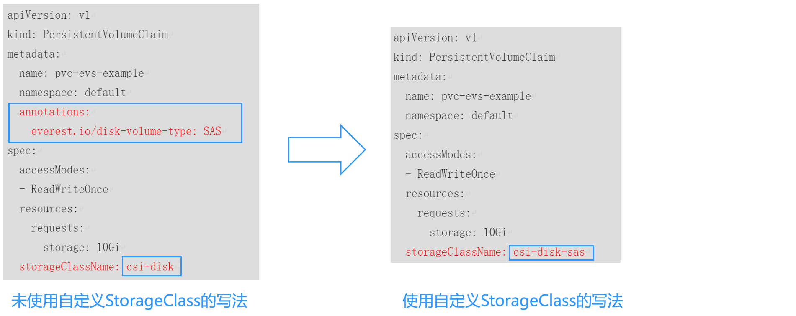
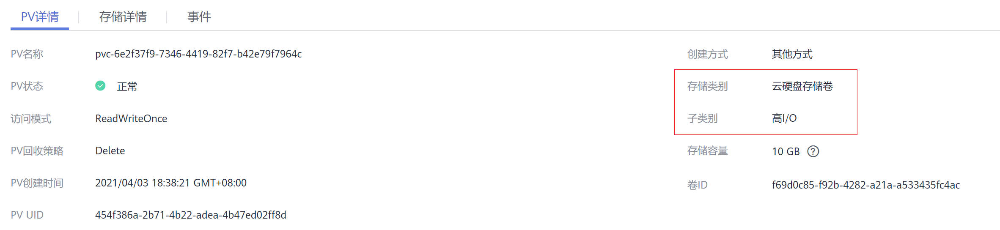
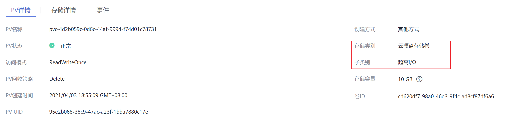

# 存储类StorageClass<a name="cce_10_0380"></a>

StorageClass描述了集群中的存储类型“分类”，在创建PVC/PV均需要指定StorageClass。目前CCE默认提供csi-disk、csi-nas、csi-obs等StorageClass，在声明PVC时使用对应StorageClassName，就可以自动创建对应类型PV，并自动创建底层的存储资源。

执行如下命令即可查询CCE提供的默认StorageClass。您可以使用CCE提供的CSI插件自定义创建StorageClass，但从功能角度与CCE提供的默认StorageClass并无区别，这里不做过多描述。

```
# kubectl get sc
NAME                PROVISIONER                     AGE
csi-disk            everest-csi-provisioner         17d          # 云硬盘 StorageClass
csi-nas             everest-csi-provisioner         17d          # 文件存储 1.0 StorageClass
csi-sfs             everest-csi-provisioner         17d          # 文件存储 3.0 StorageClass
csi-obs             everest-csi-provisioner         17d          # 对象存储 StorageClass
csi-sfsturbo        everest-csi-provisioner         17d          # 极速文件存储 StorageClass
csi-local-topology  everest-csi-provisioner         17d          # 本地持久卷
```

定义了StorageClass后，就可以减少创建并维护PV的工作，PV变成了自动创建，作为使用者，只需要在声明PVC时指定StorageClassName即可，这就大大减少工作量。

除了使用CCE提供的StorageClass外，您还可以自定义StorageClass，使用自定义StorageClass有时能为使用带来一定的方便。下面将详细介绍这些的应用现状、解决方案以及自定义StorageClass的方法等。

> **说明：** 
>当前SFS1.0文件存储处于售罄状态，暂时无法使用存储类csi-nas自动创建。

## 应用现状<a name="section18703932139"></a>

CCE中使用存储时，最常见的方法是创建PVC时通过指定StorageClassName定义要创建存储的类型，如下所示，使用PVC申请一个SAS（高I/O）类型云硬盘/块存储。

```
apiVersion: v1
kind: PersistentVolumeClaim
metadata:
  name: pvc-evs-example
  namespace: default
  annotations:
    everest.io/disk-volume-type: SAS
spec:
  accessModes:
  - ReadWriteOnce
  resources:
    requests:
      storage: 10Gi
  storageClassName: csi-disk
```

可以看到在CCE中如果需要指定云硬盘的类型，是通过everest.io/disk-volume-type: SAS字段指定，这里SAS是云硬盘的类型，代表高I/O，还有SSD（超高I/O）可以指定。

这种写法在如下几种场景下存在问题：

-   部分用户觉得使用everest.io/disk-volume-type指定云硬盘类型比繁琐，希望只通过StorageClassName指定。
-   部分用户是从自建Kubernetes或其他Kubernetes服务切换到CCE，已经写了很多应用的YAML文件，这些YAML文件中通过不同StorageClassName指定不同类型存储，迁移到CCE上时，使用存储就需要修改大量YAML文件或Helm Chart包，这非常繁琐且容易出错。
-   部分用户希望能够设置默认的StorageClassName，所有应用都使用默认存储类型，在YAML中不用指定StorageClassName也能按创建默认类型存储。

## 解决方案<a name="section1520511451"></a>

本文介绍在CCE中自定义StorageClass的方法，并介绍设置默认StorageClass的方法，通过不同StorageClassName指定不同类型存储。

-   对于第一个问题：可以将SAS、SSD类型云硬盘分别定义一个StorageClass，比如定义一个名为csi-disk-sas的StorageClass，这个StorageClass创建SAS类型的存储，则前后使用的差异如下图所示，编写YAML时只需要指定StorageClassName，符合特定用户的使用习惯。

    

-   对于第二个问题：可以定义与用户现有YAML中相同名称的StorageClass，这样可以省去修改YAML中StorageClassName的工作。
-   对于第三个问题：可以设置默认的StorageClass，则YAML中无需指定StorageClassName也能创建存储，按如下写法即可。

    ```
    apiVersion: v1
    kind: PersistentVolumeClaim
    metadata:
      name: pvc-evs-example
      namespace: default
    spec:
      accessModes:
      - ReadWriteOnce
      resources:
        requests:
          storage: 10Gi
    ```


## 自定义StorageClass<a name="section92221021258"></a>

自定义高I/O类型StorageClass，使用YAML描述如下，这里取名为csi-disk-sas，指定云硬盘类型为SAS，即高I/O。

```
apiVersion: storage.k8s.io/v1
kind: StorageClass
metadata:
  name: csi-disk-sas                          # 高IO StorageClass名字，用户可自定义
parameters:
  csi.storage.k8s.io/csi-driver-name: disk.csi.everest.io
  csi.storage.k8s.io/fstype: ext4
  everest.io/disk-volume-type: SAS            # 云硬盘高I/O类型，用户不可自定义
  everest.io/passthrough: "true"
provisioner: everest-csi-provisioner
reclaimPolicy: Delete
volumeBindingMode: Immediate
allowVolumeExpansion: true                    # true表示允许扩容
```

超高I/O类型StorageClass，这里取名为csi-disk-ssd，指定云硬盘类型为SSD，即超高I/O。

```
apiVersion: storage.k8s.io/v1
kind: StorageClass
metadata:
  name: csi-disk-ssd                       # 超高I/O StorageClass名字，用户可自定义
parameters:
  csi.storage.k8s.io/csi-driver-name: disk.csi.everest.io
  csi.storage.k8s.io/fstype: ext4
  everest.io/disk-volume-type: SSD         # 云硬盘超高I/O类型，用户不可自定义
  everest.io/passthrough: "true"
provisioner: everest-csi-provisioner
reclaimPolicy: Delete
volumeBindingMode: Immediate
allowVolumeExpansion: true
```

reclaimPolicy：底层云存储的回收策略，支持Delete、Retain回收策略。

-   **Delete**：删除PVC，PV资源与云硬盘均被删除。
-   **Retain**：删除PVC，PV资源与底层存储资源均不会被删除，需要手动删除回收。PVC删除后PV资源状态为“已释放（Released）”，不能直接再次被PVC绑定使用。

> **说明：** 
>此处设置的回收策略对SFS Turbo类型的存储无影响，因此删除集群或删除PVC时不会回收包周期的SFS Turbo资源。

如果数据安全性要求较高，建议使用**Retain**以免误删数据。

定义完之后，使用kubectl create命令创建。

```
# kubectl create -f sas.yaml
storageclass.storage.k8s.io/csi-disk-sas created
# kubectl create -f ssd.yaml
storageclass.storage.k8s.io/csi-disk-ssd created
```

再次查询StorageClass，回显如下，可以看到多了两个类型的StorageClass。

```
# kubectl get sc
NAME                PROVISIONER                     AGE
csi-disk            everest-csi-provisioner         17d
csi-disk-sas        everest-csi-provisioner         2m28s
csi-disk-ssd        everest-csi-provisioner         16s
csi-disk-topology   everest-csi-provisioner         17d
csi-nas             everest-csi-provisioner         17d
csi-obs             everest-csi-provisioner         17d
csi-sfsturbo        everest-csi-provisioner         17d
```

其他类型存储自定义方法类似，可以使用 kubectl 获取YAML，在YAML基础上根据需要修改。

-   文件存储

    ```
    # kubectl get sc csi-nas -oyaml
    kind: StorageClass
    apiVersion: storage.k8s.io/v1
    metadata:
      name: csi-nas
    provisioner: everest-csi-provisioner
    parameters:
      csi.storage.k8s.io/csi-driver-name: nas.csi.everest.io
      csi.storage.k8s.io/fstype: nfs
      everest.io/share-access-level: rw
      everest.io/share-access-to: 5e3864c6-e78d-4d00-b6fd-de09d432c632   # 集群所在VPC ID
      everest.io/share-is-public: 'false'
      everest.io/zone: xxxxx          # 可用区
    reclaimPolicy: Delete
    allowVolumeExpansion: true
    volumeBindingMode: Immediate
    ```

-   对象存储

    ```
    # kubectl get sc csi-obs -oyaml
    kind: StorageClass
    apiVersion: storage.k8s.io/v1
    metadata:
      name: csi-obs
    provisioner: everest-csi-provisioner
    parameters:
      csi.storage.k8s.io/csi-driver-name: obs.csi.everest.io
      csi.storage.k8s.io/fstype: s3fs           # 对象存储文件类型，s3fs是对象桶，obsfs是并行文件系统
      everest.io/obs-volume-type: STANDARD      # OBS桶的存储类别
    reclaimPolicy: Delete
    volumeBindingMode: Immediate
    ```


## 指定StorageClass的企业项目<a name="section878918816267"></a>

CCE支持使用存储类创建云硬盘和对象存储类型PVC时指定企业项目，将创建的存储资源（云硬盘和对象存储）归属于指定的企业项目下，**企业项目可选为集群所属的企业项目或default企业项目**。

若不指定企业项目，则创建的存储资源默认使用存储类StorageClass中指定的企业项目，CCE提供的 csi-disk 和 csi-obs 存储类，所创建的存储资源属于default企业项目。

如果您希望通过StorageClass创建的存储资源能与集群在同一个企业项目，则可以自定义StorageClass，并指定企业项目ID，如下所示。

> **说明：** 
>该功能需要Everest插件升级到1.2.33及以上版本。

```
kind: StorageClass
apiVersion: storage.k8s.io/v1
metadata:
  name: csi-disk-epid      # 自定义名称
provisioner: everest-csi-provisioner
parameters:
  csi.storage.k8s.io/csi-driver-name: disk.csi.everest.io
  csi.storage.k8s.io/fstype: ext4
  everest.io/disk-volume-type: SAS
  everest.io/enterprise-project-id: 86bfc701-9d9e-4871-a318-6385aa368183  # 指定企业项目id
  everest.io/passthrough: 'true'
reclaimPolicy: Delete
allowVolumeExpansion: true
volumeBindingMode: Immediate
```

## 指定默认StorageClass<a name="section9720192252"></a>

您还可以指定某个StorageClass作为默认StorageClass，这样在创建PVC时不指定StorageClassName就会使用默认StorageClass创建。

例如将csi-disk-ssd指定为默认StorageClass，则可以按如下方式设置。

```
apiVersion: storage.k8s.io/v1
kind: StorageClass
metadata:
  name: csi-disk-ssd
  annotations:
    storageclass.kubernetes.io/is-default-class: "true"   # 指定集群中默认的StorageClass，一个集群中只能有一个默认的StorageClass
parameters:
  csi.storage.k8s.io/csi-driver-name: disk.csi.everest.io
  csi.storage.k8s.io/fstype: ext4
  everest.io/disk-volume-type: SSD
  everest.io/passthrough: "true"
provisioner: everest-csi-provisioner
reclaimPolicy: Delete
volumeBindingMode: Immediate
allowVolumeExpansion: true
```

先删除之前创建的csi-disk-ssd，再使用kubectl create命令重新创建，然后再查询StorageClass，显示如下。

```
# kubectl delete sc csi-disk-ssd
storageclass.storage.k8s.io "csi-disk-ssd" deleted
# kubectl create -f ssd.yaml
storageclass.storage.k8s.io/csi-disk-ssd created
# kubectl get sc
NAME                     PROVISIONER                     AGE
csi-disk                 everest-csi-provisioner         17d
csi-disk-sas             everest-csi-provisioner         114m
csi-disk-ssd (default)   everest-csi-provisioner         9s
csi-disk-topology        everest-csi-provisioner         17d
csi-nas                  everest-csi-provisioner         17d
csi-obs                  everest-csi-provisioner         17d
csi-sfsturbo             everest-csi-provisioner         17d
```

## 配置验证<a name="section147641081060"></a>

-   使用csi-disk-sas创建PVC。

    ```
    apiVersion: v1
    kind: PersistentVolumeClaim
    metadata:
      name:  sas-disk
    spec:
      accessModes:
      - ReadWriteOnce
      resources:
        requests:
          storage: 10Gi
      storageClassName: csi-disk-sas
    ```

    创建并查看详情，如下所示，可以发现能够创建，且StorageClass显示为csi-disk-sas

    ```
    # kubectl create -f sas-disk.yaml 
    persistentvolumeclaim/sas-disk created
    # kubectl get pvc
    NAME       STATUS   VOLUME                                     CAPACITY   ACCESS MODES   STORAGECLASS   AGE
    sas-disk   Bound    pvc-6e2f37f9-7346-4419-82f7-b42e79f7964c   10Gi       RWO            csi-disk-sas   24s
    # kubectl get pv
    NAME                                       CAPACITY   ACCESS MODES   RECLAIM POLICY   STATUS      CLAIM                     STORAGECLASS   REASON   AGE
    pvc-6e2f37f9-7346-4419-82f7-b42e79f7964c   10Gi       RWO            Delete           Bound       default/sas-disk          csi-disk-sas            30s
    ```

    在CCE控制台界面上查看PVC详情，在“PV详情“页签下可以看到磁盘类型是高I/O。

    

-   不指定StorageClassName，使用默认配置，如下所示，并未指定storageClassName。

    ```
    apiVersion: v1
    kind: PersistentVolumeClaim
    metadata:
      name:  ssd-disk
    spec:
      accessModes:
      - ReadWriteOnce
      resources:
        requests:
          storage: 10Gi
    ```

    创建并查看，可以看到PVC ssd-disk的StorageClass为csi-disk-ssd，说明默认使用了csi-disk-ssd。

    ```
    # kubectl create -f ssd-disk.yaml 
    persistentvolumeclaim/ssd-disk created
    # kubectl get pvc
    NAME       STATUS   VOLUME                                     CAPACITY   ACCESS MODES   STORAGECLASS   AGE
    sas-disk   Bound    pvc-6e2f37f9-7346-4419-82f7-b42e79f7964c   10Gi       RWO            csi-disk-sas   16m
    ssd-disk   Bound    pvc-4d2b059c-0d6c-44af-9994-f74d01c78731   10Gi       RWO            csi-disk-ssd   10s
    # kubectl get pv
    NAME                                       CAPACITY   ACCESS MODES   RECLAIM POLICY   STATUS      CLAIM                     STORAGECLASS   REASON   AGE
    pvc-4d2b059c-0d6c-44af-9994-f74d01c78731   10Gi       RWO            Delete           Bound       default/ssd-disk          csi-disk-ssd            15s
    pvc-6e2f37f9-7346-4419-82f7-b42e79f7964c   10Gi       RWO            Delete           Bound       default/sas-disk          csi-disk-sas            17m
    ```

    在CCE控制台界面上查看PVC详情，在“PV详情“页签下可以看到磁盘类型是超高I/O。

    


