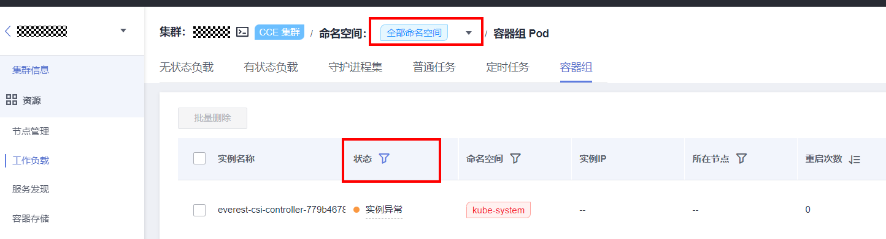
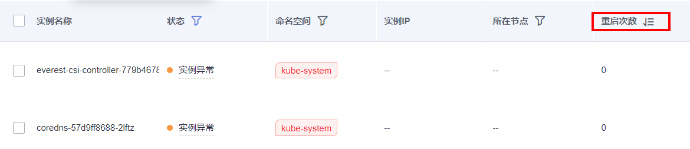

# 存量Pod检查

## 检查项内容

-   检查集群中是否的存在状态非预期的Pod
-   检查集群中的Pod是否异常重启

## 检查步骤

请您登陆CCE控制台，在“资源-\>工作负载-\>容器组”处选择全部命名空间，点击“状态”，过滤并观察是否存在异常状态的Pod。

查看“重启次数”栏目，观察是否存在异常重启的Pod。

## 解决方案

若集群升级后您的集群有异常Pod，请联系技术支持人员。

