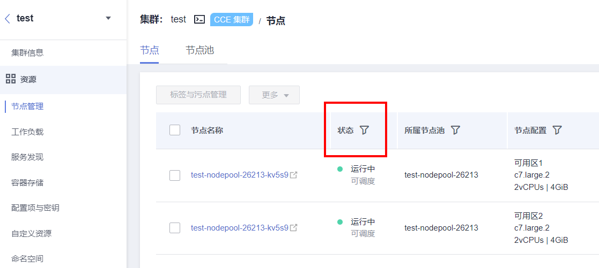

# 存量节点与容器网络检查

## 检查项内容

-   检查存量节点是否运行正常
-   检查存量节点的网络是否运行正常
-   检查存量容器的网络是否运行正常

## 检查步骤

节点组件异常或节点网络异常，均会反映在节点状态上。

请登录CCE控制台，前往“资源-\>节点管理”处查看节点状态，检查是否有处于异常状态的节点，可通过状态栏过滤。

容器网络异常会反映在业务上，请检查您的业务是否运行正常。

## 解决方案

若节点状态异常，请联系技术支持人员。

若容器网络异常，并影响了您的业务，请联系技术支持人员，并同步确认当前异常的网络访问路径。

<table><thead align="left"><tr id="row11101624195016"><th class="cellrowborder" valign="top" width="25%" id="mcps1.1.5.1.1">
源端

</th>
<th class="cellrowborder" valign="top" width="25%" id="mcps1.1.5.1.2">
目的端

</th>
<th class="cellrowborder" valign="top" width="25%" id="mcps1.1.5.1.3">
目的端类型

</th>
<th class="cellrowborder" valign="top" width="25%" id="mcps1.1.5.1.4">
可能故障

</th>
</tr>
</thead>
<tbody><tr id="row3110152410501"><td class="cellrowborder" rowspan="14" valign="top" width="25%" headers="mcps1.1.5.1.1 "><ul id="ul16651458125219"><li>集群内Pod</li><li>集群内节点</li><li>集群外同VPC下节点</li><li>华为云外</li></ul>

</td>
<td class="cellrowborder" valign="top" width="25%" headers="mcps1.1.5.1.2 ">
Service ELB 公网IP

</td>
<td class="cellrowborder" valign="top" width="25%" headers="mcps1.1.5.1.3 ">
集群流量负载均衡入口

</td>
<td class="cellrowborder" valign="top" width="25%" headers="mcps1.1.5.1.4 ">
未有记录

</td>
</tr>
<tr id="row31101924195015"><td class="cellrowborder" valign="top" headers="mcps1.1.5.1.1 ">
Service ELB 私网IP

</td>
<td class="cellrowborder" valign="top" headers="mcps1.1.5.1.2 ">
集群流量负载均衡入口

</td>
<td class="cellrowborder" valign="top" headers="mcps1.1.5.1.3 ">
未有记录

</td>
</tr>
<tr id="row9110132455013"><td class="cellrowborder" valign="top" headers="mcps1.1.5.1.1 ">
Ingress ELB 公网IP

</td>
<td class="cellrowborder" valign="top" headers="mcps1.1.5.1.2 ">
集群流量负载均衡入口

</td>
<td class="cellrowborder" valign="top" headers="mcps1.1.5.1.3 ">
未有记录

</td>
</tr>
<tr id="row2011182418507"><td class="cellrowborder" valign="top" headers="mcps1.1.5.1.1 ">
Ingress ELB 私网IP

</td>
<td class="cellrowborder" valign="top" headers="mcps1.1.5.1.2 ">
集群流量负载均衡入口

</td>
<td class="cellrowborder" valign="top" headers="mcps1.1.5.1.3 ">
未有记录

</td>
</tr>
<tr id="row1311116248504"><td class="cellrowborder" valign="top" headers="mcps1.1.5.1.1 ">
Service Node Port 公网IP

</td>
<td class="cellrowborder" valign="top" headers="mcps1.1.5.1.2 ">
集群流量入口

</td>
<td class="cellrowborder" valign="top" headers="mcps1.1.5.1.3 ">
kube proxy配置覆盖，该故障已在升级流程适配

</td>
</tr>
<tr id="row31111224115015"><td class="cellrowborder" valign="top" headers="mcps1.1.5.1.1 ">
Service Node Port 私网IP

</td>
<td class="cellrowborder" valign="top" headers="mcps1.1.5.1.2 ">
集群流量入口

</td>
<td class="cellrowborder" valign="top" headers="mcps1.1.5.1.3 ">
未有记录

</td>
</tr>
<tr id="row151114244503"><td class="cellrowborder" valign="top" headers="mcps1.1.5.1.1 ">
Service Cluster IP

</td>
<td class="cellrowborder" valign="top" headers="mcps1.1.5.1.2 ">
Service网络平面

</td>
<td class="cellrowborder" valign="top" headers="mcps1.1.5.1.3 ">
未有记录

</td>
</tr>
<tr id="row1311172419507"><td class="cellrowborder" valign="top" headers="mcps1.1.5.1.1 ">
非Service NodePort 节点端口

</td>
<td class="cellrowborder" valign="top" headers="mcps1.1.5.1.2 ">
节点容器网络

</td>
<td class="cellrowborder" valign="top" headers="mcps1.1.5.1.3 ">
未有记录

</td>
</tr>
<tr id="row1611112247507"><td class="cellrowborder" valign="top" headers="mcps1.1.5.1.1 ">
跨节点Pod

</td>
<td class="cellrowborder" valign="top" headers="mcps1.1.5.1.2 ">
容器网络平面

</td>
<td class="cellrowborder" valign="top" headers="mcps1.1.5.1.3 ">
未有记录

</td>
</tr>
<tr id="row511116242508"><td class="cellrowborder" valign="top" headers="mcps1.1.5.1.1 ">
同节点Pod

</td>
<td class="cellrowborder" valign="top" headers="mcps1.1.5.1.2 ">
容器网络平面

</td>
<td class="cellrowborder" valign="top" headers="mcps1.1.5.1.3 ">
未有记录

</td>
</tr>
<tr id="row211162416502"><td class="cellrowborder" valign="top" headers="mcps1.1.5.1.1 ">
Service域名、Pod域名等，基于CoreDNS解析

</td>
<td class="cellrowborder" valign="top" headers="mcps1.1.5.1.2 ">
域名解析

</td>
<td class="cellrowborder" valign="top" headers="mcps1.1.5.1.3 ">
未有记录

</td>
</tr>
<tr id="row10111824105013"><td class="cellrowborder" valign="top" headers="mcps1.1.5.1.1 ">
外部网站域名，基于CoreDNS hosts配置解析

</td>
<td class="cellrowborder" valign="top" headers="mcps1.1.5.1.2 ">
域名解析

</td>
<td class="cellrowborder" valign="top" headers="mcps1.1.5.1.3 ">
coredns插件升级后配置被覆盖，该故障已在插件升级流程适配

</td>
</tr>
<tr id="row1611112425018"><td class="cellrowborder" valign="top" headers="mcps1.1.5.1.1 ">
外部网站域名，基于CoreDNS 上游服务器解析

</td>
<td class="cellrowborder" valign="top" headers="mcps1.1.5.1.2 ">
域名解析

</td>
<td class="cellrowborder" valign="top" headers="mcps1.1.5.1.3 ">
coredns插件升级后配置被覆盖，该故障已在插件升级流程适配

</td>
</tr>
<tr id="row161111524125011"><td class="cellrowborder" valign="top" headers="mcps1.1.5.1.1 ">
外部网站域名，不通过CoreDNS解析

</td>
<td class="cellrowborder" valign="top" headers="mcps1.1.5.1.2 ">
域名解析

</td>
<td class="cellrowborder" valign="top" headers="mcps1.1.5.1.3 ">
未有记录

</td>
</tr>
</tbody>
</table>

