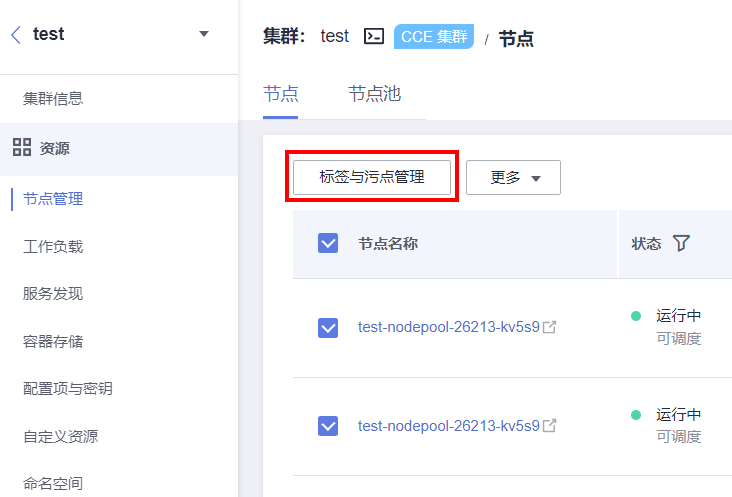

# 存量节点标签与污点检查

## 检查项内容

-   检查标签是否丢失
-   检查是否有异常新增的污点

## 检查步骤

请登录CCE控制台，前往“资源-\>节点管理-\>节点”，勾选所有节点后，单击“标签与污点管理”，查看目前节点的标签与污点。

## 解决方案

集群升级过程中不改变用户的标签，若您发现标签丢失或异常新增，请联系技术支持人员。

若您发现节点新增污点（node.kubernetes.io/upgrade），该节点可能为升级过程中跳过的节点，请参照[重置跳过节点检查](重置跳过节点检查.md)处理。

若您发现节点新增其他污点，请联系技术人员支持。

