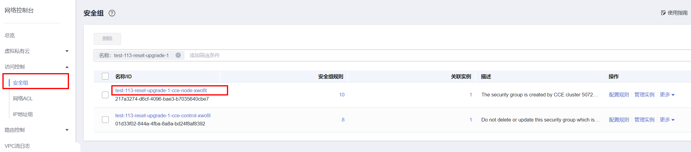
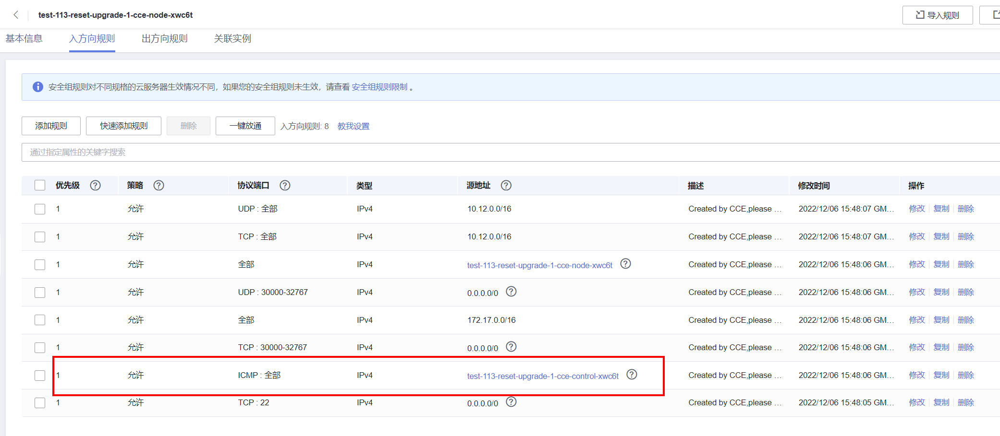
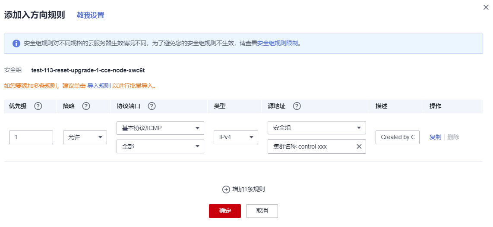

# 安全组检查

## 检查项内容

检查当前用户节点安全组是否允许Master节点使用ICMP协议访问节点。

## 解决方案

请登录VPC控制台，前往“访问控制-\>安全组”，在搜索框内输入集群名称，此时预期过滤出两个安全组：

-   安全组名称为“集群名称-node-xxx”，此安全组关联CCE用户节点。
-   安全组名称为“集群名称-control-xxx”，此安全组关联CCE控制节点。

单击node用户节点安全组，确保含有如下规则允许Master节点使用**ICMP协议**访问节点。

若不含有该规则请为node安全组添加该放通规则，源地址选择control安全组，描述信息为"Created by CCE,please don't modify! Used by the master node to access the worker node."。

