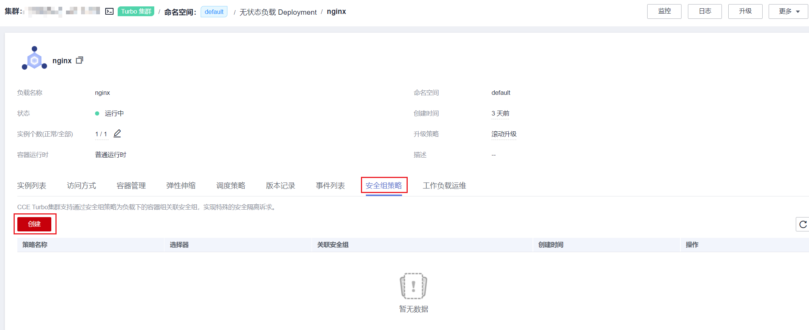

# 安全组策略（SecurityGroup）<a name="cce_10_0288"></a>

云原生网络2.0网络模式下，Pod使用的是VPC的弹性网卡/辅助弹性网卡，可直接绑定安全组，绑定弹性公网IP。为方便用户在CCE内直接为Pod关联安全组，CCE新增了一个名为SecurityGroup的自定义资源对象，通过SecurityGroup资源对象，用户可对有特定安全隔离诉求的工作负载的工作进行自定义。

## 约束与限制<a name="section21791218165310"></a>

-   v1.19及以上的CCE Turbo集群支持此功能，v1.19以下版本CCE Turbo集群需要升级到v1.19及以上版本后才能启用此功能。
-   1个工作负载最多可绑定5个安全组。

## 通过界面创建<a name="section11870154492516"></a>

1.  登录CCE控制台，单击集群名称，进入集群。
2.  在左侧选择“工作负载”，单击工作负载名称。
3.  在“安全组策略“页签下，单击“创建“。

    

4.  根据界面提示，配置参数， 具体如[表1](#table572616321913)所示。

    **表 1**  配置参数

    <a name="table572616321913"></a>
    <table><thead align="left"><tr id="row207274322093"><th class="cellrowborder" valign="top" width="27.49274927492749%" id="mcps1.2.4.1.1"><p id="p77276326911"><a name="p77276326911"></a><a name="p77276326911"></a>参数名称</p>
    </th>
    <th class="cellrowborder" valign="top" width="38.943894389438945%" id="mcps1.2.4.1.2"><p id="p0728113212917"><a name="p0728113212917"></a><a name="p0728113212917"></a>描述</p>
    </th>
    <th class="cellrowborder" valign="top" width="33.563356335633564%" id="mcps1.2.4.1.3"><p id="p1372820323916"><a name="p1372820323916"></a><a name="p1372820323916"></a>示例</p>
    </th>
    </tr>
    </thead>
    <tbody><tr id="row1772883218911"><td class="cellrowborder" valign="top" width="27.49274927492749%" headers="mcps1.2.4.1.1 "><p id="p1972843218919"><a name="p1972843218919"></a><a name="p1972843218919"></a>安全组策略名称</p>
    </td>
    <td class="cellrowborder" valign="top" width="38.943894389438945%" headers="mcps1.2.4.1.2 "><p id="p1272819324915"><a name="p1272819324915"></a><a name="p1272819324915"></a>输入安全组策略名称。</p>
    <p id="p4881951142411"><a name="p4881951142411"></a><a name="p4881951142411"></a>请输入1-63个字符，以小写字母开头，由小写字母、数字、连接符（-）组成，且不能以连接符（-）结尾。</p>
    </td>
    <td class="cellrowborder" valign="top" width="33.563356335633564%" headers="mcps1.2.4.1.3 "><p id="p972814326910"><a name="p972814326910"></a><a name="p972814326910"></a>security-group</p>
    </td>
    </tr>
    <tr id="row18733153211911"><td class="cellrowborder" valign="top" width="27.49274927492749%" headers="mcps1.2.4.1.1 "><p id="p187338321199"><a name="p187338321199"></a><a name="p187338321199"></a>关联安全组</p>
    </td>
    <td class="cellrowborder" valign="top" width="38.943894389438945%" headers="mcps1.2.4.1.2 "><p id="p1328632118575"><a name="p1328632118575"></a><a name="p1328632118575"></a>选中的安全组将绑定到选中的工作负载的弹性网卡/辅助弹性网卡上，在下拉框中最多可以选择5条，安全组必选，不可缺省。</p>
    <p id="p147335320917"><a name="p147335320917"></a><a name="p147335320917"></a>如将绑定的安全组未创建，可单击“创建安全组”，完成创建后单击刷新按钮。</p>
    <div class="notice" id="note1159255716127"><a name="note1159255716127"></a><a name="note1159255716127"></a><span class="noticetitle"> 须知： </span><div class="noticebody"><a name="ul1543718137385"></a><a name="ul1543718137385"></a><ul id="ul1543718137385"><li>最多可选择5个安全组。</li><li>鼠标悬浮在安全组名称旁的<a name="image1788617020404"></a><a name="image1788617020404"></a><span></span>图标上，可查看安全组的详细信息。</li></ul>
    </div></div>
    </td>
    <td class="cellrowborder" valign="top" width="33.563356335633564%" headers="mcps1.2.4.1.3 "><p id="p62971643205712"><a name="p62971643205712"></a><a name="p62971643205712"></a>64566556-bd6f-48fb-b2c6-df8f44617953</p>
    <p id="p109894523576"><a name="p109894523576"></a><a name="p109894523576"></a>5451f1b0-bd6f-48fb-b2c6-df8f44617953</p>
    </td>
    </tr>
    </tbody>
    </table>

5.  参数配置后，单击“确定”。

    创建完成后页面将自动返回到安全组策略列表页，可以看到新添加的安全组策略已在列表中。


## 通过kubectl命令行创建<a name="section16951511152313"></a>

1.  请参见[通过kubectl连接集群](通过kubectl连接集群.md)，使用kubectl连接集群。
2.  创建一个名为securitygroup-demo.yaml的描述文件。

    **vi securitygroup-demo.yaml**

    例如，用户创建如下的SecurityGroup资源对象，给所有的app：nginx工作负载绑定上提前已经创建的64566556-bd6f-48fb-b2c6-df8f44617953，5451f1b0-bd6f-48fb-b2c6-df8f44617953的两个安全组。示例如下：

    ```
    apiVersion: crd.yangtse.cni/v1
    kind: SecurityGroup
    metadata:
      name: demo
      namespace: default
    spec:
      podSelector:
        matchLabels:
          app: nginx    
      securityGroups:
      - id: 64566556-bd6f-48fb-b2c6-df8f44617953
      - id: 5451f1b0-bd6f-48fb-b2c6-df8f44617953
    ```

    以上yaml参数说明如[表2](#table132326831016)。

    **表 2**  参数说明

    <a name="table132326831016"></a>
    <table><thead align="left"><tr id="row523318817104"><th class="cellrowborder" valign="top" width="36.75%" id="mcps1.2.4.1.1"><p id="p162344817100"><a name="p162344817100"></a><a name="p162344817100"></a>字段名称</p>
    </th>
    <th class="cellrowborder" valign="top" width="47.25%" id="mcps1.2.4.1.2"><p id="p16234138161012"><a name="p16234138161012"></a><a name="p16234138161012"></a>字段说明</p>
    </th>
    <th class="cellrowborder" valign="top" width="16%" id="mcps1.2.4.1.3"><p id="p102881159151016"><a name="p102881159151016"></a><a name="p102881159151016"></a>必选/可选</p>
    </th>
    </tr>
    </thead>
    <tbody><tr id="row112346841018"><td class="cellrowborder" valign="top" width="36.75%" headers="mcps1.2.4.1.1 "><p id="p182345811107"><a name="p182345811107"></a><a name="p182345811107"></a>apiVersion</p>
    </td>
    <td class="cellrowborder" valign="top" width="47.25%" headers="mcps1.2.4.1.2 "><p id="p2023458141014"><a name="p2023458141014"></a><a name="p2023458141014"></a>表示API的版本号，版本号为crd.yangtse.cni/v1。</p>
    </td>
    <td class="cellrowborder" valign="top" width="16%" headers="mcps1.2.4.1.3 "><p id="p6234158101019"><a name="p6234158101019"></a><a name="p6234158101019"></a>必选</p>
    </td>
    </tr>
    <tr id="row202347814100"><td class="cellrowborder" valign="top" width="36.75%" headers="mcps1.2.4.1.1 "><p id="p172342815109"><a name="p172342815109"></a><a name="p172342815109"></a>kind</p>
    </td>
    <td class="cellrowborder" valign="top" width="47.25%" headers="mcps1.2.4.1.2 "><p id="p142346871019"><a name="p142346871019"></a><a name="p142346871019"></a>创建的对象类别。</p>
    </td>
    <td class="cellrowborder" valign="top" width="16%" headers="mcps1.2.4.1.3 "><p id="p2023416841019"><a name="p2023416841019"></a><a name="p2023416841019"></a>必选</p>
    </td>
    </tr>
    <tr id="row1459172931315"><td class="cellrowborder" valign="top" width="36.75%" headers="mcps1.2.4.1.1 "><p id="p1659232941311"><a name="p1659232941311"></a><a name="p1659232941311"></a>metadata</p>
    </td>
    <td class="cellrowborder" valign="top" width="47.25%" headers="mcps1.2.4.1.2 "><p id="p165932298137"><a name="p165932298137"></a><a name="p165932298137"></a>资源对象的元数据定义。</p>
    </td>
    <td class="cellrowborder" valign="top" width="16%" headers="mcps1.2.4.1.3 "><p id="p16593112941310"><a name="p16593112941310"></a><a name="p16593112941310"></a>必选</p>
    </td>
    </tr>
    <tr id="row33638545115"><td class="cellrowborder" valign="top" width="36.75%" headers="mcps1.2.4.1.1 "><p id="p036575412114"><a name="p036575412114"></a><a name="p036575412114"></a>name</p>
    </td>
    <td class="cellrowborder" valign="top" width="47.25%" headers="mcps1.2.4.1.2 "><p id="p1036510541116"><a name="p1036510541116"></a><a name="p1036510541116"></a>SecurityGroup的名称。</p>
    </td>
    <td class="cellrowborder" valign="top" width="16%" headers="mcps1.2.4.1.3 "><p id="p1936585415110"><a name="p1936585415110"></a><a name="p1936585415110"></a>必选</p>
    </td>
    </tr>
    <tr id="row126231712194217"><td class="cellrowborder" valign="top" width="36.75%" headers="mcps1.2.4.1.1 "><p id="p1692614369427"><a name="p1692614369427"></a><a name="p1692614369427"></a>namespace</p>
    </td>
    <td class="cellrowborder" valign="top" width="47.25%" headers="mcps1.2.4.1.2 "><p id="p7625512194216"><a name="p7625512194216"></a><a name="p7625512194216"></a>工作空间名称。</p>
    </td>
    <td class="cellrowborder" valign="top" width="16%" headers="mcps1.2.4.1.3 "><p id="p142617117439"><a name="p142617117439"></a><a name="p142617117439"></a>必选</p>
    </td>
    </tr>
    <tr id="row52341382109"><td class="cellrowborder" valign="top" width="36.75%" headers="mcps1.2.4.1.1 "><p id="p2234188171017"><a name="p2234188171017"></a><a name="p2234188171017"></a>spec</p>
    </td>
    <td class="cellrowborder" valign="top" width="47.25%" headers="mcps1.2.4.1.2 "><p id="p1023414811012"><a name="p1023414811012"></a><a name="p1023414811012"></a>用户对SecurityGroup的详细描述的主体部分都在spec中给出。</p>
    </td>
    <td class="cellrowborder" valign="top" width="16%" headers="mcps1.2.4.1.3 "><p id="p92341186101"><a name="p92341186101"></a><a name="p92341186101"></a>必选</p>
    </td>
    </tr>
    <tr id="row29372135139"><td class="cellrowborder" valign="top" width="36.75%" headers="mcps1.2.4.1.1 "><p id="p1493821315132"><a name="p1493821315132"></a><a name="p1493821315132"></a>podSelector</p>
    </td>
    <td class="cellrowborder" valign="top" width="47.25%" headers="mcps1.2.4.1.2 "><p id="p10938171341312"><a name="p10938171341312"></a><a name="p10938171341312"></a>定义SecurityGroup中需要关联安全组的工作负载。</p>
    </td>
    <td class="cellrowborder" valign="top" width="16%" headers="mcps1.2.4.1.3 "><p id="p5939181320135"><a name="p5939181320135"></a><a name="p5939181320135"></a>必选</p>
    </td>
    </tr>
    <tr id="row69398139139"><td class="cellrowborder" valign="top" width="36.75%" headers="mcps1.2.4.1.1 "><p id="p14452947144819"><a name="p14452947144819"></a><a name="p14452947144819"></a>securityGroups</p>
    </td>
    <td class="cellrowborder" valign="top" width="47.25%" headers="mcps1.2.4.1.2 "><p id="p10939121391317"><a name="p10939121391317"></a><a name="p10939121391317"></a>id为安全组的ID。</p>
    </td>
    <td class="cellrowborder" valign="top" width="16%" headers="mcps1.2.4.1.3 "><p id="p4939161321314"><a name="p4939161321314"></a><a name="p4939161321314"></a>必选</p>
    </td>
    </tr>
    </tbody>
    </table>

3.  执行以下命令，创建SecurityGroup。

    **kubectl create -f securitygroup-demo.yaml**

    回显如下表示已开始创建SecurityGroup

    ```
    securitygroup.crd.yangtse.cni/demo created
    ```

4.  执行以下命令，查看SecurityGroup。

    **kubectl get sg**

    回显信息中有创建的SecurityGroup名称为demo，表示SecurityGroup已创建成功。

    ```
    NAME                       POD-SELECTOR                      AGE
    all-no                     map[matchLabels:map[app:nginx]]   4h1m
    s001test                   map[matchLabels:map[app:nginx]]   19m
    demo                       map[matchLabels:map[app:nginx]]   2m9s
    ```


