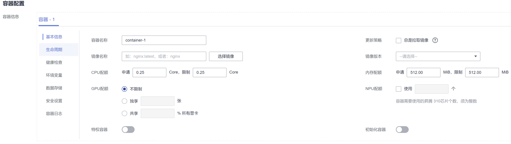

# 容器基本信息

工作负载是Kubernetes对一组Pod的抽象模型，用于描述业务的运行载体，一个Pod可以封装1个或多个容器，您可以单击右上方的“添加容器”，添加多个容器镜像并分别进行设置。

**表 1**  镜像参数说明

<table><thead align="left"><tr id="row0282348486"><th class="cellrowborder" valign="top" width="23%" id="mcps1.2.3.1.1">
参数

</th>
<th class="cellrowborder" valign="top" width="77%" id="mcps1.2.3.1.2">
说明

</th>
</tr>
</thead>
<tbody><tr id="row109911651125414"><td class="cellrowborder" valign="top" width="23%" headers="mcps1.2.3.1.1 ">
容器名称

</td>
<td class="cellrowborder" valign="top" width="77%" headers="mcps1.2.3.1.2 ">
为容器命名。

</td>
</tr>
<tr id="row1844916557597"><td class="cellrowborder" valign="top" width="23%" headers="mcps1.2.3.1.1 ">
镜像名称

</td>
<td class="cellrowborder" valign="top" width="77%" headers="mcps1.2.3.1.2 ">
单击后方“选择镜像”，选择容器使用的镜像。

如果需要使用第三方镜像，请参见<a href="如何使用第三方镜像.md">如何使用第三方镜像</a>。

</td>
</tr>
<tr id="row338117362515"><td class="cellrowborder" valign="top" width="23%" headers="mcps1.2.3.1.1 ">
镜像版本

</td>
<td class="cellrowborder" valign="top" width="77%" headers="mcps1.2.3.1.2 ">
选择需要部署的镜像版本。

</td>
</tr>
<tr id="row164532054153718"><td class="cellrowborder" valign="top" width="23%" headers="mcps1.2.3.1.1 ">
更新策略

</td>
<td class="cellrowborder" valign="top" width="77%" headers="mcps1.2.3.1.2 ">
镜像更新/拉取策略。可以勾选“总是拉取镜像”，表示每次都从镜像仓库拉取镜像；如不勾选则优使用节点已有的镜像，如果没有这个镜像再从镜像仓库拉取。

</td>
</tr>
<tr id="row161110459565"><td class="cellrowborder" valign="top" width="23%" headers="mcps1.2.3.1.1 ">
CPU配额

</td>
<td class="cellrowborder" valign="top" width="77%" headers="mcps1.2.3.1.2 "><ul id="ul9168521572"><li>申请：容器需要使用的最小CPU值，默认0.25Core。</li><li>限制：允许容器使用的CPU最大值。建议设容器配额的最高限额，避免容器资源超额导致系统故障。</li></ul>
</td>
</tr>
<tr id="row1119234316562"><td class="cellrowborder" valign="top" width="23%" headers="mcps1.2.3.1.1 ">
内存配额

</td>
<td class="cellrowborder" valign="top" width="77%" headers="mcps1.2.3.1.2 "><ul id="ul177605101578"><li>申请：容器需要使用的内存最小值，默认512MiB。</li><li>限制：允许容器使用的内存最大值。如果超过，容器会被终止。</li></ul>

申请和限制的具体请参见<a href="设置容器规格.md">设置容器规格</a>。

</td>
</tr>
<tr id="row272852945719"><td class="cellrowborder" valign="top" width="23%" headers="mcps1.2.3.1.1 ">
GPU配额

</td>
<td class="cellrowborder" valign="top" width="77%" headers="mcps1.2.3.1.2 ">
当集群中包含GPU节点时，才能设置GPU，无GPU节点不显示此选项。

<ul id="ul19823440122219"><li>不限制：表示不使用GPU。</li><li>独享：单个容器独享GPU。</li><li>共享：容器需要使用的GPU百分比，例如设置为10%，表示该容器需使用GPU资源的10%。</li></ul>
</td>
</tr>
<tr id="row4517938113"><td class="cellrowborder" valign="top" width="23%" headers="mcps1.2.3.1.1 ">
NPU配额

</td>
<td class="cellrowborder" valign="top" width="77%" headers="mcps1.2.3.1.2 ">
使用NPU芯片（昇腾D310）的数量，必须为整数。

必须安装NPU插件后才能使用。

</td>
</tr>
<tr id="row1449911299503"><td class="cellrowborder" valign="top" width="23%" headers="mcps1.2.3.1.1 ">
特权容器

</td>
<td class="cellrowborder" valign="top" width="77%" headers="mcps1.2.3.1.2 ">
特权容器是指容器里面的程序具有一定的特权。

若选中，容器将获得超级权限，例如可以操作宿主机上面的网络设备、修改内核参数等。

</td>
</tr>
<tr id="row152831345485"><td class="cellrowborder" valign="top" width="23%" headers="mcps1.2.3.1.1 ">
初始化容器

</td>
<td class="cellrowborder" valign="top" width="77%" headers="mcps1.2.3.1.2 ">
选择容器是否作为初始化容器。

Init 容器是一种特殊容器，在 Pod 内的应用容器启动之前运行。详细说明请参见<a href="https://kubernetes.io/zh/docs/concepts/workloads/pods/init-containers/" target="_blank" rel="noopener noreferrer">Init 容器</a>。

</td>
</tr>
</tbody>
</table>

