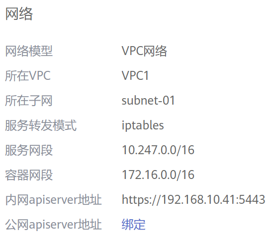
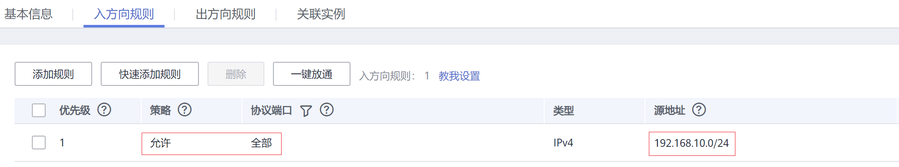
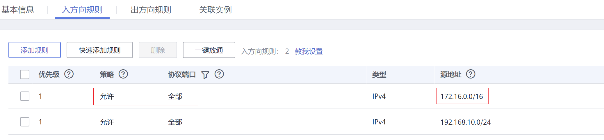

# 容器如何访问VPC内部网络<a name="cce_faq_00103"></a>

前面章节介绍了使用Service和Ingress访问容器，本节将介绍如何从容器访问内部网络（**VPC内集群外**），包括VPC内访问和跨VPC访问。

## VPC内访问<a name="section1940319933"></a>

根据集群容器网络模型不同，从容器访问内部网络有不同表现。

-   **容器隧道网络**

    容器隧道网络在节点网络基础上通过隧道封装网络数据包，容器访问同VPC下其他资源时，只要节点能访问通，容器就能访问通。如果访问不通，需要确认对端资源的安全组配置是否能够允许容器所在节点访问。

-   **云原生网络2.0**

    云原生网络2.0模型下，容器直接从VPC网段内分配IP地址，容器网段是节点所在VPC的子网，容器与VPC内其他地址天然能够互通。如果访问不通，需要确认对端资源的安全组配置是否能够允许容器网段访问。

-   **VPC网络**

    VPC网络使用了VPC路由功能来转发容器的流量，容器网段与节点VPC不在同一个网段，容器访问同VPC下其他资源时，**需要对端资源的安全组能够允许容器网段访问**。

    例如如下集群，集群节点所在网段为192.168.10.0/24，容器网段为172.16.0.0/16。

    

    VPC下（集群外）有一个地址为192.168.10.52的ECS，其安全组规则仅允许集群节点的IP网段访问。

    

    此时如果从容器中ping 192.168.10.52，会发现无法ping通。

    ```
    kubectl exec test01-6cbbf97b78-krj6h  -it -- /bin/sh
    / # ping 192.168.10.25
    PING 192.168.10.25 (192.168.10.25): 56 data bytes
    ^C
    --- 192.168.10.25 ping statistics ---
    104 packets transmitted, 0 packets received, 100% packet loss
    ```

    在安全组放通容器网段172.16.0.0/16访问。

    

    此时再从容器中ping 192.168.10.52，会发现可以ping通。

    ```
    $ kubectl exec test01-6cbbf97b78-krj6h  -it -- /bin/sh
    / # ping 192.168.10.25
    PING 192.168.10.25 (192.168.10.25): 56 data bytes
    64 bytes from 192.168.10.25: seq=0 ttl=64 time=1.412 ms
    64 bytes from 192.168.10.25: seq=1 ttl=64 time=1.400 ms
    64 bytes from 192.168.10.25: seq=2 ttl=64 time=1.299 ms
    64 bytes from 192.168.10.25: seq=3 ttl=64 time=1.283 ms
    ^C
    --- 192.168.10.25 ping statistics ---
    4 packets transmitted, 4 packets received, 0% packet loss
    ```


## 跨VPC访问<a name="section44190754210"></a>

跨VPC访问通常采用对等连接等方法打通VPC。

-   容器隧道网络只需将节点网络域对端VPC打通，容器自然就能访问对端VPC。
-   云原生网络2.0与容器隧道网络类似，将容器所在子网网段与对端VPC打通即可。
-   VPC网络由于容器网段独立，所以**打通时不能忘记容器网段**，否则容器无法访问对端VPC。

## 访问其他云服务<a name="section1787164484211"></a>

与CCE进行内网通信的与服务常见服务有：RDS、DCS、Kafka、RabbitMQ、ModelArts等。

访问其他云服务除了上面所说的[VPC内访问](#section1940319933)和[跨VPC访问](#section44190754210)的网络配置外，还**需要关注所访问的云服务是否允许外部访问**，如DCS的Redis实例，需要添加白名单才允许访问。通常这些云服务会允许同VPC下IP访问，但是VPC网络模型下容器网段与VPC网段不同，需要特殊处理，将容器网段加入到白名单中。

## 容器访问内网不通的定位方法<a name="section481075910302"></a>

如前所述，从容器中访问内部网络不通的情况可以按如下路径排查：

1.  查看要访问的对端服务器安全组规则，确认是否允许容器访问。
    -   容器隧道网络模型需要放通容器所在节点的IP地址
    -   VPC网络模型需要放通容器网段
    -   云原生网络2.0需要放通容器所在子网网段

2.  查看要访问的对端服务器是否设置了白名单，如DCS的Redis实例，需要添加白名单才允许访问。添加容器和节点网段到白名单后可解决问题。
3.  查看要访问的对端服务器上是否安装了容器引擎，是否存在与CCE中容器网段冲突的情况。如果有网络冲突，会导致无法访问。

