# 容器应用从SFS 1.0迁移到SFS 3.0或SFS Turbo<a name="cce_10_0429"></a>

弹性文件服务（SFS）提供了SFS 容量型、SFS 3.0容量型和SFS Turbo三种类型的文件系统，关于各类型文件系统的特点和优势请参见[文件系统类型](https://support.huaweicloud.com/productdesc-sfs/sfs_01_0005.html)。

历史版本中，CCE支持在工作负载中挂载SFS 1.0，建议迁移至SFS 3.0容量型或SFS Turbo。

根据工作负载类型不同，应用可实现的存储挂载方式也不同。此处动态挂载和静态挂载是从工作负载挂载存储卷的方式进行区分的。

-   动态挂载：仅有状态工作负载支持使用动态挂载，该功能通过[volumeClaimTemplates](https://kubernetes.io/zh-cn/docs/concepts/workloads/controllers/statefulset/#volume-claim-templates)字段实现，并依赖于StorageClass动态创建能力。有状态工作负载通过volumeClaimTemplates字段为每一个Pod关联了一个独有的PVC，而这个PVC又会和对应的PV绑定。因此当Pod被重新调度后，仍然能够根据该PVC名称挂载原有的数据。
-   静态挂载：与动态挂载相对，即工作负载中通过[volumes](https://kubernetes.io/zh-cn/docs/concepts/storage/persistent-volumes/#claims-as-volumes)字段挂载存储卷，所有类型的工作负载均可通过该方法挂载存储。

> **须知：** 
>将容器应用从SFS 1.0迁移到SFS 3.0或SFS Turbo的操作步骤一样，两者区别点仅限于：SFS Turbo不支持动态创建，有状态应用在使用SFS Turbo时会限制“动态挂载”的扩容能力。

## 约束与限制<a name="section21551554192919"></a>

-   您需要提前将SFS 1.0中的数据迁移至SFS 3.0容量型或SFS Turbo，操作步骤请参见[文件系统之间迁移数据](https://support.huaweicloud.com/bestpractice-sfs/sfs_03_0011.html)，必要时请联系SFS服务的客服提供支撑。
-   SFS必须与集群在同一个VPC内。
-   SFS 3.0文件存储当前正在各region逐步上线中，部分region可能还未支持，请您耐心等待。使用SFS 3.0时，集群中需要安装2.0.9及以上版本的everest插件。

## 静态挂载存储的迁移<a name="section9827175814372"></a>

静态挂载存储场景下，即工作负载中通过[volumes](https://kubernetes.io/zh-cn/docs/concepts/storage/persistent-volumes/#claims-as-volumes)字段挂载存储卷，所有类型的工作负载均可通过该方法挂载存储。使用该挂载方法的存储从SFS 1.0迁移到SFS 3.0或SFS Turbo的迁移操作步骤一致，本示例以SFS Turbo为例进行操作。

1.  选择对应的CCE集群，进入“容器存储“界面，在“存储卷“页签下单击右上角“创建存储卷“。

    设置以下参数。

    -   存储卷类型：选择“极速文件存储“。
    -   极速文件存储：选择数据迁移后的极速文件存储卷。
    -   PV名称：自定义PV名称。
    -   访问模式：选择“ReadWriteMany“。
    -   回收策略：选择“Retain“。

    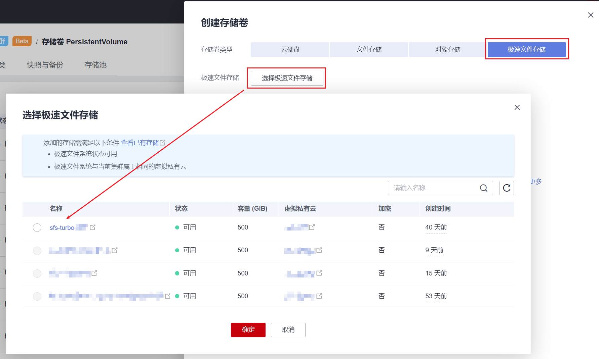

2.  <a name="li1172692513387"></a>PV创建完成后，在“存储卷声明“页签下单击右上角“创建存储卷声明“。

    设置以下参数。

    -   存储卷声明类型：选择“极速文件存储“。
    -   PVC名称：自定义PVC名称，需与原SFS1.0 PVC名称不同。
    -   创建方式：选择“已有存储卷“。
    -   关联存储卷：选择上一步中已创建的存储卷。

    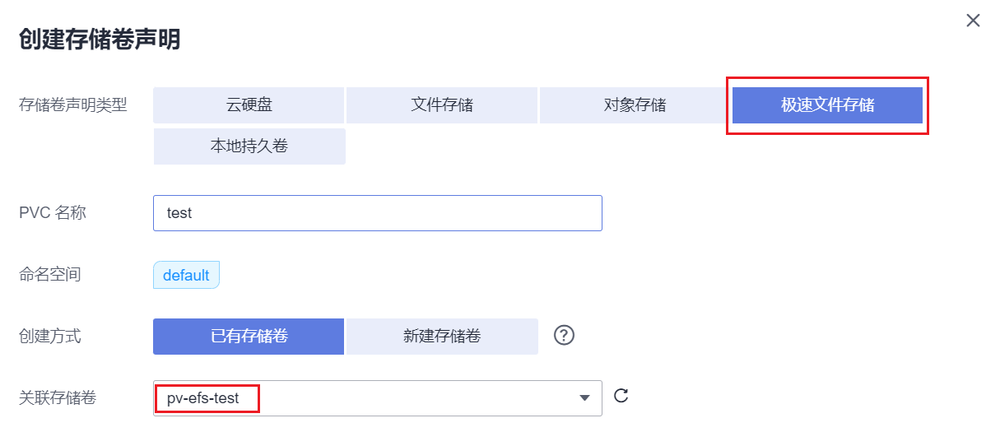

    PVC创建完成后，如下图所示。

    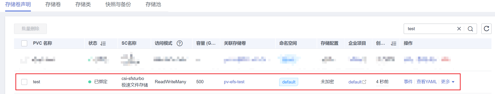

3.  在左侧导航栏中选择“工作负载“，找到目标工作负载，将工作负载实例数需要缩容到0。

    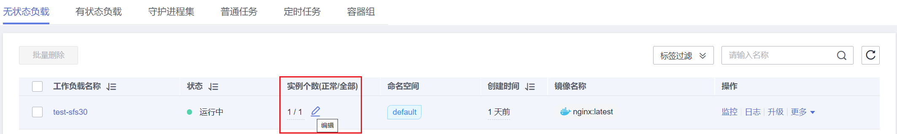

4.  单击工作负载“操作”栏中的“升级”按钮。在“容器配置”中，选择“数据存储”，切换至“存储卷声明PVC”页签，使用[2](#li1172692513387)创建的PVC替换工作负载使用的存储卷声明。

    > **须知：** 
    >迁移后，请保持容器内的挂载路径和子路径与之前挂载SFS1.0时一致。

    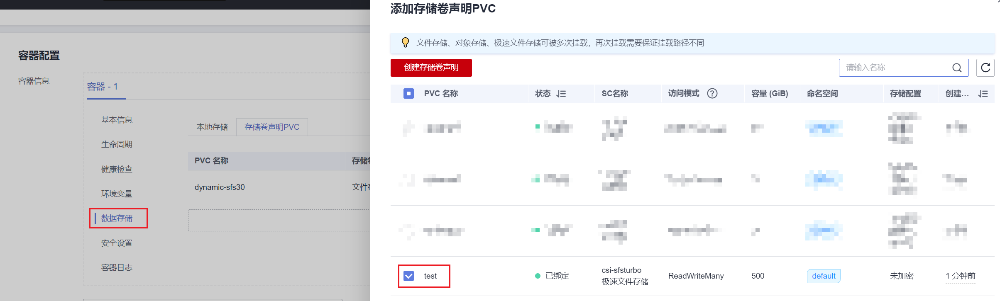

5.  替换完成后，可扩容工作负载实例数。

    确认无问题后，可清理CCE侧的SFS 1.0的存储卷。


## 有状态应用中的动态挂载存储迁移至SFS Turbo<a name="section758505214217"></a>

> **须知：** 
>-   “动态挂载“的自动扩容能力仅有状态应用支持。
>-   由于SFS Turbo不支持动态创建，因此SFS1.0在迁移至SFS Turbo后，该有状态应用不再支持“动态挂载”的自动扩容能力。

1.  在左侧导航栏中选择“工作负载“，切换至“有状态负载“页签，找到目标工作负载，记录缩容前的实例数，并将工作负载实例数需要缩容到0。

    > **说明：** 
    >对每个实例使用的PVC均需要执行步骤[2](#li1263604823614)\~[6](#li11316181193)。

2.  <a name="li1263604823614"></a>单击工作负载名称，在“容器管理\>数据存储”页面查看有状态应用使用PVC的方式。

    -   如使用“动态挂载“，则需继续执行[3](#li213113181193)\~[7](#li21319181397)。
    -   如未使用“动态挂载“，则无需执行以下步骤，请参考[静态挂载存储的迁移](#section9827175814372)。

    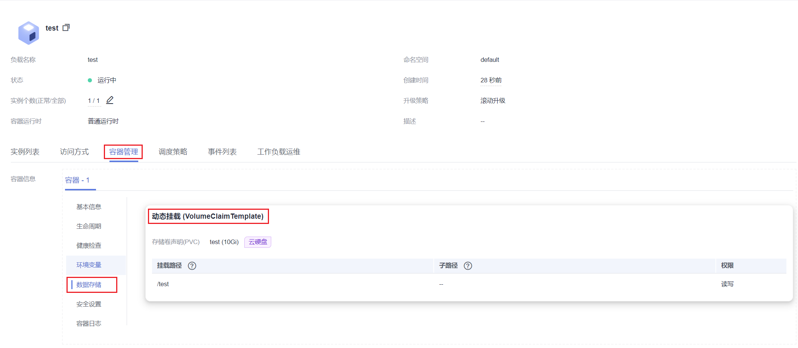

3.  <a name="li213113181193"></a>修改Pod所使用的SFS 1.0类型PVC对应PV的persistentVolumeReclaimPolicy参数，从“Delete“修改为“Retain“，命令如下：

    ```
    kubectl edit pv {pv-name} -n {namespace}
    ```

    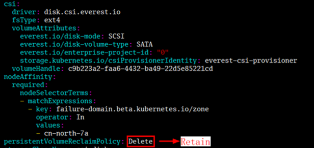

    查看修改结果：

    ```
    kubectl get pv {pv-name} -n {namespace} -o yaml |grep persistentVolumeReclaimPolicy
    ```

    例如：

    ```
     # kubectl get pv pvc-29467e4a-0120-4698-a147-5b75f0ae9a43 -o yaml |grep persistentVolumeReclaimPolicy 
       persistentVolumeReclaimPolicy: Retain 
    ```

4.  <a name="li13131018698"></a>记录SFS1.0 PV对应的PVC名称，并删除该PVC。此时该PV处于“已释放“状态。

    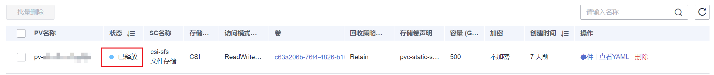

5.  进入“容器存储“界面，在“存储卷“页签下单击右上角“创建存储卷“。

    设置以下参数。

    -   存储卷类型：选择“极速文件存储“。
    -   极速文件存储：选择数据迁移后的极速文件存储卷。
    -   PV名称：自定义PV名称。
    -   访问模式：选择“ReadWriteMany“。
    -   回收策略：选择“Retain“。

    

6.  <a name="li11316181193"></a>进入“容器存储“界面，在“存储卷声明“页签下单击右上角“创建存储卷声明“，创建与[4](#li13131018698)中同名的PVC，并绑定上一步中新建的SFS Turbo PV。

    

7.  <a name="li21319181397"></a>所有实例对应的PVC均迁移后，将有状态应用扩容到原来的实例数。

    确认无问题后，可前往SFS控制台删除对应的SFS 1.0卷，并在CCE控制台中删除SFS 1.0对应的PV。


## 有状态应用中的动态挂载存储迁移SFS 3.0<a name="section1081951144311"></a>

> **须知：** 
>-   “动态挂载“的自动扩容能力仅有状态应用支持。
>-   如有状态应用从SFS 1.0迁移至SFS 3.0，则该有状态应用支持自动扩容能力。

为了让有状态负载在完成SFS 1.0迁移至SFS 3.0后仍支持动态扩容，需将有状态应用中的volumeClaimTemplates使用的存储类从csi-nas修改为csi-sfs。由于使用动态挂载的有状态应用不支持修改volumeClaimTemplates，因此需要先删除有状态应用，然后重建，过程中需要确保配置与迁移前完全一致，包括实例数。

1.  在左侧导航栏中选择“工作负载“，找到目标工作负载，记录缩容前的实例数，将工作负载实例数需要缩容到0。

    > **说明：** 
    >对每个实例使用的PVC均需要执行步骤[2](#li184742741114)\~[6](#li834915245114)。

2.  <a name="li184742741114"></a>单击工作负载名称，在“容器管理\>数据存储”页面查看有状态应用使用PVC的方式。

    -   如使用“动态挂载“，则需继续执行[3](#li213113181193)\~[7](#li21319181397)。
    -   如未使用“动态挂载“，则无需执行以下步骤，请参考[静态挂载存储的迁移](#section9827175814372)。

    

3.  修改SFS 1.0对应PV的persistentVolumeReclaimPolicy参数，从“Delete“修改为“Retain“，命令如下：

    ```
    kubectl edit pv {pv-name} -n {namespace}
    ```

    

    查看修改结果：

    ```
    kubectl get pv {pv-name} -n {namespace} -o yaml |grep persistentVolumeReclaimPolicy
    ```

    例如：

    ```
     # kubectl get pv pvc-29467e4a-0120-4698-a147-5b75f0ae9a43 -o yaml |grep persistentVolumeReclaimPolicy 
       persistentVolumeReclaimPolicy: Retain 
    ```

4.  <a name="li5484876115"></a>记录SFS1.0 PV对应的PVC名称，并删除该PVC。此时该PV处于“已释放“状态。

    

5.  进入“容器存储“界面，在“存储卷“页签下单击右上角“创建存储卷“。

    设置以下参数。

    -   存储卷类型：选择“文件存储“。
    -   文件存储：选择数据迁移后的SFS 3.0存储卷。
    -   PV名称：自定义PV名称。
    -   访问模式：选择“ReadWriteMany“。
    -   回收策略：请按需设置。
        -   Delete：删除动作会将PersistentVolume对象从Kubernetes中移除，同时也会从外部基础设施中移除所关联的存储资产。
        -   Retain：当PersistentVolumeClaim对象被删除时，PersistentVolume卷仍然存在，对应的数据卷被视为“已释放\(released\)”。

    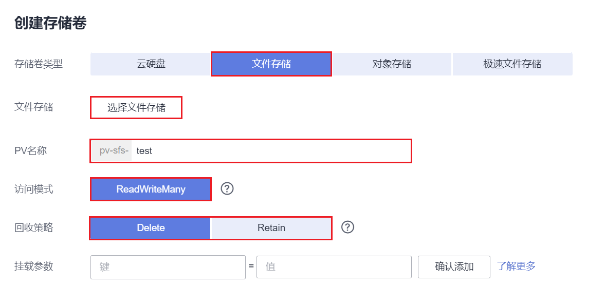

6.  <a name="li834915245114"></a>进入“容器存储“界面，在“存储卷声明“页签下单击右上角“创建存储卷声明“，创建同名的PVC，并绑定上一步中新建的SFS 3.0 PV。

    -   存储卷声明类型：选择“文件存储“。
    -   PVC名称：修改为[4](#li5484876115)中同名的PVC。
    -   创建方式：选择“已有存储卷“。
    -   关联存储卷：选择上一步中已创建的存储卷。

    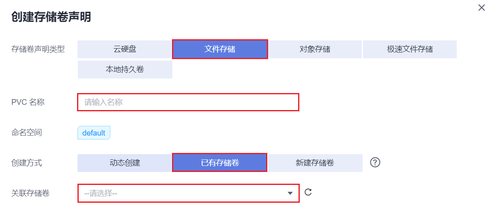

7.  前往“工作负载“页面，查看原来的有状态工作负载，单击“更多\>编辑YAML”，单击“下载”或复制YAML文件的全部内容，在本地进行备份。
8.  删除老的有状态应用，并将上一步复制的工作负载YAML配置进行以下修改：

    -   volumeClaimTemplates字段下的storageClassName: 'csi-nas'修改为'csi-sfs'。
    -   删除"resourceVersion"字段及其参数，因为该字段在创建时不可指定。

    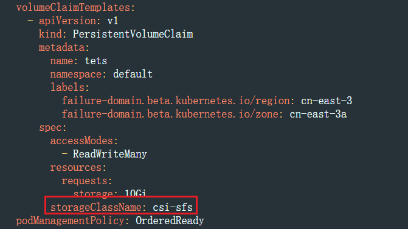

9.  单击右上角的“YAML创建”，单击“导入”或粘贴修改后的YAML文件内容，并单击“创建”。
10. 待工作负载创建完成后，将有状态应用扩容到原来的实例数。

    确认无问题后，可前往SFS控制台删除对应的SFS 1.0卷，并在CCE控制台中删除SFS 1.0对应的PV。


