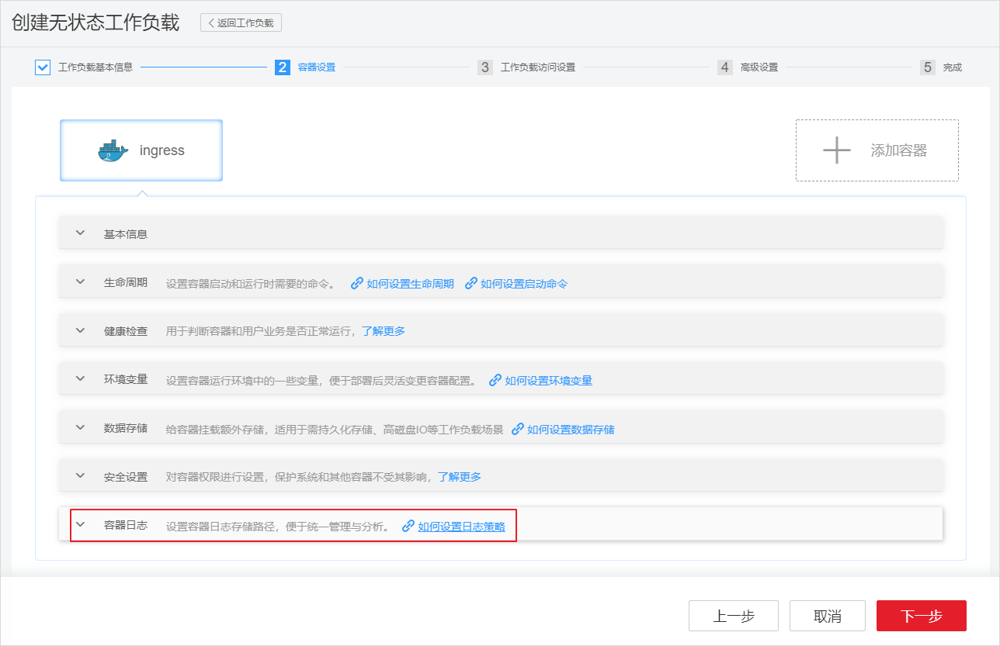
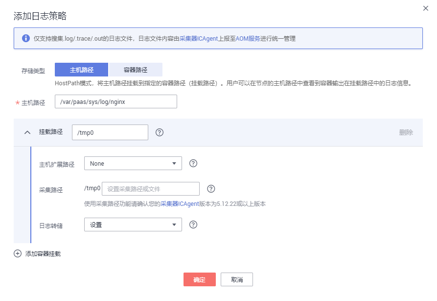

# 容器日志<a name="cce_01_0018"></a>

## 操作场景<a name="section1629125493020"></a>

CCE支持配置工作负载日志策略，便于日志的统一收集、管理和分析，以及按周期防爆处理。

CCE配合AOM收集工作负载的日志，在创建节点时会默认安装AOM的ICAgent（在集群kube-system命名空间下名为icagent的DaemonSet），ICAgent负责收集工作负载的日志并上报到AOM，您可以在CCE控制台和AOM控制台查看工作负载的日志。

-   默认情况下，ICAgent会采集容器的标准输出，您无需做任何设置。
-   您还可以在创建工作负载的时候设置容器日志存储路径，ICAgent会采集该路径下日志。

    容器日志可以选择主机路径和容器路径两种模式。

    -   主机路径：HostPath模式，将主机路径挂载到指定的容器路径（挂载路径）。用户可以在节点的主机路径中查看到容器输出在挂载路径中的日志信息。
    -   容器路径：EmptyDir模式，将节点的临时路径挂载到指定的路径（挂载路径）。临时路径中存在的但暂未被采集器上报到AOM的日志数据在Pod实例删除后会消失。


## 注意事项<a name="section17884754413"></a>

ICAgent只采集\*.log、\*.trace和\*.out类型的文本日志文件。

## 费用说明<a name="section15140651191018"></a>

AOM每月赠送每个账号500M免费日志采集额度，超过免费额度部分将产生费用（[了解计费详情](https://support.huaweicloud.com/productdesc-aom/aom_06_0022.html)）。当前日志使用情况请[点此查看](https://console.huaweicloud.com/aom/#/aom/als/setting)。

## 设置容器日志存储路径<a name="section1951732710"></a>

1.  在CCE中创建[工作负载](创建无状态负载(Deployment)-40.md)时，添加容器后，展开“容器日志”配置区域。

    **图 1**  容器日志<a name="fig9255141895912"></a>  
    

2.  单击“添加日志策略“，设置自定义日志参数，配置日志策略，以nginx为例，不同工作负载根据实际情况配置。

    **图 2**  添加日志策略<a name="fig278622318155"></a>  
    

3.  存储类型有“主机路径“和“容器路径“两种类型可供选择：

    **表 1**  配置日志策略

    <a name="table115901715550"></a>
    <table><thead align="left"><tr id="row45851074554"><th class="cellrowborder" valign="top" width="22.12%" id="mcps1.2.3.1.1"><p id="p115843785517"><a name="p115843785517"></a><a name="p115843785517"></a>参数</p>
    </th>
    <th class="cellrowborder" valign="top" width="77.88000000000001%" id="mcps1.2.3.1.2"><p id="p12584573550"><a name="p12584573550"></a><a name="p12584573550"></a>参数说明</p>
    </th>
    </tr>
    </thead>
    <tbody><tr id="row1458511725510"><td class="cellrowborder" valign="top" width="22.12%" headers="mcps1.2.3.1.1 "><p id="p115855785514"><a name="p115855785514"></a><a name="p115855785514"></a>存储类型</p>
    </td>
    <td class="cellrowborder" valign="top" width="77.88000000000001%" headers="mcps1.2.3.1.2 "><a name="ul76619114518"></a><a name="ul76619114518"></a><ul id="ul76619114518"><li>主机路径：HostPath模式，将主机路径挂载到指定的容器路径（挂载路径）。用户可以在节点的主机路径中查看到容器输出在挂载路径中的日志信息。</li><li>容器路径：EmptyDir模式，将节点的临时路径挂载到指定的路径（挂载路径）。临时路径中存在的但暂未被采集器上报到AOM的日志数据在Pod实例删除后会消失。</li></ul>
    </td>
    </tr>
    <tr id="row75867795518"><td class="cellrowborder" colspan="2" valign="top" headers="mcps1.2.3.1.1 mcps1.2.3.1.2 "><p id="p75869775515"><a name="p75869775515"></a><a name="p75869775515"></a><strong id="b125866775515"><a name="b125866775515"></a><a name="b125866775515"></a>添加容器挂载</strong></p>
    </td>
    </tr>
    <tr id="row1358135034614"><td class="cellrowborder" valign="top" width="22.12%" headers="mcps1.2.3.1.1 "><p id="p1257415611468"><a name="p1257415611468"></a><a name="p1257415611468"></a>*主机路径</p>
    </td>
    <td class="cellrowborder" valign="top" width="77.88000000000001%" headers="mcps1.2.3.1.2 "><p id="p73591502462"><a name="p73591502462"></a><a name="p73591502462"></a>请输入主机的路径，如：/var/paas/sys/log/nginx</p>
    </td>
    </tr>
    <tr id="row19587147165512"><td class="cellrowborder" valign="top" width="22.12%" headers="mcps1.2.3.1.1 "><p id="p1158647155518"><a name="p1158647155518"></a><a name="p1158647155518"></a>挂载路径</p>
    </td>
    <td class="cellrowborder" valign="top" width="77.88000000000001%" headers="mcps1.2.3.1.2 "><div class="p" id="p358711715554"><a name="p358711715554"></a><a name="p358711715554"></a>请输入数据存储要挂载到容器上的路径，如：/tmp<div class="notice" id="note155879745516"><a name="note155879745516"></a><a name="note155879745516"></a><span class="noticetitle"> 须知： </span><div class="noticebody"><a name="ul14587570556"></a><a name="ul14587570556"></a><ul id="ul14587570556"><li>请不要挂载到系统目录下，如“<strong id="b3586147145513"><a name="b3586147145513"></a><a name="b3586147145513"></a>/</strong>”、“<strong id="b85864714555"><a name="b85864714555"></a><a name="b85864714555"></a>/var/run”</strong>等，否则会导致容器异常。建议挂载在空目录下，若目录不为空，请确保目录下无影响容器启动的文件，否则文件会被替换，导致容器启动异常，工作负载创建失败。</li><li>挂载高危目录的情况下 ，建议使用低权限帐号启动，否则可能会造成宿主机高危文件被破坏。</li><li>AOM只采集最近修改过的前20个日志文件，且默认采集两级子目录。</li><li>AOM只采集挂载路径下的“.log”、“.trace”、“.out”文本日志文件。</li><li>容器中挂载点的权限设置方法，请参见<a href="https://kubernetes.io/zh/docs/tasks/configure-pod-container/security-context/" target="_blank" rel="noopener noreferrer">为Pod或容器配置安全性上下文</a>。</li></ul>
    </div></div>
    </div>
    </td>
    </tr>
    <tr id="row6588187135510"><td class="cellrowborder" valign="top" width="22.12%" headers="mcps1.2.3.1.1 "><p id="p758720775520"><a name="p758720775520"></a><a name="p758720775520"></a>主机扩展路径</p>
    </td>
    <td class="cellrowborder" valign="top" width="77.88000000000001%" headers="mcps1.2.3.1.2 "><p id="p10159815204516"><a name="p10159815204516"></a><a name="p10159815204516"></a>仅<span class="uicontrol" id="uicontrol104741538114511"><a name="uicontrol104741538114511"></a><a name="uicontrol104741538114511"></a>“主机路径”</span>类型需要填写</p>
    <p id="p15012414486"><a name="p15012414486"></a><a name="p15012414486"></a>通过实例的ID或者容器的名称扩展主机路径，实现同一个主机路径下区分来自不同容器的挂载。</p>
    <p id="p158737185514"><a name="p158737185514"></a><a name="p158737185514"></a>会在原先的“卷目录/子目录”中增加一个三级目录。使用户更方便获取单个<span class="keyword" id="keyword185874755518"><a name="keyword185874755518"></a><a name="keyword185874755518"></a>Pod</span>输出的文件。</p>
    <a name="ul1358877135514"></a><a name="ul1358877135514"></a><ul id="ul1358877135514"><li>None：不配置拓展路径。</li><li>PodUID：Pod的ID。</li><li>PodName：Pod的名称。</li><li>PodUID/ContainerName：Pod的ID/容器名称。</li><li>PodName/ContainerName：Pod名称/容器名称。</li></ul>
    </td>
    </tr>
    <tr id="row1740653212476"><td class="cellrowborder" valign="top" width="22.12%" headers="mcps1.2.3.1.1 "><p id="p84061032144714"><a name="p84061032144714"></a><a name="p84061032144714"></a>采集路径</p>
    </td>
    <td class="cellrowborder" valign="top" width="77.88000000000001%" headers="mcps1.2.3.1.2 "><p id="p157615551480"><a name="p157615551480"></a><a name="p157615551480"></a>设置采集路径可以更精确的指定采集内容，当前支持以下设置方式：</p>
    <a name="ul1676055194810"></a><a name="ul1676055194810"></a><ul id="ul1676055194810"><li>不设置则默认采集当前路径下.log .trace .out文件</li><li>设置**表示递归采集5层目录下的.log .trace .out文件</li><li>设置*表示模糊匹配</li></ul>
    <p id="p197795574820"><a name="p197795574820"></a><a name="p197795574820"></a>例子： 采集路径为/tmp/**/test*.log表示采集/tmp目录及其1-5层子目录下的全部以test开头的.log文件。</p>
    <div class="caution" id="note1039671516135"><a name="note1039671516135"></a><a name="note1039671516135"></a><span class="cautiontitle"> 注意： </span><div class="cautionbody"><p id="p5396171516138"><a name="p5396171516138"></a><a name="p5396171516138"></a>使用采集路径功能请确认您的<a href="https://console.huaweicloud.com/apm/?#/apm/agent" target="_blank" rel="noopener noreferrer">采集器ICAgent</a>版本为5.12.22或以上版本。</p>
    </div></div>
    </td>
    </tr>
    <tr id="row85891275552"><td class="cellrowborder" valign="top" width="22.12%" headers="mcps1.2.3.1.1 "><p id="p258847105513"><a name="p258847105513"></a><a name="p258847105513"></a>日志转储</p>
    </td>
    <td class="cellrowborder" valign="top" width="77.88000000000001%" headers="mcps1.2.3.1.2 "><p id="p674918171418"><a name="p674918171418"></a><a name="p674918171418"></a>此处日志转储是指日志的本地绕接。</p>
    <a name="ul1493171511410"></a><a name="ul1493171511410"></a><ul id="ul1493171511410"><li>设置：AOM每分钟扫描一次日志文件，当某个日志文件超过50MB时，会立即对其转储（转储时会在该日志文件所在的目录下生成一个新的zip文件。对于一个日志文件，AOM只保留最近生成的20个zip文件，当zip文件超过20个时，时间较早的zip文件会被删除），转储完成后AOM会将该日志文件清空。</li><li>不设置：若您在下拉列表框中选择“不设置”，则AOM不会对日志文件进行转储。</li></ul>
    <div class="note" id="note746743620142"><a name="note746743620142"></a><a name="note746743620142"></a><span class="notetitle"> 说明： </span><div class="notebody"><a name="ul148957434143"></a><a name="ul148957434143"></a><ul id="ul148957434143"><li>AOM的日志绕接能力是使用copytruncate方式实现的，如果选择了设置，请务必保证您写日志文件的方式是append（追加模式），否则可能出现文件空洞问题。</li><li>当前主流的日志组件例如Log4j、Logback等均已经具备日志文件的绕接能力，如果您的日志文件已经实现了绕接能力，则无需设置。否则可能出现冲突。</li><li>建议您的业务自己实现绕接，可以更灵活的控制绕接文件的大小和个数。</li></ul>
    </div></div>
    </td>
    </tr>
    <tr id="row7606830131615"><td class="cellrowborder" valign="top" width="22.12%" headers="mcps1.2.3.1.1 "><p id="p26071630181612"><a name="p26071630181612"></a><a name="p26071630181612"></a>多行日志</p>
    </td>
    <td class="cellrowborder" valign="top" width="77.88000000000001%" headers="mcps1.2.3.1.2 "><p id="p153553236594"><a name="p153553236594"></a><a name="p153553236594"></a>有些程序打印的日志存在一条完整的日志数据跨占多行（例如 Java 程序日志）情况，日志采集系统默认是按行采集。如果您想在日志采集系统中按整条显示日志，可以开启多行日志，采用时间或正则匹配的方式，当某行日志匹配上预先设置的时间格式或正则表达式，就认为是一条日志的开头，而下一个行首出现作为该条日志的结束标识符。</p>
    <p id="p12791691714"><a name="p12791691714"></a><a name="p12791691714"></a><strong id="b8970124261718"><a name="b8970124261718"></a><a name="b8970124261718"></a>分行模式：</strong></p>
    <a name="ul7651213182"></a><a name="ul7651213182"></a><ul id="ul7651213182"><li>日志时间：请输入时间通配符。时间通配符填写参考示例：如日志中的时间是2017-01-01 23:59:59，按照规则应该填写：YYYY-MM-DD hh:mm:ss。</li><li>正则模式：请输入正则表达式。</li></ul>
    </td>
    </tr>
    <tr id="row13384134515259"><td class="cellrowborder" valign="top" width="22.12%" headers="mcps1.2.3.1.1 "><p id="p17229104717250"><a name="p17229104717250"></a><a name="p17229104717250"></a>添加容器挂载</p>
    </td>
    <td class="cellrowborder" valign="top" width="77.88000000000001%" headers="mcps1.2.3.1.2 "><p id="p5229104742512"><a name="p5229104742512"></a><a name="p5229104742512"></a>单击后可配置多条容器挂载路径，即一个主机路径可对应多个容器挂载路径。</p>
    </td>
    </tr>
    </tbody>
    </table>

4.  单击“确定“，并完成创建工作负载。

## 设置容器日志存储路径-使用kubectl<a name="section3676337461"></a>

您可以通过在YAML定义的方式设置容器日志存储路径。

如下所示，使用EmptyDir挂载到容器的“/var/log/nginx“路径下，这样ICAgent就会采集容器“/var/log/nginx“路径下的日志。其中policy字段是CCE自定义的字段，能够让ICAgent识别并采集日志。

```
apiVersion: apps/v1
kind: Deployment
metadata:
  name: testlog
  namespace: default
spec:
  selector:
    matchLabels:
      app: testlog
  template:
    replicas: 1
    metadata:
      labels:
        app: testlog
    spec:
      containers:
        - image: 'nginx:alpine'
          name: container-0
          resources:
            requests:
              cpu: 250m
              memory: 512Mi
            limits:
              cpu: 250m
              memory: 512Mi
          volumeMounts:
            - name: vol-log
              mountPath: /var/log/nginx
              policy:
                logs:
                  rotate: ''
      volumes:
        - emptyDir: {}
          name: vol-log
      imagePullSecrets:
        - name: default-secret
```

使用HostPath方法如下所示，相比EmptyDir就是volume的类型变成hostPath，且需要配置hostPath在主机上的路径。下面示例中将主机上“/tmp/log“挂载到容器的“/var/log/nginx“路径下，这样ICAgent就会采集容器“/var/log/nginx“路径下的日志，且日志还会在主机的“/tmp/log“路径下存储。

```
apiVersion: apps/v1
kind: Deployment
metadata:
  name: testlog
  namespace: default
spec:
  replicas: 1
  selector:
    matchLabels:
      app: testlog
  template:
    metadata:
      labels:
        app: testlog
    spec:
      containers:
        - image: 'nginx:alpine'
          name: container-0
          resources:
            requests:
              cpu: 250m
              memory: 512Mi
            limits:
              cpu: 250m
              memory: 512Mi
          volumeMounts:
            - name: vol-log
              mountPath: /var/log/nginx
              readOnly: false
              extendPathMode: PodUID
              policy:
                logs:
                  rotate: Hourly
                  annotations:
                    pathPattern: '**'
                    format: ''
      volumes:
        - hostPath:
            path: /tmp/log
          name: vol-log
      imagePullSecrets:
        - name: default-secret
```

**表 2**  关键参数解释

<a name="table1332817095114"></a>
<table><thead align="left"><tr id="row63291603518"><th class="cellrowborder" valign="top" width="17.06%" id="mcps1.2.4.1.1"><p id="p53291009514"><a name="p53291009514"></a><a name="p53291009514"></a>参数</p>
</th>
<th class="cellrowborder" valign="top" width="19.23%" id="mcps1.2.4.1.2"><p id="p3329208519"><a name="p3329208519"></a><a name="p3329208519"></a>中文解释</p>
</th>
<th class="cellrowborder" valign="top" width="63.71%" id="mcps1.2.4.1.3"><p id="p93291706517"><a name="p93291706517"></a><a name="p93291706517"></a>说明</p>
</th>
</tr>
</thead>
<tbody><tr id="row932940125114"><td class="cellrowborder" valign="top" width="17.06%" headers="mcps1.2.4.1.1 "><p id="p173292019514"><a name="p173292019514"></a><a name="p173292019514"></a>extendPathMode</p>
</td>
<td class="cellrowborder" valign="top" width="19.23%" headers="mcps1.2.4.1.2 "><p id="p6329709512"><a name="p6329709512"></a><a name="p6329709512"></a>主机扩展路径</p>
</td>
<td class="cellrowborder" valign="top" width="63.71%" headers="mcps1.2.4.1.3 "><p id="p32881805119"><a name="p32881805119"></a><a name="p32881805119"></a>通过实例的ID或者容器的名称扩展主机路径，实现同一个主机路径下区分来自不同容器的挂载。</p>
<p id="p1728888115112"><a name="p1728888115112"></a><a name="p1728888115112"></a>会在原先的“卷目录/子目录”中增加一个三级目录。使用户更方便获取单个<span class="keyword" id="keyword10288188145114"><a name="keyword10288188145114"></a><a name="keyword10288188145114"></a>Pod</span>输出的文件。</p>
<a name="ul2028828105113"></a><a name="ul2028828105113"></a><ul id="ul2028828105113"><li>None：不配置拓展路径。</li><li>PodUID：Pod的ID。</li><li>PodName：Pod的名称。</li><li>PodUID/ContainerName：Pod的ID/容器名称。</li><li>PodName/ContainerName：Pod名称/容器名称。</li></ul>
</td>
</tr>
<tr id="row732915085118"><td class="cellrowborder" valign="top" width="17.06%" headers="mcps1.2.4.1.1 "><p id="p17329004514"><a name="p17329004514"></a><a name="p17329004514"></a>policy.logs.rotate</p>
</td>
<td class="cellrowborder" valign="top" width="19.23%" headers="mcps1.2.4.1.2 "><p id="p123292055113"><a name="p123292055113"></a><a name="p123292055113"></a>日志转储</p>
</td>
<td class="cellrowborder" valign="top" width="63.71%" headers="mcps1.2.4.1.3 "><p id="p1017113396539"><a name="p1017113396539"></a><a name="p1017113396539"></a>此处日志转储是指日志的本地绕接。</p>
<a name="ul1617120398533"></a><a name="ul1617120398533"></a><ul id="ul1617120398533"><li>设置：AOM每分钟扫描一次日志文件，当某个日志文件超过50MB时，会立即对其转储（转储时会在该日志文件所在的目录下生成一个新的zip文件。对于一个日志文件，AOM只保留最近生成的20个zip文件，当zip文件超过20个时，时间较早的zip文件会被删除），转储完成后AOM会将该日志文件清空。</li><li>不设置：若您在下拉列表框中选择“不设置”，则AOM不会对日志文件进行转储。</li></ul>
<div class="note" id="note121711639195319"><a name="note121711639195319"></a><a name="note121711639195319"></a><span class="notetitle"> 说明： </span><div class="notebody"><a name="ul817183918533"></a><a name="ul817183918533"></a><ul id="ul817183918533"><li>AOM的日志绕接能力是使用copytruncate方式实现的，如果选择了设置，请务必保证您写日志文件的方式是append（追加模式），否则可能出现文件空洞问题。</li><li>当前主流的日志组件例如Log4j、Logback等均已经具备日志文件的绕接能力，如果您的日志文件已经实现了绕接能力，则无需设置。否则可能出现冲突。</li><li>建议您的业务自己实现绕接，可以更灵活的控制绕接文件的大小和个数。</li></ul>
</div></div>
</td>
</tr>
<tr id="row14329504511"><td class="cellrowborder" valign="top" width="17.06%" headers="mcps1.2.4.1.1 "><p id="p93292045113"><a name="p93292045113"></a><a name="p93292045113"></a>policy.logs.annotations.pathPattern</p>
</td>
<td class="cellrowborder" valign="top" width="19.23%" headers="mcps1.2.4.1.2 "><p id="p14388112019519"><a name="p14388112019519"></a><a name="p14388112019519"></a>采集路径</p>
</td>
<td class="cellrowborder" valign="top" width="63.71%" headers="mcps1.2.4.1.3 "><p id="p63882201153"><a name="p63882201153"></a><a name="p63882201153"></a>设置采集路径可以更精确的指定采集内容，当前支持以下设置方式：</p>
<a name="ul73883209510"></a><a name="ul73883209510"></a><ul id="ul73883209510"><li>不设置则默认采集当前路径下.log .trace .out文件</li><li>设置**表示递归采集5层目录下的.log .trace .out文件</li><li>设置*表示模糊匹配</li></ul>
<p id="p17388152013515"><a name="p17388152013515"></a><a name="p17388152013515"></a>例子： 采集路径为/tmp/**/test*.log表示采集/tmp目录及其1-5层子目录下的全部以test开头的.log文件。</p>
<div class="caution" id="note153881220751"><a name="note153881220751"></a><a name="note153881220751"></a><span class="cautiontitle"> 注意： </span><div class="cautionbody"><p id="p938810204516"><a name="p938810204516"></a><a name="p938810204516"></a>使用采集路径功能请确认您的<a href="https://console.huaweicloud.com/apm/?#/apm/agent" target="_blank" rel="noopener noreferrer">采集器ICAgent</a>版本为5.12.22或以上版本。</p>
</div></div>
</td>
</tr>
<tr id="row10264639195415"><td class="cellrowborder" valign="top" width="17.06%" headers="mcps1.2.4.1.1 "><p id="p17265103911544"><a name="p17265103911544"></a><a name="p17265103911544"></a>policy.logs.annotations.format</p>
</td>
<td class="cellrowborder" valign="top" width="19.23%" headers="mcps1.2.4.1.2 "><p id="p17265039125417"><a name="p17265039125417"></a><a name="p17265039125417"></a>多行日志匹配</p>
</td>
<td class="cellrowborder" valign="top" width="63.71%" headers="mcps1.2.4.1.3 "><p id="p0105153218557"><a name="p0105153218557"></a><a name="p0105153218557"></a>有些程序打印的日志存在一条完整的日志数据跨占多行（例如 Java 程序日志）情况，日志采集系统默认是按行采集。如果您想在日志采集系统中按整条显示日志，可以开启多行日志，采用时间或正则匹配的方式，当某行日志匹配上预先设置的时间格式或正则表达式，就认为是一条日志的开头，而下一个行首出现作为该条日志的结束标识符。</p>
<p id="p11877353598"><a name="p11877353598"></a><a name="p11877353598"></a>格式如下</p>
<pre class="screen" id="screen91091621603"><a name="screen91091621603"></a><a name="screen91091621603"></a>{
    "multi": {
        "mode": "time",
        "value": "YYYY-MM-DD hh:mm:ss"
    }
}</pre>
<p id="p16105113225519"><a name="p16105113225519"></a><a name="p16105113225519"></a><strong id="b181051032175514"><a name="b181051032175514"></a><a name="b181051032175514"></a>multi表示分行模式：</strong></p>
<a name="ul4106732185516"></a><a name="ul4106732185516"></a><ul id="ul4106732185516"><li>time：日志时间，请输入时间通配符。时间通配符填写参考示例：如日志中的时间是2017-01-01 23:59:59，按照规则应该填写：YYYY-MM-DD hh:mm:ss。</li><li>regular：正则模式，请输入正则表达式。</li></ul>
</td>
</tr>
</tbody>
</table>

## 查看日志<a name="section25851847232"></a>

日志采集路径配置和工作负载创建完成后，若已配置的路径下存在日志文件，则ICAgent会从已配置的路径中采集日志文件，采集大概需要1分钟，请您耐心等待。

待采集完成后，进入工作负载详情页，单击右上角的“日志“按钮查看日志详情。

您还可以在AOM控制台查看日志。

另外您还可以使用kubectl logs命令查看容器的标准输出，具体如下所示。

```
# 查看指定pod的日志
kubectl logs <pod_name>
kubectl logs -f <pod_name> #类似tail -f的方式查看

# 查看指定pod中指定容器的日志
kubectl logs <pod_name> -c <container_name>

kubectl logs pod_name -c container_name -n namespace (一次性查看)
kubectl logs -f <pod_name> -n namespace (tail -f方式实时查看)
```

