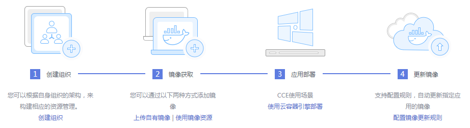

# 容器镜像服务

容器镜像服务（Software Repository for Container，简称SWR）是一种支持镜像全生命周期管理的服务， 提供简单易用、安全可靠的镜像管理功能，帮助您快速部署容器化服务。您可以通过界面、社区CLI和原生API上传、下载和管理容器镜像。

容器镜像服务可配合[云容器引擎CCE](https://support.huaweicloud.com/productdesc-cce/cce_productdesc_0001.html)、[云容器实例CCI](https://support.huaweicloud.com/productdesc-cci/cci_03_0001.html)云容器引擎CCE使用，也可单独作为容器镜像仓库使用。

**图 1**  SWR使用流程  

## 产品功能

-   **镜像全生命周期管理**

    容器镜像服务支持镜像的全生命周期管理，包括镜像的上传、下载、删除等。

-   **私有镜像仓库**

    容器镜像服务提供私有镜像库，并支持细粒度的权限管理，可以为不同用户分配相应的访问权限（读取、编辑、管理）。

-   **镜像源加速**

    容器镜像服务提供了镜像源加速服务，容器镜像服务智能调度全球区域节点，根据所使用的镜像地址自动分配至最近的主机节点进行镜像拉取。

-   **大规模镜像分发P2P加速**

    容器镜像服务使用华为自主专利的镜像下载加速技术，使用CCE集群下载时可确保高并发下能获得更快的下载体验。

-   **镜像仓库触发器**

    容器镜像服务支持容器镜像版本更新自动触发部署。您只需要为镜像设置一个触发器，通过触发器，可以在每次镜像版本更新时，自动更新使用该镜像部署的应用。

-   **源代码自动镜像构建、自动镜像部署、容器从代码到上线的自动化交付流水线（通过集成[容器交付流水线ContainerOps](https://support.huaweicloud.com/productdesc-containerops/ops_productdesc_0001.html)）**
-   **镜像安全扫描（通过集成[容器安全服务CGS](https://support.huaweicloud.com/productdesc-cgs/cgs_01_0001.html)）**

## 上传镜像

容器镜像服务上传镜像的详细操作请参见[客户端上传镜像](https://support.huaweicloud.com/usermanual-swr/swr_01_0011.html)。

## 如何访问容器镜像服务

可以使用以下方式访问和管理容器镜像服务：

-   管理控制台

    请使用管理控制台方式访问容器镜像服务。可直接登录管理控制台，从主页选择“容器镜像服务”。

-   查询API

    通过调用API的方式访问容器镜像服务，具体操作请参见[《容器镜像服务API参考》](https://support.huaweicloud.com/api-swr/swr_02_0101.html  )《容器镜像服务API参考》。

## 使用镜像

镜像上传成功后，在CCE中创建工作负载时可选择“我的镜像“，以2048游戏为例，具体操作如下：

1.  登录[CCE控制台](https://console.huaweicloud.com/cce2.0/?utm_source=helpcenter)，在左侧导航栏中选择“工作负载 \> 无状态负载 Deployment”，单击“创建无状态工作负载”。
2.  输入以下参数，其它保持默认。
    -   工作负载名称：game。
    -   集群名称：选择应用所要运行的集群。
    -   实例数量：1。

3.  单击“下一步：容器设置”，添加容器。

    单击“添加容器”，在“我的镜像”页签下，选择已上传的镜像，单击“确定”。

4.  更多创建工作负载的步骤请参见[创建无状态负载\(Deployment\)](创建无状态负载(Deployment).md)或[创建有状态负载\(StatefulSet\)](创建有状态负载(StatefulSet).md)。

