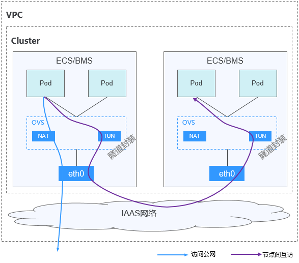

# 容器隧道网络

-   [约束与限制](#section72394163548)
-   [优缺点](#section207316301745)
-   [应用场景](#section474217381446)
-   [适用集群](#section10441454192410)

**容器隧道网络（Overlay）**基于底层VPC网络，另构建了独立的VXLAN隧道化容器网络，适用于一般场景。VXLAN是将以太网报文封装成UDP报文进行隧道传输。容器网络是承载于VPC网络之上的Overlay网络平面，具有付出少量隧道封装性能损耗，即可获得通用性强、互通性强、高级特性支持全面（例如Network Policy网络隔离）的优势，可以满足大多数应用需求。

**图 1**  容器隧道网络  

**说明如下：**

Overlay L2指的是容器跨节点以Overlay通信，所有节点上的容器IP都是2层可达的。Canal支持的Overlay类型为vxlan，采用的vswitch为openvswitch。

Overlay L2特性支持的功能包括：

-   支持多平面通信和隔离。
-   支持Pod访问Service IP。
-   支持Pod应用和Host应用的访问。
-   IP地址为以节点为单位的预分配。

## 约束与限制

-   Overlay L2通信的上行链路网卡设备需要预配置IP地址。
-   Overlay L2目前不支持与其他网络模式的混用。
-   ServiceIP不支持多平面，只支持默认平面。
-   Overaly L2逻辑网络掩码（大子网掩码）目前不支持配置为大于24的值。
-   Overlay L2逻辑网络分配给节点的小子网掩码默认为26，支持配置为24\~30。另外当小子网掩码为配置为24时，大子网掩码不支持配置为24。
-   Overlay L2由于在每个节点上都是小子网，容器内网络的网关都是由Canal自动分配，不支持指定网关。

## 优缺点

优点：不受VPC配额规格、响应速度限制（路由条目数、弹性网卡数、创建速度限制）。

缺点：封装的额外开销，网络复杂性较高、性能较低，无法直接利用VPC提供的负载均衡、安全组等能力。

## 应用场景

适用于对网络时延、带宽要求不是特别高的一般容器业务场景。

## 适用集群

-   CCE集群
-   虚机集群

