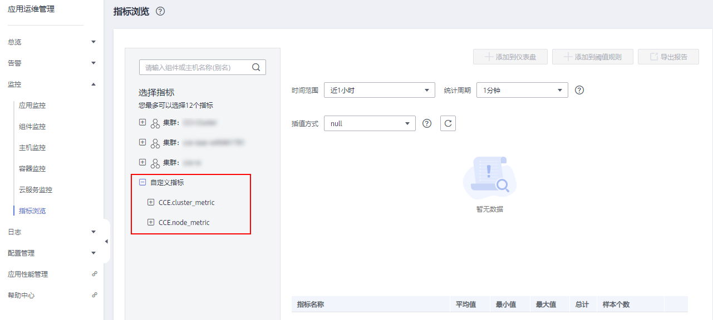
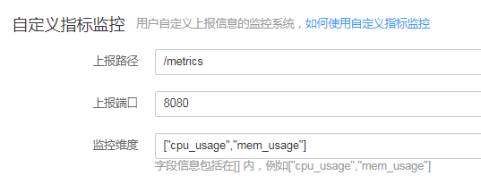

# 对接Prometheus实现自定义指标监控

-   [背景知识](#section7646185263910)
-   [前提条件](#section1439216379382)
-   [操作步骤](#section2050317783613)
-   [相关链接](#section834624942119)

## 背景知识

在CCE创建容器应用时，支持您通过对接普罗米修斯（prometheus）来上报自定义指标，并将其展示在应用运维管理（AOM）服务中的“监控 \> 指标浏览”中。

指标是应用运维管理（AOM）服务中对资源性能的数据描述或状态描述，指标由[命名空间](https://support.huaweicloud.com/productdesc-aom/aom_06_0014.html#section0)、[维度](https://support.huaweicloud.com/productdesc-aom/aom_06_0014.html#section1)、指标名称和单位组成。指标分为系统指标和自定义指标。

-   系统指标：AOM提供的基础指标，例如：CPU使用率、CPU内核占用等。
-   自定义指标：您自己定义的指标。可参考如下两种方式上报自定义指标。
    -   方式一：通过AOM提供的接口上报自定义指标，接口详见[添加监控数据](https://support.huaweicloud.com/api-aom/aom_04_0013.html)和[查询监控数据](https://support.huaweicloud.com/api-aom/aom_04_0012.html)。
    -   方式二：在CCE创建容器工作负载时，通过对接普罗米修斯（prometheus）上报自定义指标，详细操作请参见[操作步骤](#section2050317783613)。

**图 1**  AOM中自定义指标  

## 前提条件

-   您已经成功创建一个Kubernetes集群，参见[购买CCE集群](购买CCE集群.md)。
-   您已连接到集群的控制节点，方便快速查看节点标签等信息，参见[通过kubectl或web-terminal插件操作CCE集群](通过kubectl或web-terminal插件操作CCE集群.md)。
-   在设置自定义监控前，您需先了解和安装[prometheus](https://prometheus.io/)，并在您的工作负载中提供获取自定义指标数据的GET接口，以便能够通过该接口获取您的自定义指标数据。

    > **说明：** 
    >当前仅支持获取prometheus的[Gauge指标类型](https://prometheus.io/docs/concepts/metric_types/)。

## 操作步骤

1.  当您在创建工作负载时，在“高级设置”步骤中配置“自定义指标监控”。
2.  您的exporter必须提供自定义指标的上报端口及上报路径，请参考[图2](#fig166069267219)设置。设置完成后，CCE将通过“http://PodIP:上报端口/上报路径”GET请求（例如，http://192.168.1.19:8080/metrics）获取自定义指标数据。

    **图 2**  设置自定义指标监控  
    

    **表 1**  参数说明

    
    <table><thead align="left"><tr id="row107721193110"><th class="cellrowborder" valign="top" width="15%" id="mcps1.2.4.1.1">
参数

    </th>
    <th class="cellrowborder" valign="top" width="70%" id="mcps1.2.4.1.2">
说明

    </th>
    <th class="cellrowborder" valign="top" width="15%" id="mcps1.2.4.1.3">
是否必须设置

    </th>
    </tr>
    </thead>
    <tbody><tr id="row1772191119"><td class="cellrowborder" valign="top" width="15%" headers="mcps1.2.4.1.1 ">
上报路径

    </td>
    <td class="cellrowborder" valign="top" width="70%" headers="mcps1.2.4.1.2 ">
exporter提供的供CCE获取自定义指标数据的URL。

    
由字母、数字、斜杠（/）和下划线（_）组成，且<strong id="b1819813266435">必须以“/”开头</strong>。例如，/metrics。

    </td>
    <td class="cellrowborder" valign="top" width="15%" headers="mcps1.2.4.1.3 ">
是

    </td>
    </tr>
    <tr id="row6772791719"><td class="cellrowborder" valign="top" width="15%" headers="mcps1.2.4.1.1 ">
上报端口

    </td>
    <td class="cellrowborder" valign="top" width="70%" headers="mcps1.2.4.1.2 ">
exporter提供的供CCE获取自定义指标数据的端口。

    
取值范围：1～65535。例如，8080。

    </td>
    <td class="cellrowborder" valign="top" width="15%" headers="mcps1.2.4.1.3 ">
是

    </td>
    </tr>
    <tr id="row19772091114"><td class="cellrowborder" valign="top" width="15%" headers="mcps1.2.4.1.1 ">
监控维度

    </td>
    <td class="cellrowborder" valign="top" width="70%" headers="mcps1.2.4.1.2 ">
exporter提供的自定义指标名称。

    
自定义指标名称为由字母、数字和下划线（_）组成的字符串，长度为5～100个字符。输入格式为：["自定义指标名称1","自定义指标名称2"]，多个自定义指标名称请以英文逗号（,）分隔。例如，["cpu_usage","mem_usage"]。

    <ul id="ul187211651191910"><li>如果不设置，则CCE会获取所有的自定义指标数据。</li><li>如果设置，例如，设置为["cpu_usage","mem_usage"]，则CCE会对自定义指标进行过滤，只获取cpu_usage、mem_usage指标数据。</li></ul>
    </td>
    <td class="cellrowborder" valign="top" width="15%" headers="mcps1.2.4.1.3 ">
否

    </td>
    </tr>
    </tbody>
    </table>

## 相关链接

-   [应用运维管理 AOM的“指标”是什么？](https://support.huaweicloud.com/productdesc-aom/aom_06_0014.html)
-   [主机指标及其维度](https://support.huaweicloud.com/productdesc-aom/aom_06_0009.html)
-   [集群指标及其维度](https://support.huaweicloud.com/productdesc-aom/aom_06_0010.html)
-   [容器指标及其维度](https://support.huaweicloud.com/productdesc-aom/aom_06_0018.html)

