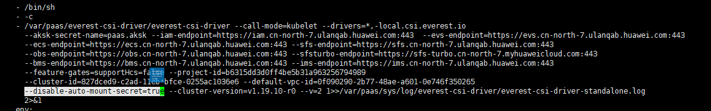
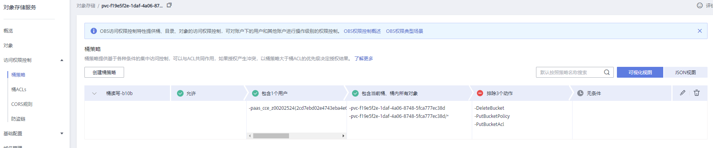

# 对象存储卷挂载设置自定义访问密钥（AK/SK）<a name="cce_10_0336"></a>

## 背景信息<a name="section69149541619"></a>

Everest在1.2.8及以上版本提供了设置自定义访问密钥的能力，这样可以让IAM用户使用自己的访问密钥挂载对象存储卷，从而可以对OBS进行访问权限控制（具体请参见[如何对OBS进行访问权限控制？](https://support.huaweicloud.com/obs_faq/obs_faq_0042.html)）。

## 前提条件<a name="section1356645410223"></a>

-   Everest要求1.2.8及以上版本。
-   集群要求1.15.11及以上版本。

## 约束与限制<a name="section19922155718332"></a>

自定义访问密钥暂不支持安全容器。

## 关闭自动挂载访问密钥<a name="section1045502219184"></a>

老版本控制台会要求您上传AK/SK，对象存储卷挂载时默认使用您上传的访问密钥，相当于所有IAM用户（即子用户）都使用的是同一个访问密钥挂载的对象捅，对桶的权限都是一样的，导致无法对IAM用户使用对象存储桶进行权限控制。

如果您之前上传过AK/SK，为防止IAM用户越权，建议关闭自动挂载访问密钥，即需要在Everest插件中将**disable\_auto\_mount\_secret**参数打开，这样使用对象存储时就不会自动使用在控制台上传的访问密钥。

> **说明：** 
>-   设置disable-auto-mount-secret时要求当前集群中无对象存储卷，否则挂载了该对象卷的工作负载扩容或重启的时候会由于必须指定访问密钥而导致挂卷失败。
>-   disable-auto-mount-secret设置为true后，则创建PV和PVC时必须指定挂载访问密钥，否则会导致对象卷挂载失败。

**kubectl edit ds everest-csi-driver -nkube-system**

搜索disable-auto-mount-secret，并将值设置为true。



执行** :wq **保存退出，等待实例重启完毕即可。

## 使用访问密钥创建Secret<a name="section12416824164618"></a>

1.  获取访问密钥。

    获取访问密钥的方法，具体请参见[获取访问密钥（AK/SK）](https://support.huaweicloud.com/qs-obs/obs_qs_0005.html)。

2.  对访问密钥进行base64编码（假设上文获取到的ak为“xxx”，sk为“yyy”）。

    **echo -n xxx|base64**

    **echo -n yyy|base64**

    记录编码后的AK和SK。

3.  新建一个secret的yaml，如test-user.yaml。

    ```
    apiVersion: v1
    data:
      access.key: WE5WWVhVNU*****
      secret.key: Nnk4emJyZ0*****
    kind: Secret
    metadata:
      name: test-user
      namespace: default
      labels:
        secret.kubernetes.io/used-by: csi
    type: cfe/secure-opaque
    ```

    其中：

    <a name="table551243410100"></a>
    <table><thead align="left"><tr id="row951223481012"><th class="cellrowborder" valign="top" width="26.43%" id="mcps1.1.3.1.1"><p id="p55121341100"><a name="p55121341100"></a><a name="p55121341100"></a>参数</p>
    </th>
    <th class="cellrowborder" valign="top" width="73.57000000000001%" id="mcps1.1.3.1.2"><p id="p451233461016"><a name="p451233461016"></a><a name="p451233461016"></a>描述</p>
    </th>
    </tr>
    </thead>
    <tbody><tr id="row551203451016"><td class="cellrowborder" valign="top" width="26.43%" headers="mcps1.1.3.1.1 "><p id="p13512734101015"><a name="p13512734101015"></a><a name="p13512734101015"></a>access.key</p>
    </td>
    <td class="cellrowborder" valign="top" width="73.57000000000001%" headers="mcps1.1.3.1.2 "><p id="p451213342102"><a name="p451213342102"></a><a name="p451213342102"></a>base64编码后的ak。</p>
    </td>
    </tr>
    <tr id="row5512123420106"><td class="cellrowborder" valign="top" width="26.43%" headers="mcps1.1.3.1.1 "><p id="p6512143431020"><a name="p6512143431020"></a><a name="p6512143431020"></a>secret.key</p>
    </td>
    <td class="cellrowborder" valign="top" width="73.57000000000001%" headers="mcps1.1.3.1.2 "><p id="p115121434121020"><a name="p115121434121020"></a><a name="p115121434121020"></a>base64编码后的sk。</p>
    </td>
    </tr>
    <tr id="row7512834131017"><td class="cellrowborder" valign="top" width="26.43%" headers="mcps1.1.3.1.1 "><p id="p25121534181016"><a name="p25121534181016"></a><a name="p25121534181016"></a>name</p>
    </td>
    <td class="cellrowborder" valign="top" width="73.57000000000001%" headers="mcps1.1.3.1.2 "><p id="p251233441019"><a name="p251233441019"></a><a name="p251233441019"></a>secret的名称</p>
    </td>
    </tr>
    <tr id="row95121534191014"><td class="cellrowborder" valign="top" width="26.43%" headers="mcps1.1.3.1.1 "><p id="p16512834121016"><a name="p16512834121016"></a><a name="p16512834121016"></a>namespace</p>
    </td>
    <td class="cellrowborder" valign="top" width="73.57000000000001%" headers="mcps1.1.3.1.2 "><p id="p551243461015"><a name="p551243461015"></a><a name="p551243461015"></a>secret的命名空间</p>
    </td>
    </tr>
    <tr id="row16799198182814"><td class="cellrowborder" valign="top" width="26.43%" headers="mcps1.1.3.1.1 "><p id="p0245182232816"><a name="p0245182232816"></a><a name="p0245182232816"></a>secret.kubernetes.io/used-by: csi</p>
    </td>
    <td class="cellrowborder" valign="top" width="73.57000000000001%" headers="mcps1.1.3.1.2 "><p id="p380018122814"><a name="p380018122814"></a><a name="p380018122814"></a>带上这个标签才能在控制台上创建OBS PV/PVC时可见。</p>
    </td>
    </tr>
    <tr id="row1451283421016"><td class="cellrowborder" valign="top" width="26.43%" headers="mcps1.1.3.1.1 "><p id="p25121234161018"><a name="p25121234161018"></a><a name="p25121234161018"></a>type</p>
    </td>
    <td class="cellrowborder" valign="top" width="73.57000000000001%" headers="mcps1.1.3.1.2 "><p id="p851212346102"><a name="p851212346102"></a><a name="p851212346102"></a>密钥类型，该值必须为cfe/secure-opaque</p>
    <p id="p4512334141012"><a name="p4512334141012"></a><a name="p4512334141012"></a>使用该类型，用户输入的数据会自动加密。</p>
    </td>
    </tr>
    </tbody>
    </table>

4.  创建Secret。

    **kubectl create -f test-user.yaml**


## 静态创建对象存储卷时指定挂载Secret<a name="section14417324114618"></a>

使用访问密钥创建Secret后，在创建PV时只需要关联上Secret，就可以使用Secret中的访问密钥（AK/SK）挂载对象存储卷。

1.  登录OBS控制台，创建对象存储桶，记录桶名称和存储类型，以并行文件系统为例。
2.  新建一个pv的yaml文件，如pv-example.yaml。

    ```
    apiVersion: v1
    kind: PersistentVolume
    metadata:
      name: pv-obs-example
      annotations:
        pv.kubernetes.io/provisioned-by: everest-csi-provisioner
    spec:
      accessModes:
      - ReadWriteMany
      capacity:
        storage: 1Gi
      csi:
        nodePublishSecretRef:
          name: test-user
          namespace: default
        driver: obs.csi.everest.io
        fsType: obsfs
        volumeAttributes:
          everest.io/obs-volume-type: STANDARD
          everest.io/region: cn-north-4
          storage.kubernetes.io/csiProvisionerIdentity: everest-csi-provisioner
        volumeHandle: obs-normal-static-pv
      persistentVolumeReclaimPolicy: Delete
      storageClassName: csi-obs
    ```

    <a name="table6615161819296"></a>
    <table><thead align="left"><tr id="row1361531813296"><th class="cellrowborder" valign="top" width="26.43%" id="mcps1.1.3.1.1"><p id="p5615151822915"><a name="p5615151822915"></a><a name="p5615151822915"></a>参数</p>
    </th>
    <th class="cellrowborder" valign="top" width="73.57000000000001%" id="mcps1.1.3.1.2"><p id="p461519185298"><a name="p461519185298"></a><a name="p461519185298"></a>描述</p>
    </th>
    </tr>
    </thead>
    <tbody><tr id="row12615101802919"><td class="cellrowborder" valign="top" width="26.43%" headers="mcps1.1.3.1.1 "><p id="p96441230162919"><a name="p96441230162919"></a><a name="p96441230162919"></a>nodePublishSecretRef</p>
    </td>
    <td class="cellrowborder" valign="top" width="73.57000000000001%" headers="mcps1.1.3.1.2 "><p id="p26152189295"><a name="p26152189295"></a><a name="p26152189295"></a>挂载时指定的密钥，其中</p>
    <a name="ul1061862010115"></a><a name="ul1061862010115"></a><ul id="ul1061862010115"><li>name：指定secret的名字</li><li>namespace：指定secret的命令空间</li></ul>
    </td>
    </tr>
    <tr id="row17768552185616"><td class="cellrowborder" valign="top" width="26.43%" headers="mcps1.1.3.1.1 "><p id="p98321261573"><a name="p98321261573"></a><a name="p98321261573"></a>fsType</p>
    </td>
    <td class="cellrowborder" valign="top" width="73.57000000000001%" headers="mcps1.1.3.1.2 "><p id="p168323610576"><a name="p168323610576"></a><a name="p168323610576"></a>文件类型，支持“obsfs”与“s3fs”，取值为s3fs时创建是obs对象桶，配套使用s3fs挂载；取值为obsfs时创建的是obs并行文件系统，配套使用obsfs挂载，推荐使用。</p>
    </td>
    </tr>
    <tr id="row78891119135511"><td class="cellrowborder" valign="top" width="26.43%" headers="mcps1.1.3.1.1 "><p id="p17889141914554"><a name="p17889141914554"></a><a name="p17889141914554"></a>volumeHandle</p>
    </td>
    <td class="cellrowborder" valign="top" width="73.57000000000001%" headers="mcps1.1.3.1.2 "><p id="p12890141918554"><a name="p12890141918554"></a><a name="p12890141918554"></a>对象存储的桶名称。</p>
    </td>
    </tr>
    </tbody>
    </table>

3.  创建PV。

    **kubectl create -f pv-example.yaml**

    PV创建完成后，就可以创建PVC关联PV。

4.  新建一个PVC的yaml文件，如pvc-example.yaml。

    **PVC yaml文件配置示例：**

    ```
    apiVersion: v1
    kind: PersistentVolumeClaim
    metadata:
      annotations:
        csi.storage.k8s.io/node-publish-secret-name: test-user
        csi.storage.k8s.io/node-publish-secret-namespace: default
        volume.beta.kubernetes.io/storage-provisioner: everest-csi-provisioner
        everest.io/obs-volume-type: STANDARD
        csi.storage.k8s.io/fstype: obsfs
      name: obs-secret
      namespace: default
    spec:
      accessModes:
      - ReadWriteMany
      resources:
        requests:
          storage: 1Gi
      storageClassName: csi-obs
      volumeName: pv-obs-example
    ```

    <a name="table36670218280"></a>
    <table><thead align="left"><tr id="row166713212813"><th class="cellrowborder" valign="top" width="44.89%" id="mcps1.1.3.1.1"><p id="p16675202812"><a name="p16675202812"></a><a name="p16675202812"></a>参数</p>
    </th>
    <th class="cellrowborder" valign="top" width="55.11000000000001%" id="mcps1.1.3.1.2"><p id="p156674217284"><a name="p156674217284"></a><a name="p156674217284"></a>描述</p>
    </th>
    </tr>
    </thead>
    <tbody><tr id="row866717219285"><td class="cellrowborder" valign="top" width="44.89%" headers="mcps1.1.3.1.1 "><p id="p196674219287"><a name="p196674219287"></a><a name="p196674219287"></a>csi.storage.k8s.io/node-publish-secret-name</p>
    </td>
    <td class="cellrowborder" valign="top" width="55.11000000000001%" headers="mcps1.1.3.1.2 "><p id="p1466715214280"><a name="p1466715214280"></a><a name="p1466715214280"></a>指定secret的名字</p>
    </td>
    </tr>
    <tr id="row1966762142811"><td class="cellrowborder" valign="top" width="44.89%" headers="mcps1.1.3.1.1 "><p id="p866718272816"><a name="p866718272816"></a><a name="p866718272816"></a>csi.storage.k8s.io/node-publish-secret-namespace</p>
    </td>
    <td class="cellrowborder" valign="top" width="55.11000000000001%" headers="mcps1.1.3.1.2 "><p id="p11667142182814"><a name="p11667142182814"></a><a name="p11667142182814"></a>指定secret的命令空间</p>
    </td>
    </tr>
    </tbody>
    </table>

5.  创建PVC。

    **kubectl create -f pvc-example.yaml**

    PVC创建后，就可以创建工作负载挂载PVC使用存储。


## 动态创建对象存储卷时指定挂载密钥<a name="section204171024144619"></a>

动态创建对象存储卷时，可通过如下方法指定挂载密钥。

1.  新建一个pvc的yaml文件，如pvc-example.yaml。

    ```
    apiVersion: v1
    kind: PersistentVolumeClaim
    metadata:
      annotations:
        csi.storage.k8s.io/node-publish-secret-name: test-user
        csi.storage.k8s.io/node-publish-secret-namespace: default
        everest.io/obs-volume-type: STANDARD
        csi.storage.k8s.io/fstype: obsfs
      name: obs-secret
      namespace: default
    spec:
      accessModes:
      - ReadWriteMany
      resources:
        requests:
          storage: 1Gi
      storageClassName: csi-obs
    ```

    <a name="table1911916210118"></a>
    <table><thead align="left"><tr id="row711972201120"><th class="cellrowborder" valign="top" width="44.89%" id="mcps1.1.3.1.1"><p id="p15120821110"><a name="p15120821110"></a><a name="p15120821110"></a>参数</p>
    </th>
    <th class="cellrowborder" valign="top" width="55.11000000000001%" id="mcps1.1.3.1.2"><p id="p71209271119"><a name="p71209271119"></a><a name="p71209271119"></a>描述</p>
    </th>
    </tr>
    </thead>
    <tbody><tr id="row1112012271110"><td class="cellrowborder" valign="top" width="44.89%" headers="mcps1.1.3.1.1 "><p id="p61203218111"><a name="p61203218111"></a><a name="p61203218111"></a>csi.storage.k8s.io/node-publish-secret-name</p>
    </td>
    <td class="cellrowborder" valign="top" width="55.11000000000001%" headers="mcps1.1.3.1.2 "><p id="p2120122121114"><a name="p2120122121114"></a><a name="p2120122121114"></a>指定secret的名字</p>
    </td>
    </tr>
    <tr id="row266117185118"><td class="cellrowborder" valign="top" width="44.89%" headers="mcps1.1.3.1.1 "><p id="p1662151891115"><a name="p1662151891115"></a><a name="p1662151891115"></a>csi.storage.k8s.io/node-publish-secret-namespace</p>
    </td>
    <td class="cellrowborder" valign="top" width="55.11000000000001%" headers="mcps1.1.3.1.2 "><p id="p12662131811118"><a name="p12662131811118"></a><a name="p12662131811118"></a>指定secret的命令空间</p>
    </td>
    </tr>
    </tbody>
    </table>

2.  创建PVC。

    **kubectl create -f pvc-example.yaml**

    PVC创建后，就可以创建工作负载挂载PVC使用存储。


## 配置验证<a name="section1698122173919"></a>

根据上述步骤，使用IAM用户的密钥挂载对象存储卷。假设工作负载名称为obs-secret，容器内挂载目录是/temp，IAM用户权限为CCE ReadOnlyAccess和Tenant Guest。

1.  查询工作负载实例名称。

    **kubectl get po | grep obs-secret**

    期望输出：

    ```
    obs-secret-5cd558f76f-vxslv          1/1     Running   0          3m22s
    ```

2.  查询挂载目录下对象，查询正常。

    **kubectl exec obs-secret-5cd558f76f-vxslv -- ls -l /temp/**

3.  尝试在挂在目录内写入数据，写入失败。

    **kubectl exec obs-secret-5cd558f76f-vxslv -- touch /temp/test**

    期望输出：

    ```
    touch: setting times of '/temp/test': No such file or directory
    command terminated with exit code 1
    ```

4.  参考桶策略配置，给挂载桶的子用户设置读写权限。

    

5.  再次尝试在挂在目录内写入数据，写入成功。

    **kubectl exec obs-secret-5cd558f76f-vxslv -- touch /temp/test**

6.  查看容器内挂载目录，验证数据写入成功。

    **kubectl exec obs-secret-5cd558f76f-vxslv -- ls -l /temp/**

    期望输出：

    ```
    -rwxrwxrwx 1 root root 0 Jun  7 01:52 test
    ```


