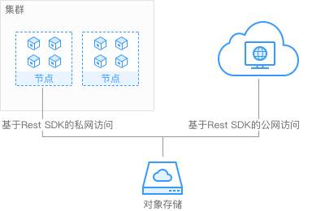

# 对象存储卷概述

为满足数据持久化的需求，CCE支持将对象存储服务（OBS）创建的存储卷挂载到容器的某一路径下，对象存储适用于云工作负载、数据分析、内容分析和热点对象等场景。

**图 1**  CCE挂载对象存储卷  

## 约束限制

安全容器不支持使用对象存储卷。

OBS限制单用户创建100个桶，但是CCE使用OBS桶为单个工作负载挂载一个桶，当工作负载数量较多时，容易导致桶数量超过限制，OBS桶无法创建。建议此种场景下直接通过OBS的API或SDK使用OBS，不在工作负载中挂载OBS桶。

## 存储类别

对象存储提供了三种存储类别：标准存储、低频访问存储、归档存储，从而满足客户业务对存储性能、成本的不同诉求。

-   标准存储：访问时延低和吞吐量高，因而适用于有大量热点文件（平均一个月多次）或小文件（小于1MB），且需要频繁访问数据的业务场景，例如：大数据、移动应用、热点视频、社交图片等场景。
-   低频访问存储：适用于不频繁访问（平均一年少于12次）但在需要时也要求快速访问数据的业务场景，例如：文件同步/共享、企业备份等场景。与标准存储相比，低频访问存储有相同的数据持久性、吞吐量以及访问时延，且成本较低，但是可用性略低于标准存储。
-   归档存储：适用于很少访问（平均一年访问一次）数据的业务场景，例如：数据归档、长期备份等场景。归档存储安全、持久且成本极低，可以用来替代磁带库。为了保持成本低廉，数据取回时间可能长达数分钟到数小时不等。

## 使用说明

-   **标准接口：**具备标准Http Restful API接口，用户必须通过编程或第三方工具访问对象存储。
-   **数据共享：**服务器、嵌入式设备、IOT设备等所有调用相同路径，均可访问共享的对象存储数据。
-   **公共/私有网络：**对象存储数据允许在公网访问，满足互联网应用需求。
-   **容量与性能：**容量无限制，性能较高（IO读写时延10ms级）。
-   **应用场景：**适用于（基于OBS界面、OBS工具、OBS SDK等）的一次上传共享多读（ReadOnlyMany）的各种工作负载（Deployment/StatefulSet）和普通任务（Job）使用，主要面向大数据分析、静态网站托管、在线视频点播、基因测序、智能视频监控、备份归档、企业云盘（网盘）等场景。

## 相关参考

CCE支持挂载第三方租户的OBS桶，包含OBS并行文件系统（优先）和OBS对象桶，使用方法请参见[挂载第三方租户的对象存储](https://support.huaweicloud.com/bestpractice-cce/cce_bestpractice_00199.html)。

