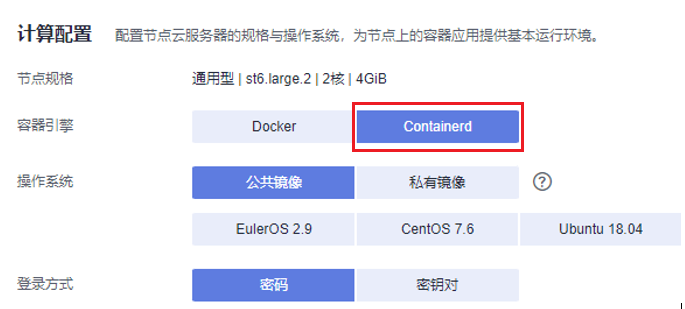
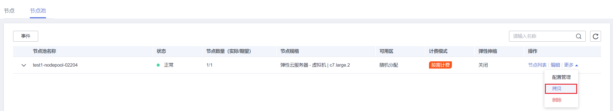
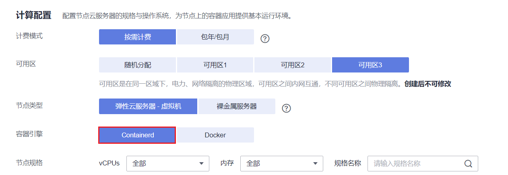

# 将节点容器引擎从Docker迁移到Containerd

## 背景介绍

Kubernetes在1.24版本中移除了Dockershim，并从此不再默认支持Docker容器引擎。CCE 1.25集群中仍将继续维护Docker容器引擎，并计划在1.27版本中移除对Docker容器引擎的支持。如果您需要将容器引擎为Docker的节点迁移至Containerd节点，请参考本文。

## 前提条件

-   已创建至少一个集群，并且该集群支持Containerd节点，详情请参见[节点操作系统与容器引擎对应关系](容器引擎.md#section159298451879)。
-   您的集群中存在容器引擎为Docker的节点或节点池。

## 注意事项

-   理论上节点容器运行时的迁移会导致业务短暂中断，因此强烈建议您迁移的业务保证多实例高可用部署，并且建议先在测试环境试验迁移的影响，以最大限度避免可能存在的风险。
-   Containerd不具备镜像构建功能，请勿在Containerd节点上使用Docker Build功能构建镜像。Docker和Containerd其他差异请参考[容器引擎](容器引擎.md)。

## 节点迁移步骤

1.  登录CCE控制台，单击集群名称进入集群。
2.  在左侧选择“节点管理”，并在节点列表中选择一个或多个需要重置的节点，单击“更多 \> 重置节点”。
3.  在容器引擎中选择Containerd，其余参数可根据需要进行调整，也可以和创建时保持一致。

    

4.  当节点状态显示为安装中时，即表示正在重置节点。

    待节点状态显示为运行中时，您即可检查节点容器运行时是否切换成功，页面中可以看到节点运行时版本已经切换为Containerd，并且登录节点可以执行**crictl**等Containerd相关命令查看节点上运行的容器信息。

## 节点池迁移步骤

您可使用[节点池拷贝](管理节点池.md#section550619571556)功能，拷贝原有的Docker节点池，并将新节点池的容器引擎选择为Containerd，其余配置和原Docker节点池保持一致。

1.  登录CCE控制台，单击集群名称进入集群。
2.  在左侧选择“节点管理”，切换至“节点池”页签，并在需要拷贝的Docker节点池“操作”栏中，单击“更多 \> 拷贝”。

    

3.  在节点池配置页面中，选择容器引擎为Containerd，其余参数可根据需要进行调整，并完成节点池创建。

    

4.  将创建完的Containerd节点池扩容至原Docker节点池的数量，并逐个删除Docker节点池中的节点。

    推荐使用滚动的方式迁移，即扩容部分Containerd节点，再删除部分Docker节点，直至新的Containerd节点池中节点数量和原Docker节点池中节点数量一致。

    > **说明：** 
    >若您在原有Docker节点或节点池上部署的负载设置了对应的节点亲和性，则需要将负载的节点亲和性策略配置为的新Containerd节点或节点池。

5.  迁移完成后，删除原有Docker节点池。

