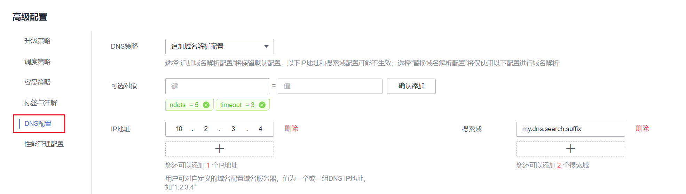

# 工作负载DNS配置说明<a name="cce_10_0365"></a>

Kubernetes集群内置DNS插件Kube-DNS/CoreDNS，为集群内的工作负载提供域名解析服务。业务在高并发调用场景下，如果使用到域名解析服务，可能会触及到Kube-DNS/CoreDNS的性能瓶颈，导致DNS请求概率失败，影响用户业务正常运行。在Kubernetes使用的过程中，发现有些场景下工作负载的域名解析存在冗余的DNS查询，使得高并发场景更容易触及DNS的性能瓶颈。根据业务使用场景，对工作负载的DNS配置进行优化，能够在一定程度上减少DNS请求概率失败的问题。

更多DNS相关信息请参见[CoreDNS（系统资源插件，必装）](CoreDNS（系统资源插件-必装）.md)。

## DNS配置项说明<a name="section18633925113111"></a>

在Linux系统的节点或者容器里执行cat /etc/resolv.conf命令，能够查看到DNS配置，以Kubernetes集群的容器DNS配置为例：

```
nameserver 10.247.x.x
search default.svc.cluster.local svc.cluster.local cluster.local
options ndots:5
```

**配置项说明：**

-   nameserver：容器解析域名时查询的DNS服务器的IP地址列表。如果设置为10.247.x.x说明DNS对接到Kube-DNS/CoreDNS，如果是其他IP地址，则表示采用云上DNS或者用户自建的DNS。
-   search：定义域名的搜索域列表，当访问的域名不能被DNS解析时，会把该域名与搜索域列表中的域依次进行组合，并重新向DNS发起请求，直到域名被正确解析或者尝试完搜索域列表为止。对于CCE集群来说，容器的搜索域列表配置3个域，当解析一个不存在的域名时，会产生8次DNS查询，因为对于每个域名需要查询两次，分别是IPv4和IPv6。
-   options：定义域名解析配置文件的其他选项，常见的有timeout、ndots等等。

    Kubernetes集群容器的域名解析文件设置为options ndots:5，该参数的含义是当域名的“.”个数小于ndots的值，会先把域名与search搜索域列表进行组合后进行DNS查询，如果均没有被正确解析，再以域名本身去进行DNS查询。当域名的“.”个数大于或者等于ndots的值，会先对域名本身进行DNS查询，如果没有被正确解析，再把域名与search搜索域列表依次进行组合后进行DNS查询。

    如查询www.\*\*\*.com域名时，由于该域名的“.”个数为2，小于ndots的值，所以DNS查询请求的顺序依次为：www.\*\*\*.default.svc.cluster.local、www.\*\*\*.com.svc.cluster.local、 www.\*\*\*.com.cluster.local和 www.\*\*\*.com，需要发起至少7次DNS查询请求才能解析出该域名的IP。可以看出，这种配置在访问外部域名时，存在大量冗余的DNS查询，存在优化点。


> **说明：** 
>完整的Linux域名解析文件配置项说明可以参考文档：[http://man7.org/linux/man-pages/man5/resolv.conf.5.html](http://man7.org/linux/man-pages/man5/resolv.conf.5.html)。

## 通过工作负载YAML进行DNS配置<a name="section1742333103211"></a>

您也可以通过YAML的方式创建工作负载，以nginx应用为例，其YAML文件中的DNS配置示例如下：

```
apiVersion: apps/v1
kind: Deployment
metadata:
  name: nginx
  namespace: default
spec:
  replicas: 1
  selector:
    matchLabels:
      app: nginx
  template:
    metadata:
      labels:
        app: nginx
    spec:
      containers:
        - name: container-1
          image: nginx:latest
          imagePullPolicy: IfNotPresent
      imagePullSecrets:
        - name: default-secret
      dnsPolicy: None
      dnsConfig:
        options:
          - name: ndots
            value: '5'
          - name: timeout
            value: '3'
        nameservers:
          - 10.2.3.4
        searches:
          - my.dns.search.suffix
```

**dnsPolicy字段说明：**

dnsPolicy字段是应用设置的DNS策略，默认值为“ClusterFirst”。基于dnsPolicy策略生成的域名解析文件会与dnsConfig设置的DNS参数进行合并，合并规则将在[表2](#table16581121652515)中说明，dnsPolicy当前支持四种参数值：

**表 1**  dnsPolicy字段说明

<a name="table144443315261"></a>
<table><thead align="left"><tr id="row1441933172613"><th class="cellrowborder" valign="top" width="20.62%" id="mcps1.2.3.1.1"><p id="p174414338268"><a name="p174414338268"></a><a name="p174414338268"></a>参数</p>
</th>
<th class="cellrowborder" valign="top" width="79.38%" id="mcps1.2.3.1.2"><p id="p24433342614"><a name="p24433342614"></a><a name="p24433342614"></a>说明</p>
</th>
</tr>
</thead>
<tbody><tr id="row154463320269"><td class="cellrowborder" valign="top" width="20.62%" headers="mcps1.2.3.1.1 "><p id="p34473317261"><a name="p34473317261"></a><a name="p34473317261"></a>ClusterFirst（默认值）</p>
</td>
<td class="cellrowborder" valign="top" width="79.38%" headers="mcps1.2.3.1.2 "><p id="p114463315266"><a name="p114463315266"></a><a name="p114463315266"></a>应用对接CoreDNS（CCE集群的CoreDNS默认级联云上DNS）。这种场景下，容器既能够解析service注册的集群内部域名，也能够解析发布到互联网上的外部域名。由于该配置下，域名解析文件设置了search搜索域列表和ndots: 5，因此当访问外部域名和集群内部长域名（如kubernetes.default.svc.cluster.local）时，大部分域名都会优先遍历search搜索域列表，导致至少有6次无效的DNS查询，只有访问集群内部短域名（如kubernetes）时，才不存在无效的DNS查询。</p>
</td>
</tr>
<tr id="row344133312617"><td class="cellrowborder" valign="top" width="20.62%" headers="mcps1.2.3.1.1 "><p id="p1449331268"><a name="p1449331268"></a><a name="p1449331268"></a>ClusterFirstWithHostNet</p>
</td>
<td class="cellrowborder" valign="top" width="79.38%" headers="mcps1.2.3.1.2 "><div class="p" id="p3129123815244"><a name="p3129123815244"></a><a name="p3129123815244"></a>对于配置主机网络的应用，即设置hostNetwork字段为true时，默认对接kubelet的“--resolv-conf”参数指向的域名解析文件（CCE集群在该配置下对接云上DNS）。如需对接集群的Kube-DNS/CoreDNS，dnsPolicy字段需设置为ClusterFirstWithHostNet，此时容器的域名解析文件配置与“ClusterFirst”一致，也存在无效的DNS查询。<pre class="screen" id="screen2519123019148"><a name="screen2519123019148"></a><a name="screen2519123019148"></a>...
spec:
  containers:
  - image: nginx:latest
    imagePullPolicy: IfNotPresent
    name: container-1
  restartPolicy: Always
  <strong id="b19219548111615"><a name="b19219548111615"></a><a name="b19219548111615"></a>hostNetwork: true</strong>
  dnsPolicy: <strong id="b718235115162"><a name="b718235115162"></a><a name="b718235115162"></a>ClusterFirstWithHostNet</strong></pre>
</div>
</td>
</tr>
<tr id="row1444113332613"><td class="cellrowborder" valign="top" width="20.62%" headers="mcps1.2.3.1.1 "><p id="p13441033202612"><a name="p13441033202612"></a><a name="p13441033202612"></a>Default</p>
</td>
<td class="cellrowborder" valign="top" width="79.38%" headers="mcps1.2.3.1.2 "><p id="p13441336269"><a name="p13441336269"></a><a name="p13441336269"></a>容器的域名解析文件使用kubelet的“--resolv-conf”参数指向的域名解析文件（CCE集群在该配置下对接云上DNS），没有配置search搜索域列表和options。该配置只能解析注册到互联网上的外部域名，无法解析集群内部域名，且不存在无效的DNS查询。</p>
</td>
</tr>
<tr id="row1646271816277"><td class="cellrowborder" valign="top" width="20.62%" headers="mcps1.2.3.1.1 "><p id="p54621118122710"><a name="p54621118122710"></a><a name="p54621118122710"></a>None</p>
</td>
<td class="cellrowborder" valign="top" width="79.38%" headers="mcps1.2.3.1.2 "><p id="p446221852718"><a name="p446221852718"></a><a name="p446221852718"></a>设置为None之后，必须设置dnsConfig字段，此时容器的域名解析文件将完全通过dnsConfig的配置来生成。</p>
</td>
</tr>
</tbody>
</table>

> **说明：** 
>此处如果dnsPolicy字段未被指定，其默认值为ClusterFirst，而不是Default。

**dnsConfig字段说明：**

dnsConfig为应用设置DNS参数，设置的参数将合并到基于dnsPolicy策略生成的域名解析文件中。当dnsPolicy为“None”，应用的域名解析文件完全由dnsConfig指定；当dnsPolicy不为“None”时，会在基于dnsPolicy生成的域名解析文件的基础上，追加dnsConfig中配置的dns参数。

**表 2**  dnsConfig字段说明

<a name="table16581121652515"></a>
<table><thead align="left"><tr id="row15582141612255"><th class="cellrowborder" valign="top" width="18.970000000000002%" id="mcps1.2.3.1.1"><p id="p17582111619250"><a name="p17582111619250"></a><a name="p17582111619250"></a>参数</p>
</th>
<th class="cellrowborder" valign="top" width="81.03%" id="mcps1.2.3.1.2"><p id="p1758251613256"><a name="p1758251613256"></a><a name="p1758251613256"></a>说明</p>
</th>
</tr>
</thead>
<tbody><tr id="row749091534419"><td class="cellrowborder" valign="top" width="18.970000000000002%" headers="mcps1.2.3.1.1 "><p id="p058231612255"><a name="p058231612255"></a><a name="p058231612255"></a>options</p>
</td>
<td class="cellrowborder" valign="top" width="81.03%" headers="mcps1.2.3.1.2 "><p id="p1958291612516"><a name="p1958291612516"></a><a name="p1958291612516"></a>DNS的配置选项，其中每个对象可以具有name属性（必需）和value属性（可选）。该字段中的内容将合并到基于dnsPolicy生成的域名解析文件的options字段中，dnsConfig的options的某些选项如果与基于dnsPolicy生成的域名解析文件的选项冲突，则会被dnsConfig所覆盖。</p>
</td>
</tr>
<tr id="row1358215168255"><td class="cellrowborder" valign="top" width="18.970000000000002%" headers="mcps1.2.3.1.1 "><p id="p45821616172514"><a name="p45821616172514"></a><a name="p45821616172514"></a>nameservers</p>
</td>
<td class="cellrowborder" valign="top" width="81.03%" headers="mcps1.2.3.1.2 "><p id="p10213757202413"><a name="p10213757202413"></a><a name="p10213757202413"></a>DNS的IP地址列表。当应用的dnsPolicy设置为“None”时，列表必须至少包含一个IP地址，否则此属性是可选的。列出的DNS的IP列表将合并到基于dnsPolicy生成的域名解析文件的nameserver字段中，并删除重复的地址。</p>
</td>
</tr>
<tr id="row0582181632518"><td class="cellrowborder" valign="top" width="18.970000000000002%" headers="mcps1.2.3.1.1 "><p id="p9582101612511"><a name="p9582101612511"></a><a name="p9582101612511"></a>searches</p>
</td>
<td class="cellrowborder" valign="top" width="81.03%" headers="mcps1.2.3.1.2 "><p id="p5582111692512"><a name="p5582111692512"></a><a name="p5582111692512"></a>域名查询时的DNS搜索域列表，此属性是可选的。指定后，提供的搜索域列表将合并到基于dnsPolicy生成的域名解析文件的search字段中，并删除重复的域名。Kubernetes最多允许6个搜索域。</p>
</td>
</tr>
</tbody>
</table>

## 通过控制台进行工作负载DNS配置<a name="section782913619427"></a>

Kubernetes为应用提供了与DNS相关的配置选项，通过对应用进行DNS配置，能够在某些场景下有效地减少冗余的DNS查询，提升业务并发量。以下步骤以nginx应用为例，介绍如何通过控制台为工作负载添加DNS配置。

1.  登录CCE控制台，进入集群，在左侧选择“工作负载“，在右上角单击“创建负载“。
2.  设置工作负载基本参数，详情请参见[创建无状态负载\(Deployment\)](创建无状态负载(Deployment).md)。
3.  在“高级配置”中，选择“DNS配置”页签，并按需填写以下参数。

    -   DNS策略：控制台中提供的DNS策略与YAML中的dnsPolicy字段对应，详情请参见[表1](#table144443315261)。
        -   追加域名解析配置：即dnsPolicy字段设置为ClusterFirst，此时容器中既能够解析service注册的集群内部域名，也能够解析发布到互联网上的外部域名。
        -   替换域名解析配置：即dnsPolicy字段设置为None，此时必须填写“IP地址“和“搜索域“参数。容器将仅使用自定义的IP地址和搜索域配置进行域名解析。
        -   继承Pod所在节点域名解析配置：即dnsPolicy字段设置为Default，此时容器将使用Pod所在节点的域名解析配置，无法解析集群内部域名。

    -   可选对象：即[dnsConfig字段](#table16581121652515)中的options参数。每个对象可以具有name属性（必需）和value属性（可选），填写完成后需单击“确认添加“。
        -   timeout：超时时间 \(s\)。
        -   ndots：域名中必须出现的"."的个数。如果域名中的"."的个数不小于ndots，则该域名为一个全限定域名，操作系统会直接查询；如果域名中的"."的个数小于ndots，操作系统会在搜索域中进行查询。

    -   IP地址：即[dnsConfig字段](#table16581121652515)中的nameservers参数，您可对自定义的域名配置域名服务器，值为一个或一组DNS IP地址。
    -   搜索域：即[dnsConfig字段](#table16581121652515)中的searches参数，表示域名查询时的DNS搜索域列表，此属性是可选的。指定后，提供的搜索域列表将合并到基于dnsPolicy生成的域名解析文件的search字段中，并删除重复的域名。

    

4.  单击“创建工作负载“。

## 工作负载的DNS配置实践<a name="section12309936102318"></a>

前面介绍了Linux系统域名解析文件以及Kubernetes为应用提供的DNS相关配置项，下面将举例介绍应用如何进行DNS配置。

-   **场景1 对接kubernetes内置的Kube-DNS/CoreDNS**

    **场景说明：**

    这种方式适用于应用中的域名解析只涉及集群内部域名，或者集群内部域名+外部域名两种方式，应用默认采用这种配置。

    **示例：**

    ```
    apiVersion: v1
    kind: Pod
    metadata:
      namespace: default
      name: dns-example
    spec:
      containers:
      - name: test
        image: nginx:alpine
      dnsPolicy: ClusterFirst
    ```

    该配置下容器的域名解析文件将如下所示：

    ```
    nameserver 10.247.3.10
    search default.svc.cluster.local svc.cluster.local cluster.local
    options ndots:5
    ```

-   **场景2 直接对接云DNS**

    **场景说明：**

    这种方式适用于应用只访问注册到互联网的外部域名，该场景不能解析集群内部域名。

    **示例：**

    ```
    apiVersion: v1
    kind: Pod
    metadata:
      namespace: default
      name: dns-example
    spec:
      containers:
      - name: test
        image: nginx:alpine
      dnsPolicy: Default //使用kubelet的“--resolv-conf”参数指向的域名解析文件（CCE集群在该配置下对接云DNS）
    ```

    该配置下容器的域名解析文件将如下所示：

    ```
    nameserver 100.125.x.x
    ```

-   **场景3 主机网络模式的应用对接Kube-DNS/CoreDNS**

    **场景说明：**

    对于配置主机网络模式的应用，默认对接云DNS，如果应用需要对接Kube-DNS/CoreDNS，需将dnsPolicy设置为“ClusterFirstWithHostNet”。

    **示例：**

    ```
    apiVersion: v1
    kind: Pod
    metadata:
      name: nginx
    spec:
      hostNetwork: true
      dnsPolicy: ClusterFirstWithHostNet
      containers:
      - name: nginx
        image: nginx:alpine
        ports:
        - containerPort: 80
    ```

    该配置下容器的域名解析文件将如下所示：

    ```
    nameserver 10.247.3.10
    search default.svc.cluster.local svc.cluster.local cluster.local
    options ndots:5
    ```

-   **场景4 自定义应用的域名配置**

    **场景说明：**

    用户可以完全自定义配置应用的域名解析文件，这种方式非常灵活，dnsPolicy和dnsConfig配合使用，几乎能够满足所有使用场景，如对接用户自建DNS的场景、串联多个DNS的场景以及优化DNS配置选项的场景等等。

    **示例1：对接用户自建DNS**

    该配置下，dnsPolicy为“None”，应用的域名解析文件完全根据dnsConfig配置生成。

    ```
    apiVersion: v1
    kind: Pod
    metadata:
      namespace: default
      name: dns-example
    spec:
      containers:
      - name: test
        image: nginx:alpine
      dnsPolicy: "None"
      dnsConfig:
        nameservers:
        - 10.2.3.4 //用户自建DNS的IP地址
        searches:
        - ns1.svc.cluster.local
        - my.dns.search.suffix
        options:
        - name: ndots
          value: "2"
        - name: timeout
          value: "3"
    ```

    该配置下容器的域名解析文件将如下所示：

    ```
    nameserver 10.2.3.4
    search ns1.svc.cluster.local my.dns.search.suffix
    options timeout:3 ndots:2
    ```

    **示例2：修改域名解析文件的ndots选项，减少无效的DNS查询**

    该配置下，dnsPolicy不为“None”，会在基于dnsPolicy生成的域名解析文件的基础上，追加dnsConfig中配置的dns参数。

    ```
    apiVersion: v1
    kind: Pod
    metadata:
      namespace: default
      name: dns-example
    spec:
      containers:
      - name: test
        image: nginx:alpine
      dnsPolicy: "ClusterFirst"
      dnsConfig:
        options:
        - name: ndots
          value: "2" //该配置会将基于ClusterFirst策略生成的域名解析文件的ndots:5参数改写为ndots:2
    ```

    该配置下容器的域名解析文件将如下所示：

    ```
    nameserver 10.247.3.10
    search default.svc.cluster.local svc.cluster.local cluster.local
    options ndots:2
    ```


