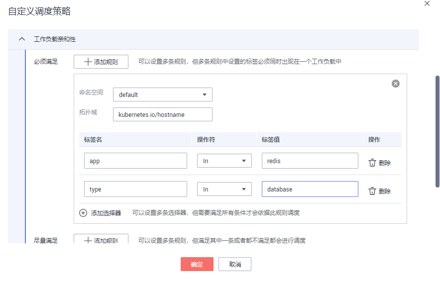

# 工作负载亲和性<a name="cce_01_0233"></a>

## 通过控制台设置<a name="section085916413596"></a>

决定工作负载的Pod和哪些工作负载的Pod部署在同一个拓扑域。

1.  登录CCE控制台，在左侧导航栏中选择“工作负载 \> 无状态负载 Deployment”或“工作负载 \> 有状态负载 StatefulSet”。
2.  在无状态工作负载或有状态工作负载列表中，单击工作负载名称进入详情页，单击“调度策略 \> 自定义调度策略”。

    **图 1**  自定义调度策略<a name="fig1149695815347"></a>  
    

3.  在工作负载亲和性设置中，依据工作负载的Pod标签，同时配置命名空间和拓扑域进行业务需求的设置。

    工作负载亲和性调度支持必须满足和尽量满足（硬约束Required/软约束Preferred），以及可以设置相应的匹配关系（In, NotIn, Exists, DoesNotExist）：

    **表 1**  工作负载亲和性设置

    <a name="table202751247311"></a>
    <table><thead align="left"><tr id="row6275154232"><th class="cellrowborder" valign="top" width="23.95%" id="mcps1.2.3.1.1"><p id="p11274641534"><a name="p11274641534"></a><a name="p11274641534"></a>参数名</p>
    </th>
    <th class="cellrowborder" valign="top" width="76.05%" id="mcps1.2.3.1.2"><p id="p12747418317"><a name="p12747418317"></a><a name="p12747418317"></a>参数描述</p>
    </th>
    </tr>
    </thead>
    <tbody><tr id="row1327511413311"><td class="cellrowborder" valign="top" width="23.95%" headers="mcps1.2.3.1.1 "><p id="p1827516415318"><a name="p1827516415318"></a><a name="p1827516415318"></a>必须满足</p>
    </td>
    <td class="cellrowborder" valign="top" width="76.05%" headers="mcps1.2.3.1.2 "><p id="p1427512410317"><a name="p1427512410317"></a><a name="p1427512410317"></a>即硬约束，设置必须要满足的条件，对应于requiredDuringSchedulingIgnoredDuringExecution，您可以单击“<strong id="b121103210127"><a name="b121103210127"></a><a name="b121103210127"></a>添加规则</strong>”添加多条必须满足的规则，但多条规则中设置的标签必须同时出现在一个工作负载中。在规则中还需要设置命名空间和拓扑域。</p>
    </td>
    </tr>
    <tr id="row112751441939"><td class="cellrowborder" valign="top" width="23.95%" headers="mcps1.2.3.1.1 "><p id="p172751442316"><a name="p172751442316"></a><a name="p172751442316"></a>尽量满足</p>
    </td>
    <td class="cellrowborder" valign="top" width="76.05%" headers="mcps1.2.3.1.2 "><p id="p12275164932"><a name="p12275164932"></a><a name="p12275164932"></a>即软约束，设置尽量满足的条件，对应于preferredDuringSchedulingIgnoredDuringExecution，您可以单击“<strong id="b344344422312"><a name="b344344422312"></a><a name="b344344422312"></a>添加规则</strong>”添加多条尽量满足的规则，无论是满足其中一条或者是都不满足都会进行调度。</p>
    </td>
    </tr>
    </tbody>
    </table>

4.  在已经添加的一条规则中，您可以根据如下参数及描述进行设置，单击“添加选择器”设置多条选择器。

    **表 2**  选择器设置

    <a name="table3820121171412"></a>
    <table><thead align="left"><tr id="row118208114146"><th class="cellrowborder" valign="top" width="23.95%" id="mcps1.2.3.1.1"><p id="p8820141131410"><a name="p8820141131410"></a><a name="p8820141131410"></a>参数名</p>
    </th>
    <th class="cellrowborder" valign="top" width="76.05%" id="mcps1.2.3.1.2"><p id="p7820141131415"><a name="p7820141131415"></a><a name="p7820141131415"></a>参数描述</p>
    </th>
    </tr>
    </thead>
    <tbody><tr id="row11564913306"><td class="cellrowborder" valign="top" width="23.95%" headers="mcps1.2.3.1.1 "><p id="p131524913015"><a name="p131524913015"></a><a name="p131524913015"></a>权重</p>
    </td>
    <td class="cellrowborder" valign="top" width="76.05%" headers="mcps1.2.3.1.2 "><a name="ul114651256173313"></a><a name="ul114651256173313"></a><ul id="ul114651256173313"><li>“必须满足”时无此参数设置。</li><li>“尽量满足”时可以为规则设置权重值，权重值越高会被优先调度。</li></ul>
    </td>
    </tr>
    <tr id="row11583112162819"><td class="cellrowborder" valign="top" width="23.95%" headers="mcps1.2.3.1.1 "><p id="p758331272819"><a name="p758331272819"></a><a name="p758331272819"></a>命名空间</p>
    </td>
    <td class="cellrowborder" valign="top" width="76.05%" headers="mcps1.2.3.1.2 "><p id="p10583812112815"><a name="p10583812112815"></a><a name="p10583812112815"></a>即namespaces，默认情况下使用和当前工作负载相同的命名空间，您可以设置其他的已有的命名空间。</p>
    </td>
    </tr>
    <tr id="row710121010284"><td class="cellrowborder" valign="top" width="23.95%" headers="mcps1.2.3.1.1 "><p id="p7102181002814"><a name="p7102181002814"></a><a name="p7102181002814"></a>拓扑域</p>
    </td>
    <td class="cellrowborder" valign="top" width="76.05%" headers="mcps1.2.3.1.2 "><p id="p151023106286"><a name="p151023106286"></a><a name="p151023106286"></a>即topologyKey，拓扑域通过设置工作节点的标签，包含默认和自定义标签，用于指定调度时作用域。</p>
    </td>
    </tr>
    <tr id="row2082010171412"><td class="cellrowborder" valign="top" width="23.95%" headers="mcps1.2.3.1.1 "><p id="p168202112145"><a name="p168202112145"></a><a name="p168202112145"></a>标签名</p>
    </td>
    <td class="cellrowborder" valign="top" width="76.05%" headers="mcps1.2.3.1.2 "><p id="p982013151417"><a name="p982013151417"></a><a name="p982013151417"></a>对应工作负载的Pod标签，您可以自定义标签名称。</p>
    </td>
    </tr>
    <tr id="row782019181410"><td class="cellrowborder" valign="top" width="23.95%" headers="mcps1.2.3.1.1 "><p id="p198241835201413"><a name="p198241835201413"></a><a name="p198241835201413"></a>操作符</p>
    </td>
    <td class="cellrowborder" valign="top" width="76.05%" headers="mcps1.2.3.1.2 "><p id="p882119117140"><a name="p882119117140"></a><a name="p882119117140"></a>可以设置四种匹配关系（In, NotIn, Exists, DoesNotExist）。</p>
    </td>
    </tr>
    <tr id="row14631352121414"><td class="cellrowborder" valign="top" width="23.95%" headers="mcps1.2.3.1.1 "><p id="p9463125251410"><a name="p9463125251410"></a><a name="p9463125251410"></a>标签值</p>
    </td>
    <td class="cellrowborder" valign="top" width="76.05%" headers="mcps1.2.3.1.2 "><p id="p16464155219144"><a name="p16464155219144"></a><a name="p16464155219144"></a>请填写标签值。</p>
    <p id="p35182478198"><a name="p35182478198"></a><a name="p35182478198"></a>In和NotIn操作符可以添加单个值或者多个value值（多值使用；进行划分），Exists和DoesNotExist判断某个label是否存在，不需设置value值。</p>
    </td>
    </tr>
    <tr id="row09151254201410"><td class="cellrowborder" valign="top" width="23.95%" headers="mcps1.2.3.1.1 "><p id="p19915155416141"><a name="p19915155416141"></a><a name="p19915155416141"></a>操作</p>
    </td>
    <td class="cellrowborder" valign="top" width="76.05%" headers="mcps1.2.3.1.2 "><p id="p2915054201417"><a name="p2915054201417"></a><a name="p2915054201417"></a>您可以单击“删除”按钮删除该选择器。</p>
    </td>
    </tr>
    <tr id="row134525715142"><td class="cellrowborder" valign="top" width="23.95%" headers="mcps1.2.3.1.1 "><p id="p845155741412"><a name="p845155741412"></a><a name="p845155741412"></a>添加选择器</p>
    </td>
    <td class="cellrowborder" valign="top" width="76.05%" headers="mcps1.2.3.1.2 "><p id="p1145757121416"><a name="p1145757121416"></a><a name="p1145757121416"></a>对应于matchExpressions，您可以单击“添加选择器”添加多条选择器，多条选择器之间是一种“与”的关系，即需要满足全部选择器才能依据此条规则进行调度。</p>
    </td>
    </tr>
    </tbody>
    </table>

    **图 2**  工作负载亲和性调度策略<a name="fig108358136268"></a>  
    


## 通过kubectl命令行设置<a name="section69149192383"></a>

本节以nginx为例，创建[图2](#fig108358136268)中的工作负载亲和性。

**前提条件**

已有使用nginx容器的工作负载和节点。

**操作步骤**

使用默认的命名空间default，拓扑域使用内置的节点标签kubernetes.io/hostname用于表示以节点为区分范围，设置标签app和type，标签值为redis和database。同时设置操作符为In，最后单击“确定“提交。

设置后的工作负载亲和性所得的yaml如下：

```
apiVersion: apps/v1
kind: Deployment
metadata:
  name: nginx
  namespace: default
spec:
  replicas: 2
  selector:
    matchLabels:
      app: nginx
  template:
    metadata:
      labels:
        app: nginx
    spec:
      containers:
      - image: nginx 
        imagePullPolicy: Always
        name: nginx
      imagePullSecrets:
      - name: default-secret
      affinity:
        nodeAffinity: {}
        podAffinity:
          requiredDuringSchedulingIgnoredDuringExecution:
            - labelSelector:
                matchExpressions:
                  - key: app
                    operator: In
                    values:
                      - redis
                  - key: type
                    operator: In
                    values:
                      - database
              namespaces:
                - default
              topologyKey: kubernetes.io/hostname
```

> **须知：** 
>上例中只有当某个工作负载同时具有app和type两个标签的时候，工作负载nginx才能调度成功，会将工作负载nginx调度到此工作负载的节点上。

