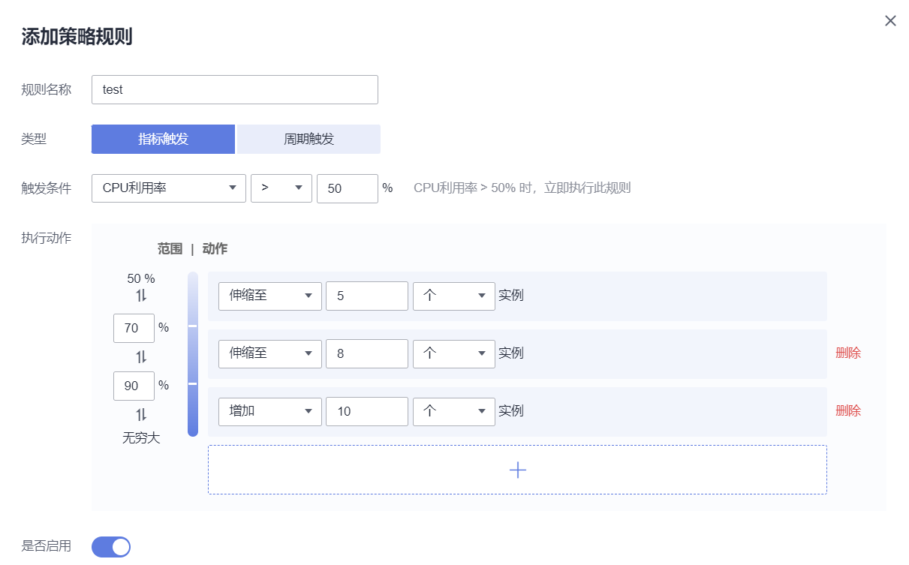

# 工作负载伸缩

工作负载伸缩提供HPA策略和CustomedHPA策略两种创建方式。两种策略的对比如下：

-   **HPA策略：**即Horizontal Pod Autoscaling，是Kubernetes中实现POD水平自动伸缩的功能。该策略在kubernetes社区HPA功能的基础上，增加了HPA级别的冷却时间窗和扩缩容阈值等功能。
-   **CustomedHPA策略：**华为云自研的弹性伸缩增强能力，能够基于CPU利用率、内存利用率等指标，对无状态工作负载进行弹性扩缩容。

    主要功能如下：

    -   支持按照当前实例数的百分比进行扩缩容。
    -   支持设置一次扩缩容的最小步长。
    -   支持按照实际指标值执行不同的扩缩容动作。

## 前提条件

-   使用HPA策略功能，需要安装[metrics-server](metrics-server.md)插件， 以采集HPA策略所关联工作负载的运行指标。
-   使用CustomedHPA策略功能，需要安装[cce-hpa-controller](cce-hpa-controller.md)和[prometheus](prometheus.md)插件，且两个插件均需为1.1.0及以上版本。

## 限制条件

-   HPA策略：仅支持1.13及以上版本的集群创建。
-   CustomedHPA策略：仅支持1.15及以上版本的集群创建。

## 创建HPA策略

1.  在[CCE控制台](https://console.huaweicloud.com/cce2.0/?utm_source=helpcenter)中，单击左侧导航栏的“弹性伸缩“，在“工作负载伸缩“页签中，查看界面提示，确认已安装[metrics-server](metrics-server.md)插件且处于正常状态。
2.  安装metrics-server插件后，单击“创建HPA策略“。
3.  在打开的“创建工作负载HPA策略“页面中，参照[表1](#table8638121213265)设置策略参数。

    **表 1**  HPA策略参数配置

    
    <table><thead align="left"><tr id="row10638181262612"><th class="cellrowborder" valign="top" width="20.02%" id="mcps1.2.3.1.1">
参数

    </th>
    <th class="cellrowborder" valign="top" width="79.97999999999999%" id="mcps1.2.3.1.2">
参数说明

    </th>
    </tr>
    </thead>
    <tbody><tr id="row1922964644615"><td class="cellrowborder" valign="top" width="20.02%" headers="mcps1.2.3.1.1 ">
策略名称

    </td>
    <td class="cellrowborder" valign="top" width="79.97999999999999%" headers="mcps1.2.3.1.2 ">
新建策略的名称，请自定义。

    </td>
    </tr>
    <tr id="row42961494311"><td class="cellrowborder" valign="top" width="20.02%" headers="mcps1.2.3.1.1 ">
集群名称

    </td>
    <td class="cellrowborder" valign="top" width="79.97999999999999%" headers="mcps1.2.3.1.2 ">
请选择工作负载所在的集群。

    </td>
    </tr>
    <tr id="row12321131519262"><td class="cellrowborder" valign="top" width="20.02%" headers="mcps1.2.3.1.1 ">
命名空间

    </td>
    <td class="cellrowborder" valign="top" width="79.97999999999999%" headers="mcps1.2.3.1.2 ">
请选择工作负载所在的命名空间。

    </td>
    </tr>
    <tr id="row1063812126263"><td class="cellrowborder" valign="top" width="20.02%" headers="mcps1.2.3.1.1 ">
关联工作负载

    </td>
    <td class="cellrowborder" valign="top" width="79.97999999999999%" headers="mcps1.2.3.1.2 ">
请选择要设置HPA策略的工作负载。

    </td>
    </tr>
    <tr id="row6649879161231"><td class="cellrowborder" valign="top" width="20.02%" headers="mcps1.2.3.1.1 ">
实例范围

    </td>
    <td class="cellrowborder" valign="top" width="79.97999999999999%" headers="mcps1.2.3.1.2 ">
请输入最小实例数和最大实例数。策略触发时，工作负载实例将在此范围内伸缩。

    </td>
    </tr>
    <tr id="row572593234714"><td class="cellrowborder" valign="top" width="20.02%" headers="mcps1.2.3.1.1 ">
策略规则

    </td>
    <td class="cellrowborder" valign="top" width="79.97999999999999%" headers="mcps1.2.3.1.2 "><ul id="ul56611653205511"><li>指标：可选择“CPU利用率”或“内存利用率”。利用率 = 工作负载容器组（Pod）的实际使用量 / 申请量。</li><li>期望值：请输入期望值。期望值表示所选指标的期望值，与阈值共同起作用，通过（期望值 / 阈值 × 当前实例数）来计算需要伸缩的实例数。</li><li>阈值：指标值小于缩容阈值时，触发缩容；指标值大于扩容阈值时，触发扩容。</li></ul>
    
您可以单击“添加策略规则”，设置多条伸缩策略。

    </td>
    </tr>
    </tbody>
    </table>

4.  设置完成后，单击“创建“将自动跳转到“工作负载伸缩“页面，在页面下方的列表中可以看到刚刚创建的HPA策略。

    **图 1**  创建HPA策略  
    

## 创建CustomedHPA策略

1.  在[CCE控制台](https://console.huaweicloud.com/cce2.0/?utm_source=helpcenter)中，单击左侧导航栏的“弹性伸缩“，在“工作负载伸缩“页签中，查看界面提示，确认已安装[cce-hpa-controller](cce-hpa-controller.md)和[prometheus](prometheus.md)插件且处于正常状态，两个插件均需为1.1.0及以上版本。
2.  安装cce-hpa-controller和prometheus插件后，单击“创建CustomedHPA策略“。
3.  在打开的“创建工作负载CustomedHPA策略“页面中，参照[表2](#table1318553420299)设置策略参数。

    **表 2**  CustomedHPA策略参数配置

    
    <table><thead align="left"><tr id="row1718512347298"><th class="cellrowborder" valign="top" width="20.02%" id="mcps1.2.3.1.1">
参数

    </th>
    <th class="cellrowborder" valign="top" width="79.97999999999999%" id="mcps1.2.3.1.2">
参数说明

    </th>
    </tr>
    </thead>
    <tbody><tr id="row13185434192914"><td class="cellrowborder" valign="top" width="20.02%" headers="mcps1.2.3.1.1 ">
策略名称

    </td>
    <td class="cellrowborder" valign="top" width="79.97999999999999%" headers="mcps1.2.3.1.2 ">
新建策略的名称，请自定义。

    </td>
    </tr>
    <tr id="row6185133422918"><td class="cellrowborder" valign="top" width="20.02%" headers="mcps1.2.3.1.1 ">
集群名称

    </td>
    <td class="cellrowborder" valign="top" width="79.97999999999999%" headers="mcps1.2.3.1.2 ">
请选择工作负载所在的集群。

    </td>
    </tr>
    <tr id="row14185173417296"><td class="cellrowborder" valign="top" width="20.02%" headers="mcps1.2.3.1.1 ">
命名空间

    </td>
    <td class="cellrowborder" valign="top" width="79.97999999999999%" headers="mcps1.2.3.1.2 ">
请选择工作负载所在的命名空间。

    </td>
    </tr>
    <tr id="row2018563419298"><td class="cellrowborder" valign="top" width="20.02%" headers="mcps1.2.3.1.1 ">
关联工作负载

    </td>
    <td class="cellrowborder" valign="top" width="79.97999999999999%" headers="mcps1.2.3.1.2 ">
请选择要设置CustomedHPA策略的工作负载。

    </td>
    </tr>
    <tr id="row1318511345294"><td class="cellrowborder" valign="top" width="20.02%" headers="mcps1.2.3.1.1 ">
实例范围

    </td>
    <td class="cellrowborder" valign="top" width="79.97999999999999%" headers="mcps1.2.3.1.2 ">
请输入最小实例数和最大实例数。

    
策略触发时，工作负载实例将在此范围内伸缩。

    </td>
    </tr>
    <tr id="row1428311016121"><td class="cellrowborder" valign="top" width="20.02%" headers="mcps1.2.3.1.1 ">
冷却时间

    </td>
    <td class="cellrowborder" valign="top" width="79.97999999999999%" headers="mcps1.2.3.1.2 ">
请输入时间值，单位为分钟。

    
伸缩策略执行后停止继续匹配的时间，目的是等待伸缩动作完成后在系统稳定且集群正常的情况下进行下一次策略匹配。

    </td>
    </tr>
    <tr id="row20185183462913"><td class="cellrowborder" valign="top" width="20.02%" headers="mcps1.2.3.1.1 ">
策略规则

    </td>
    <td class="cellrowborder" valign="top" width="79.97999999999999%" headers="mcps1.2.3.1.2 ">
单击“添加策略规则”在弹出的窗口中设置伸缩策略参数：

    <ul id="ul1118523472911"><li>规则名称：请输入规则名称，可自定义。</li><li>类型：默认选择“指标触发”，不可取消。</li><li>触发条件：请选择“CPU利用率”或“内存利用率”，选择“&gt;”或“&lt;”，并输入百分比的值。如<a href="#fig77841552319">图2</a>中所示，则表示CPU利用率瞬时值 &gt; 50% 时，立即执行此规则。
<b>图1 </b>触发条件 

    </li><li>执行动作：与上述“触发条件”相对应，达到触发条件值后所要执行的动作，可添加多个执行动作。如<a href="#fig515211863120">图3</a>中所示，当CPU利用率超过50%时将伸缩至5个实例，当超过70%时伸缩至8个实例，当超过90%时在8个实例基础上再增加10个实例。反之，按此规则执行缩容。
<b>图2 </b>执行动作 

    </li><li>是否启用：可单击启用或关闭该策略规则。</li></ul>
    
单击确定后，您可以在“策略规则”列表中查看添加的规则，并可执行开启关闭、编辑、删除等操作。

    
单击“策略规则”列表下方的“添加策略规则”，可设置多条策略。

    </td>
    </tr>
    </tbody>
    </table>

4.  设置完成后，单击“创建“将自动跳转到“工作负载伸缩“页面，在页面下方的列表中可以看到刚刚创建的HPA策略。

    **图 4**  创建HPA策略  
    

    > **说明：**   
    >若该工作负载已经创建过HPA策略，再对其创建CustomedHPA策略后，原HPA策略将被替换。  

## 管理HPA/CustomedHPA策略

HPA或CustomedHPA策略创建完成后，可对创建的策略进行更新、克隆、编辑YAML以及删除等操作。

**更新HPA或CustomedHPA策略**

1.  登录[CCE控制台](https://console.huaweicloud.com/cce2.0/?utm_source=helpcenter)，在左侧导航栏中单击“弹性伸缩”，在“工作负载伸缩“页签中，单击要更新的策略后方“操作“栏中的“更新“。
2.  在打开的“更新工作负载HPA策略“页面中，参考[表1](#table8638121213265)更新策略参数。
3.  单击“更新“按钮完成策略更新。

**克隆HPA或CustomedHPA策略**

1.  登录[CCE控制台](https://console.huaweicloud.com/cce2.0/?utm_source=helpcenter)，在左侧导航栏中单击“弹性伸缩”，在“工作负载伸缩“页签中，单击要更新的策略后方“操作“栏中的“克隆“。
2.  在打开的“创建工作负载HPA策略“页面中，可以看到部分参数（如实例范围、冷却时间和策略规则）已经克隆过来，请按照业务需求补充或修改其他策略参数。
3.  单击“创建“按钮完成策略克隆，在“工作负载伸缩“页签下的策略列表中可以看到新克隆的策略。

**编辑YAML**

1.  登录[CCE控制台](https://console.huaweicloud.com/cce2.0/?utm_source=helpcenter)，在左侧导航栏中单击“弹性伸缩”，在“工作负载伸缩“页签中，单击要更新的策略后方“操作“栏中的“更多 \> 编辑YAML“。
2.  在弹出的“编辑YAML“窗口中，可以对YAML进行修改和下载。
3.  单击右上角的关闭按钮完成操作。

**删除HPA或CustomedHPA策略**

1.  登录[CCE控制台](https://console.huaweicloud.com/cce2.0/?utm_source=helpcenter)，在左侧导航栏中单击“弹性伸缩”，在“工作负载伸缩“页签中，单击要更新的策略后方“操作“栏中的“更多 \> 删除“。
2.  在弹出的“删除HPA策略“窗口中，确认是否删除。
3.  单击“是“完成删除操作。

## 查看HPA策略

您可以查看HPA策略的规则、状态和事件，参照界面中的报错提示有针对性的解决异常事件。

1.  登录[CCE控制台](https://console.huaweicloud.com/cce2.0/?utm_source=helpcenter)，在左侧导航栏中单击“弹性伸缩”，在“工作负载伸缩“页签中，单击要查看的HPA策略前方的。
2.  在展开的区域中，可以看到规则、状态和事件页签，若策略异常，请参照界面中的报错提示进行定位处理。

    > **说明：**   
    >您还可以在工作负载详情页中查看已创建的HPA策略，登录[CCE控制台](https://console.huaweicloud.com/cce2.0/?utm_source=helpcenter)，在左侧导航栏中单击“工作负载 \> 无状态负载 Deployment”或“工作负载 \> 有状态负载 StatefulSet”，单击工作负载后方“操作“中的“更多 \> 伸缩“，在该工作负载详情页的“伸缩“页签中可以看到“弹性伸缩 - HPA / CustomedHPA“，您在“弹性伸缩“页面配置的HPA策略也会在这里显示。  

    **表 3**  事件类型及名称

    
    <table><thead align="left"><tr id="row269117254324"><th class="cellrowborder" valign="top" width="17.531753175317533%" id="mcps1.2.4.1.1">
事件类型

    </th>
    <th class="cellrowborder" valign="top" width="40.94409440944094%" id="mcps1.2.4.1.2">
事件名称

    </th>
    <th class="cellrowborder" valign="top" width="41.52415241524153%" id="mcps1.2.4.1.3">
描述

    </th>
    </tr>
    </thead>
    <tbody><tr id="row2692325123216"><td class="cellrowborder" valign="top" width="17.531753175317533%" headers="mcps1.2.4.1.1 ">
正常

    </td>
    <td class="cellrowborder" valign="top" width="40.94409440944094%" headers="mcps1.2.4.1.2 ">
SuccessfulRescale

    </td>
    <td class="cellrowborder" valign="top" width="41.52415241524153%" headers="mcps1.2.4.1.3 ">
扩缩容成功

    </td>
    </tr>
    <tr id="row15692192511329"><td class="cellrowborder" rowspan="12" valign="top" width="17.531753175317533%" headers="mcps1.2.4.1.1 ">
异常

    </td>
    <td class="cellrowborder" valign="top" width="40.94409440944094%" headers="mcps1.2.4.1.2 ">
InvalidTargetRange

    </td>
    <td class="cellrowborder" valign="top" width="41.52415241524153%" headers="mcps1.2.4.1.3 ">
无效的TargetRange

    </td>
    </tr>
    <tr id="row1669211256324"><td class="cellrowborder" valign="top" headers="mcps1.2.4.1.1 ">
InvalidSelector

    </td>
    <td class="cellrowborder" valign="top" headers="mcps1.2.4.1.2 ">
无效选择器

    </td>
    </tr>
    <tr id="row36921525173217"><td class="cellrowborder" valign="top" headers="mcps1.2.4.1.1 ">
FailedGetObjectMetric

    </td>
    <td class="cellrowborder" valign="top" headers="mcps1.2.4.1.2 ">
获取对象失败数

    </td>
    </tr>
    <tr id="row769216258320"><td class="cellrowborder" valign="top" headers="mcps1.2.4.1.1 ">
FailedGetPodsMetric

    </td>
    <td class="cellrowborder" valign="top" headers="mcps1.2.4.1.2 ">
获取Pod列表失败指标

    </td>
    </tr>
    <tr id="row17692925143210"><td class="cellrowborder" valign="top" headers="mcps1.2.4.1.1 ">
FailedGetResourceMetric

    </td>
    <td class="cellrowborder" valign="top" headers="mcps1.2.4.1.2 ">
获取资源失败数

    </td>
    </tr>
    <tr id="row669216253320"><td class="cellrowborder" valign="top" headers="mcps1.2.4.1.1 ">
FailedGetExternalMetric

    </td>
    <td class="cellrowborder" valign="top" headers="mcps1.2.4.1.2 ">
获取外部指标失败

    </td>
    </tr>
    <tr id="row869212503211"><td class="cellrowborder" valign="top" headers="mcps1.2.4.1.1 ">
InvalidMetricSourceType

    </td>
    <td class="cellrowborder" valign="top" headers="mcps1.2.4.1.2 ">
无效的指标来源类型

    </td>
    </tr>
    <tr id="row11692142513324"><td class="cellrowborder" valign="top" headers="mcps1.2.4.1.1 ">
FailedConvertHPA

    </td>
    <td class="cellrowborder" valign="top" headers="mcps1.2.4.1.2 ">
转换HPA失败

    </td>
    </tr>
    <tr id="row1469282513323"><td class="cellrowborder" valign="top" headers="mcps1.2.4.1.1 ">
FailedGetScale

    </td>
    <td class="cellrowborder" valign="top" headers="mcps1.2.4.1.2 ">
获取比例尺失败

    </td>
    </tr>
    <tr id="row186921525183211"><td class="cellrowborder" valign="top" headers="mcps1.2.4.1.1 ">
FailedComputeMetricsReplicas

    </td>
    <td class="cellrowborder" valign="top" headers="mcps1.2.4.1.2 ">
失败计算指标副本数

    </td>
    </tr>
    <tr id="row176931225143214"><td class="cellrowborder" valign="top" headers="mcps1.2.4.1.1 ">
FailedGetScaleWindow

    </td>
    <td class="cellrowborder" valign="top" headers="mcps1.2.4.1.2 ">
获取ScaleWindow失败

    </td>
    </tr>
    <tr id="row19693132523211"><td class="cellrowborder" valign="top" headers="mcps1.2.4.1.1 ">
FailedRescale

    </td>
    <td class="cellrowborder" valign="top" headers="mcps1.2.4.1.2 ">
失败重新扩缩容

    </td>
    </tr>
    </tbody>
    </table>

## 查看CustomedHPA策略

您可以查看CustomedHPA策略的规则和最新状态，参照界面中的报错提示有针对性的解决异常事件。

1.  登录[CCE控制台](https://console.huaweicloud.com/cce2.0/?utm_source=helpcenter)，在左侧导航栏中单击“弹性伸缩”，在“工作负载伸缩“页签中，单击要查看的CustomedHPA策略前方的。
2.  在展开的区域中，可以看到规则页签，若策略异常，请单击“最新状态“栏中的“详情“，参照展开的详细信息进行定位处理。

    > **说明：**   
    >您还可以在工作负载详情页中查看已创建的CustomedHPA策略，登录[CCE控制台](https://console.huaweicloud.com/cce2.0/?utm_source=helpcenter)，在左侧导航栏中单击“工作负载 \> 无状态负载 Deployment”或“工作负载 \> 有状态负载 StatefulSet”，单击工作负载后方“操作“中的“更多 \> 伸缩“，在该工作负载详情页的“伸缩“页签中可以看到“弹性伸缩 - HPA / CustomedHPA“，您在“弹性伸缩“页面配置的CustomedHPA策略也会在这里显示。  

