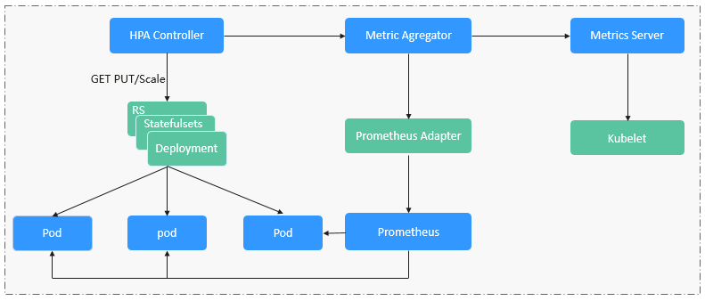

# 工作负载伸缩原理

CCE支持HPA策略和CustomedHPA策略两种工作负载伸缩方式。两种策略的对比如下：

**表 1**  HPA和CustomedHPA策略对比

<table><thead align="left"><tr id="row13891131410285"><th class="cellrowborder" valign="top" width="18.801880188018803%" id="mcps1.2.4.1.1">
伸缩策略

</th>
<th class="cellrowborder" valign="top" width="40.22402240224022%" id="mcps1.2.4.1.2">
HPA策略

</th>
<th class="cellrowborder" valign="top" width="40.97409740974097%" id="mcps1.2.4.1.3">
CustomedHPA策略

</th>
</tr>
</thead>
<tbody><tr id="row17891191413288"><td class="cellrowborder" valign="top" width="18.801880188018803%" headers="mcps1.2.4.1.1 ">
实现方式

</td>
<td class="cellrowborder" valign="top" width="40.22402240224022%" headers="mcps1.2.4.1.2 ">
Kubernetes中实现POD水平自动伸缩的功能，即Horizontal Pod Autoscaling

</td>
<td class="cellrowborder" valign="top" width="40.97409740974097%" headers="mcps1.2.4.1.3 ">
华为云自研的弹性伸缩增强能力

</td>
</tr>
<tr id="row1189151452816"><td class="cellrowborder" valign="top" width="18.801880188018803%" headers="mcps1.2.4.1.1 ">
策略规则

</td>
<td class="cellrowborder" valign="top" width="40.22402240224022%" headers="mcps1.2.4.1.2 ">
基于<strong id="b5412115419013">指标</strong>（CPU利用率、内存利用率），对无状态工作负载进行弹性扩缩容。

</td>
<td class="cellrowborder" valign="top" width="40.97409740974097%" headers="mcps1.2.4.1.3 ">
基于<strong id="b71841849504">指标</strong>（CPU利用率、内存利用率）或<strong id="b046514511014">周期</strong>（每天、每周、每月或每年的具体时间点），对无状态工作负载进行弹性扩缩容。

</td>
</tr>
<tr id="row19891161415282"><td class="cellrowborder" valign="top" width="18.801880188018803%" headers="mcps1.2.4.1.1 ">
主要功能

</td>
<td class="cellrowborder" valign="top" width="40.22402240224022%" headers="mcps1.2.4.1.2 ">
在kubernetes社区HPA功能的基础上，增加了应用级别的冷却时间窗和扩缩容阈值等功能。

</td>
<td class="cellrowborder" valign="top" width="40.97409740974097%" headers="mcps1.2.4.1.3 ">
<strong id="b4230421408">指标触发</strong>

<ul id="ul0749241175310"><li>支持按照当前实例数的百分比进行扩缩容。</li><li>支持设置一次扩缩容的最小步长，可分步分级扩缩容。</li><li>支持按照实际指标值执行不同的扩缩容动作。</li></ul>

<strong id="b615104513020">周期触发</strong>

支持选择天、周、月或年的具体时间点或周期作为触发时间

</td>
</tr>
</tbody>
</table>

> **说明：** 
>**伸缩策略优先级：**手动伸缩和自动伸缩同时配置的情况下，在不执行手动伸缩时，资源调度以自动伸缩为准，伸缩按照监控信息自动触发，如果使用[手动伸缩](工作负载弹性伸缩.md#section1050418516503)，自动伸缩会暂时失效。

## HPA工作原理

HPA（Horizontal Pod Autoscaler）是用来控制Pod水平伸缩的控制器，HPA周期性检查Pod的度量数据，计算满足HPA资源所配置的目标数值所需的副本数量，进而调整目标资源（如Deployment）的replicas字段。

想要做到自动弹性伸缩，先决条件就是能感知到各种运行数据，例如集群节点、Pod、容器的CPU、内存使用率等等。而这些数据的监控能力Kubernetes也没有自己实现，而是通过其他项目来扩展Kubernetes的能力，CCE提供如下两个插件来实现该能力：

-   [Prometheus](https://prometheus.io/)是一套开源的系统监控报警框架，能够采集丰富的Metrics（度量数据），目前已经基本是Kubernetes的标准监控方案。
-   [Metrics Server](https://github.com/kubernetes-sigs/metrics-server)是Kubernetes集群范围资源使用数据的聚合器。Metrics Server从kubelet公开的Summary API中采集度量数据，能够收集包括了Pod、Node、容器、Service等主要Kubernetes核心资源的度量数据，且对外提供一套标准的API。

使用HPA（Horizontal Pod Autoscaler）配合Metrics Server可以实现基于CPU和内存的自动弹性伸缩，再配合Prometheus还可以实现[自定义监控指标](https://github.com/kubernetes/community/blob/master/contributors/design-proposals/instrumentation/custom-metrics-api.md)的自动弹性伸缩。

HPA主要流程如[图1](#fig4979183710538)所示。

**图 1**  HPA流程图  

**HPA的核心有如下2个部分：**

-   监控数据来源

    最早社区只提供基于CPU和Mem的HPA，随着应用越来越多搬迁到k8s上以及Prometheus的发展，开发者已经不满足于CPU和Memory，开发者需要应用自身的业务指标，或者是一些接入层的监控信息，例如：Load Balancer的QPS、网站的实时在线人数等。社区经过思考之后，定义了一套标准的Metrics API，通过聚合API对外提供服务。

    -   metrics.k8s.io： 主要提供Pod和Node的CPU和Memory相关的监控指标。
    -   custom.metrics.k8s.io： 主要提供Kubernetes Object相关的自定义监控指标。
    -   external.metrics.k8s.io：指标来源外部，与任何的Kubernetes资源的指标无关。

-   扩缩容决策算法

    HPA controller跟据当前指标和期望指标来计算缩放比例，计算公式如下：

    **desiredReplicas = ceil\[currentReplicas \* \( currentMetricValue / desiredMetricValue \)\]**

    例如当前的指标值是200m，目标值是100m，那么按照公式计算期望的实例数就会翻倍。那么在实际过程中，可能会遇到实例数值反复伸缩，导致集群震荡。为了保证稳定性，HPA controller从以下几个方面进行优化：

    -   冷却时间：在1.11版本以及之前的版本，社区引入了horizontal-pod-autoscaler-downscale-stabilization-window和horizontal-pod-autoScaler-upscale-stabilization-window这两个启动参数代表扩容冷却时间和缩容冷却时间，这样保证在冷却时间内，跳过扩缩容。1.14版本之后引入延迟队列，保存一段时间内每一次检测的决策建议，然后根据当前所有有效的决策建议来进行决策，从而保证期望的副本数尽量小的发生变更，保证稳定性。
    -   忍受度：可以看成一个缓冲区，当实例变化范围在忍受范围之内的话，保持原有的实例数不变。

        首先定义ratio = currentMetricValue / desiredMetricValue

        当|ratio – 1.0| <= tolerance时，则会忽略，跳过scale。

        当|ratio – 1.0| \> tolerance时， 就会根据之前的公式计算期望值。

        当前社区版本中默认值为0.1

    由于当前冷却时间窗，忍受度都是全局的参数，对于用户来说，可能应用所需的忍受度和冷却时间窗都不一致，所以当前CCE在社区的基础上，提供应用级别的忍受度和冷却时间窗。

HPA是基于指标阈值进行伸缩的，常见的指标主要是 CPU、内存，当然也可以通过自定义指标，例如QPS、连接数等进行伸缩。但是存在一个问题：基于指标的伸缩存在一定的时延，这个时延主要包含：采集时延\(分钟级\) + 判断时延\(分钟级\) + 伸缩时延\(分钟级\)。这个分钟级的时延，可能会导致应用CPU飚高，相应时间变慢。为了解决这个问题，CCE提供了定时策略，对于一些有周期性变化的应用，提前扩容资源，而业务低谷时，定时回收资源。

