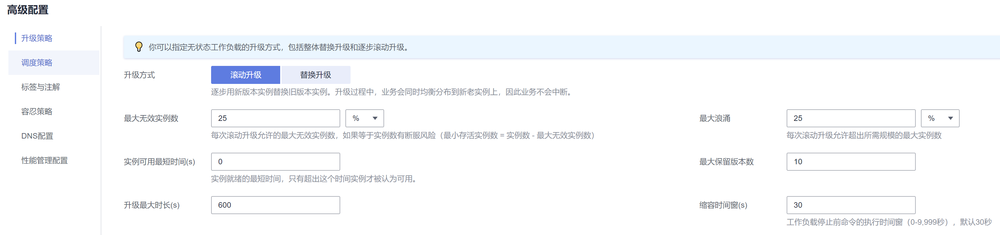

# 工作负载升级配置<a name="cce_10_0397"></a>

在实际应用中，升级是一个常见的场景，Deployment、StatefulSet和DaemonSet都能够很方便的支撑应用升级。

设置不同的升级策略，有如下两种。

-   RollingUpdate：滚动升级，即逐步创建新Pod再删除旧Pod，为默认策略。
-   Recreate：替换升级，即先把当前Pod删掉再重新创建Pod。



## 升级参数说明<a name="section718835152215"></a>

-   最大浪涌（maxSurge）

    与spec.replicas相比，可以有多少个Pod存在，默认值是25%，比如spec.replicas为 4，那升级过程中就不能超过5个Pod存在，即按1个的步伐升级，实际升级过程中会换算成数字，且换算会向上取整。这个值也可以直接设置成数字。

    仅Deployment支持配置。

-   最大无效实例数（maxUnavailable）

    与spec.replicas相比，可以有多少个Pod失效，也就是删除的比例，默认值是25%，比如spec.replicas为4，那升级过程中就至少有3个Pod存在，即删除Pod的步伐是1。同样这个值也可以设置成数字。

    仅Deployment支持配置。

-   实例可用最短时间（minReadySeconds）

    指定新创建的 Pod 在没有任意容器崩溃情况下的最小就绪时间， 只有超出这个时间 Pod 才被视为可用。默认值为 0（Pod 在准备就绪后立即将被视为可用）。

-   最大保留版本数（revisionHistoryLimit）

    用来设定出于回滚目的所要保留的旧 ReplicaSet 数量。 这些旧 ReplicaSet 会消耗 etcd 中的资源，并占用 kubectl get rs 的输出。 每个 Deployment 修订版本的配置都存储在其 ReplicaSets 中；因此，一旦删除了旧的 ReplicaSet， 将失去回滚到 Deployment 的对应修订版本的能力。 默认情况下，系统保留 10 个旧 ReplicaSet，但其理想值取决于新 Deployment 的频率和稳定性。

-   升级最大时长（progressDeadlineSeconds）

    指定系统在报告 Deployment 进展失败 之前等待 Deployment 取得进展的秒数。 这类报告会在资源状态中体现为 Type=Progressing、Status=False、 Reason=ProgressDeadlineExceeded。Deployment 控制器将持续重试 Deployment。 将来，一旦实现了自动回滚，Deployment 控制器将在探测到这样的条件时立即回滚 Deployment。

    如果指定，则此字段值需要大于 .spec.minReadySeconds 取值。

-   缩容时间窗（terminationGracePeriodSeconds）：

    优雅删除时间，默认为30秒，删除Pod时发送SIGTERM终止信号，然后等待容器中的应用程序终止执行，如果在terminationGracePeriodSeconds时间内未能终止，则发送SIGKILL的系统信号强行终止。


## 升级示例<a name="section388485452919"></a>

Deployment的升级可以是声明式的，也就是说只需要修改Deployment的YAML定义即可，比如使用kubectl edit命令将上面Deployment中的镜像修改为nginx:alpine。修改完成后再查询ReplicaSet和Pod，发现创建了一个新的ReplicaSet，Pod也重新创建了。

```
$ kubectl edit deploy nginx

$ kubectl get rs
NAME               DESIRED   CURRENT   READY     AGE
nginx-6f9f58dffd   2         2         2         1m
nginx-7f98958cdf   0         0         0         48m

$ kubectl get pods
NAME                     READY     STATUS    RESTARTS   AGE
nginx-6f9f58dffd-tdmqk   1/1       Running   0          1m
nginx-6f9f58dffd-tesqr   1/1       Running   0          1m
```

Deployment可以通过maxSurge和maxUnavailable两个参数控制升级过程中同时重新创建Pod的比例，这在很多时候是非常有用，配置如下所示。

```
spec:
  strategy:
    rollingUpdate:
      maxSurge: 1
      maxUnavailable: 0
    type: RollingUpdate
```

在前面的例子中，由于spec.replicas是2，如果maxSurge和maxUnavailable都为默认值25%，那实际升级过程中，maxSurge允许最多3个Pod存在（向上取整，2\*1.25=2.5，取整为3），而maxUnavailable则不允许有Pod Unavailable（向上取整，2\*0.75=1.5，取整为2），也就是说在升级过程中，一直会有2个Pod处于运行状态，每次新建一个Pod，等这个Pod创建成功后再删掉一个旧Pod，直至Pod全部为新Pod。

## 回滚<a name="section48841529143718"></a>

回滚也称为回退，即当发现升级出现问题时，让应用回到老的版本。Deployment可以非常方便的回滚到老版本。

例如上面升级的新版镜像有问题，可以执行kubectl rollout undo命令进行回滚。

```
$ kubectl rollout undo deployment nginx
deployment.apps/nginx rolled back
```

Deployment之所以能如此容易的做到回滚，是因为Deployment是通过ReplicaSet控制Pod的，升级后之前ReplicaSet都一直存在，Deployment回滚做的就是使用之前的ReplicaSet再次把Pod创建出来。Deployment中保存ReplicaSet的数量可以使用revisionHistoryLimit参数限制，默认值为10。

