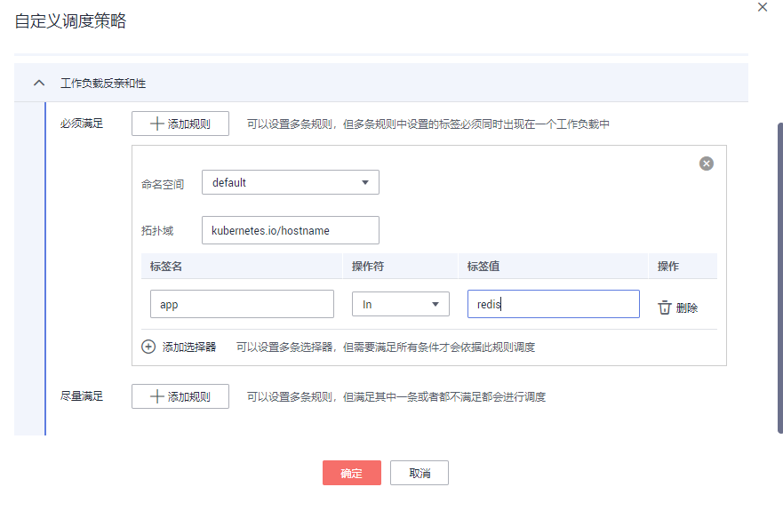

# 工作负载反亲和性<a name="cce_01_0234"></a>

## 通过控制台设置<a name="section984110391216"></a>

决定工作负载的Pod不和哪些工作负载的Pod部署在同一个拓扑域。

1.  登录[CCE控制台](https://console.huaweicloud.com/cce2.0/?utm_source=helpcenter)，在左侧导航栏中选择“工作负载 \> 无状态负载 Deployment”或“工作负载 \> 有状态负载 StatefulSet”。
2.  在无状态工作负载或有状态工作负载列表中，单击工作负载名称进入详情页，单击“调度策略 \> 自定义调度策略”。
3.  在工作负载反亲和性设置中，依据工作负载中标签同时还可以配置命名空间和拓扑域进行业务需求的设置。

    > **说明：** 
    >工作负载反亲和性调度支持必须满足和尽量满足（硬约束Required/软约束Preferred），以及可以设置相应的匹配关系（In、 NotIn、Exists、DoesNotExist）：
    >-   **必须满足：**即硬约束，设置必须要满足的条件，对应于requiredDuringSchedulingIgnoredDuringExecution，您可以添加多条必须满足的规则。在规则中还需要设置命名空间和拓扑域。
    >-   **尽量满足：**即软约束，设置尽量满足的条件，对应于preferredDuringSchedulingIgnoredDuringExecution，您可以添加多条尽量满足的规则，无论是满足其中一条或者是都不满足都会进行调度。另外可以为规则设置权重值，权重值越高会被优先调度。
    >-   **命名空间：**即namespaces，默认情况下使用和当前工作负载相同的命名空间，您可以设置其他的已有的命名空间。
    >-   **拓扑域：**即topologyKey，拓扑域通过设置工作节点的标签，包含默认和自定义标签，用于指定调度时作用域。
    >-   **选择器：**对应于matchExpressions，您可以添加多条选择器，多条选择器之间是一种“与”的关系，即需要满足全部选择器才能依据此条规则进行调度。
    >-   **标签名：**对应工作负载的标签，您可以使用默认标签app或者使用自定义标签。
    >-   **匹配关系：**即操作符，可以设置四种匹配关系（In, NotIn, Exists, DoesNotExist）。In和NotIn操作符可以添加单个值或者多个value值（多值使用；进行划分），Exists和DoesNotExist判断某个label是否存在，不需设置value值。

    **图 1**  工作负载反亲和性调度策略<a name="fig189719591135"></a>  
    


## 通过kubectl命令行设置<a name="section93428308559"></a>

本节以nginx为例，创建[图1](#fig189719591135)中工作负载反亲和性。

**前提条件**

已有使用nginx容器的工作负载和节点。

**操作步骤**

使用默认的命名空间default，拓扑域使用内置的节点标签kubernetes.io/hostname用于表示以节点为区分范围，设置标签app，标签值为redis。同时设置操作符为In，最后单击“确定“提交。

设置后的工作负载反亲和性所得的yaml如下：

```
apiVersion: extensions/v1beta1
kind: Deployment
metadata:
  name: nginx
  namespace: default
spec:
  replicas: 2
  selector:
    matchLabels:
      app: nginx
  template:
    metadata:
      labels:
        app: nginx
    spec:
      imagePullSecrets:
        - name: default-secret
      affinity:
        podAntiAffinity:
          requiredDuringSchedulingIgnoredDuringExecution:
            - labelSelector:
                matchExpressions:
                  - key: app
                    operator: In
                    values:
                      - redis
              namespaces:
                - default
              topologyKey: kubernetes.io/hostname
```

