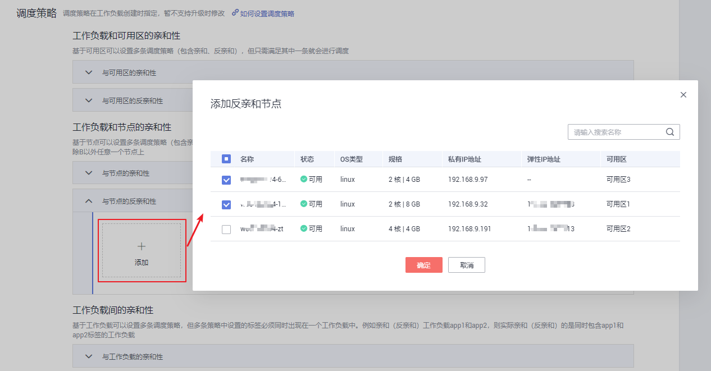
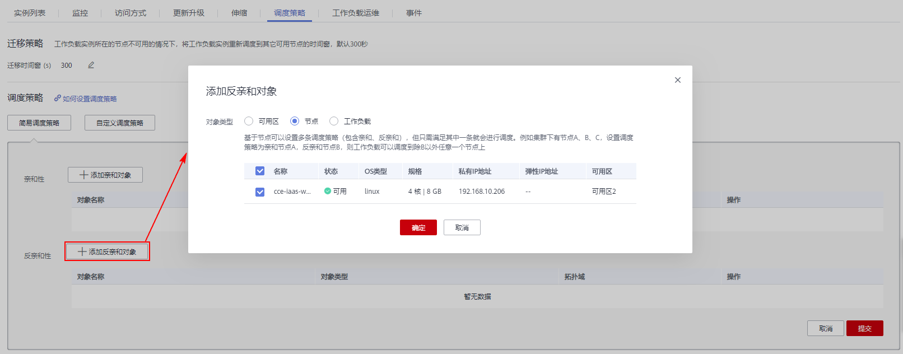

# 工作负载和节点的反亲和性<a name="cce_01_0226"></a>

## 通过控制台设置<a name="section122391413184616"></a>

1.  参照[创建无状态负载\(Deployment\)](创建无状态负载(Deployment)-40.md)或[创建有状态负载\(StatefulSet\)](创建有状态负载(StatefulSet)-41.md)，在“高级设置“的“调度策略“下，单击“工作负载和节点的亲和性 \> 与节点的反亲和性”下的“添加“。

    **图 1**  与节点的反亲和性<a name="fig12343196125211"></a>  
    

2.  勾选工作负载不希望部署到的节点，单击“确定“。

    若勾选多个节点，工作负载将不会部署到这些节点上。


## 通过kubectl命令行设置<a name="section1361482522712"></a>

本节以nginx为例，说明kubectl命令创建工作负载的方法。

**前提条件**

请参见[通过kubectl连接集群](通过kubectl连接集群-7.md)配置kubectl命令，使弹性云服务器连接集群。

**操作步骤**

参见[通过kubectl命令行创建无状态工作负载](创建无状态负载(Deployment)-40.md#section155246177178)或[通过kubectl命令行创建有状态工作负载](创建有状态负载(StatefulSet)-41.md#section113441881214)，工作负载和节点反亲和性的yaml示例如下：

```
apiVersion: apps/v1
kind: Deployment
metadata:
  name: nginx
spec:
  replicas: 1
  selector:
    matchLabels:
      app: nginx
  strategy:
    type: RollingUpdate
  template:
    metadata:
      labels:
        app: nginx
    spec:
      containers:
      - image: nginx 
        imagePullPolicy: Always
        name: nginx
      imagePullSecrets:
      - name: default-secret
      affinity:
        nodeAffinity:
          requiredDuringSchedulingIgnoredDuringExecution:
            nodeSelectorTerms:
            - matchExpressions:
              - key: nodeName          #node中lable的key
                operator: NotIn        #notin说明不部署
                values:
                - test-node-1          #node中对应key的value
```

## 工作负载创建完成后设置<a name="section02391513134618"></a>

1.  登录CCE控制台，在左侧导航栏中选择“工作负载 \> 无状态负载 Deployment”或“工作负载 \> 有状态负载 StatefulSet”。
2.  单击工作负载名称进入详情页，单击“调度策略 \> 简易调度策略 \> 添加反亲和对象”。
3.  对象类型选择“节点”，勾选工作负载不希望部署到的节点，设置完成后当前工作负载不会部署到已选择的节点上。

    **图 2**  添加反亲和对象-节点<a name="fig10448115415533"></a>  
    

    > **说明：** 
    >该方法可新增、编辑和删除调度策略。


