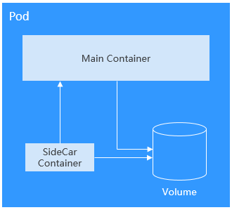
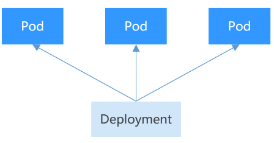
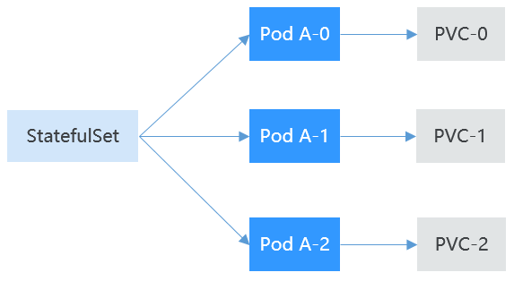
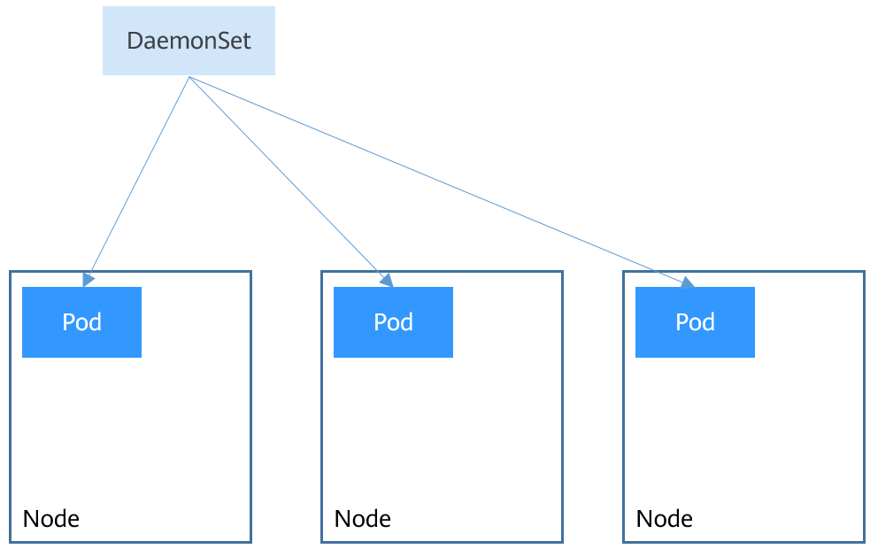

# 工作负载概述

工作负载是在Kubernetes上运行的应用程序。无论您的工作负载是单个组件还是协同工作的多个组件，您都可以在Kubernetes上的一组Pod中运行它。在Kubernetes中，工作负载是对一组Pod的抽象模型，用于描述业务的运行载体，包括Deployment、Statefulset、Daemonset、Job、CronJob等多种类型。

云容器引擎CCE提供基于Kubernetes原生类型的容器部署和管理能力，支持容器工作负载部署、配置、监控、扩容、升级、卸载、服务发现及负载均衡等生命周期管理。

## Pod

Pod是Kubernetes创建或部署的最小单位。一个Pod封装一个或多个容器（container）、存储资源（volume）、一个独立的网络IP以及管理控制容器运行方式的策略选项。

Pod使用主要分为两种方式：

-   Pod中运行一个容器。这是Kubernetes最常见的用法，您可以将Pod视为单个封装的容器，但是Kubernetes是直接管理Pod而不是容器。
-   Pod中运行多个需要耦合在一起工作、需要共享资源的容器。通常这种场景下应用包含一个主容器和几个辅助容器（SideCar Container），如[图1](#zh-cn_topic_0254767870_fig347141918551)所示，例如主容器为一个web服务器，从一个固定目录下对外提供文件服务，而辅助容器周期性的从外部下载文件存到这个固定目录下。

    **图 1**  Pod  
    

实际使用中很少直接创建Pod，而是使用Kubernetes中称为Controller的抽象层来管理Pod实例，例如Deployment和Job。Controller可以创建和管理多个Pod，提供副本管理、滚动升级和自愈能力。通常，Controller会使用Pod Template来创建相应的Pod。

## Deployment

Pod是Kubernetes创建或部署的最小单位，但是Pod是被设计为相对短暂的一次性实体，Pod可以被驱逐（当节点资源不足时）、随着集群的节点崩溃而消失。Kubernetes提供了Controller（控制器）来管理Pod，Controller可以创建和管理多个Pod，提供副本管理、滚动升级和自愈能力，其中最为常用的就是Deployment。

**图 2**  Deployment  

一个Deployment可以包含一个或多个Pod副本，每个Pod副本的角色相同，所以系统会自动为Deployment的多个Pod副本分发请求。

Deployment集成了上线部署、滚动升级、创建副本、恢复上线的功能，在某种程度上，Deployment实现无人值守的上线，大大降低了上线过程的复杂性和操作风险。

## StatefulSet

Deployment控制器下的Pod都有个共同特点，那就是每个Pod除了名称和IP地址不同，其余完全相同。需要的时候，Deployment可以通过Pod模板创建新的Pod；不需要的时候，Deployment就可以删除任意一个Pod。

但是在某些场景下，这并不满足需求，比如有些分布式的场景，要求每个Pod都有自己单独的状态时，比如分布式数据库，每个Pod要求有单独的存储，这时Deployment就不能满足需求了。

详细分析下有状态应用的需求，分布式有状态的特点主要是应用中每个部分的角色不同（即分工不同），比如数据库有主备，Pod之间有依赖，对应到Kubernetes中就是对Pod有如下要求：

-   Pod能够被别的Pod找到，这就要求Pod有固定的标识。
-   每个Pod有单独存储，Pod被删除恢复后，读取的数据必须还是以前那份，否则状态就会不一致。

Kubernetes提供了StatefulSet来解决这个问题，其具体如下：

1.  StatefulSet给每个Pod提供固定名称，Pod名称增加从0-N的固定后缀，Pod重新调度后Pod名称和HostName不变。
2.  StatefulSet通过Headless Service给每个Pod提供固定的访问域名，Service的概念会在后面章节中详细介绍。
3.  StatefulSet通过创建固定标识的PVC保证Pod重新调度后还是能访问到相同的持久化数据。

    

## DaemonSet

DaemonSet是这样一种对象（守护进程），它在集群的每个节点上运行一个Pod，且保证只有一个Pod，这非常适合一些系统层面的应用，例如日志收集、资源监控等，这类应用需要每个节点都运行，且不需要太多实例，一个比较好的例子就是Kubernetes的kube-proxy。

DaemonSet跟节点相关，如果节点异常，也不会在其他节点重新创建。

**图 3**  DaemonSet  

## Job和CronJob

Job和CronJob是负责批量处理短暂的一次性任务（short lived one-off tasks），即仅执行一次的任务，它保证批处理任务的一个或多个Pod成功结束。

-   Job：是Kubernetes用来控制批处理型任务的资源对象。批处理业务与长期伺服业务（Deployment、Statefulset）的主要区别是批处理业务的运行有头有尾，而长期伺服业务在用户不停止的情况下永远运行。Job管理的Pod根据用户的设置把任务成功完成就自动退出（Pod自动删除）。
-   CronJob：是基于时间的Job，就类似于Linux系统的crontab文件中的一行，在指定的时间周期运行指定的Job。

任务负载的这种用完即停止的特性特别适合一次性任务，比如持续集成。

## 工作负载生命周期说明

**表 1**  状态说明

<table><thead align="left"><tr id="row13888105212343"><th class="cellrowborder" valign="top" width="25%" id="mcps1.2.3.1.1">
状态

</th>
<th class="cellrowborder" valign="top" width="75%" id="mcps1.2.3.1.2">
说明

</th>
</tr>
</thead>
<tbody><tr id="row14889152173415"><td class="cellrowborder" valign="top" width="25%" headers="mcps1.2.3.1.1 ">
运行中

</td>
<td class="cellrowborder" valign="top" width="75%" headers="mcps1.2.3.1.2 ">
所有实例都处于运行中才是运行中。

</td>
</tr>
<tr id="row12889195263417"><td class="cellrowborder" valign="top" width="25%" headers="mcps1.2.3.1.1 ">
未就绪

</td>
<td class="cellrowborder" valign="top" width="75%" headers="mcps1.2.3.1.2 ">
容器处于异常、实例数为0或pending状态时显示此状态。

</td>
</tr>
<tr id="row12889195213419"><td class="cellrowborder" valign="top" width="25%" headers="mcps1.2.3.1.1 ">
升级/回滚中

</td>
<td class="cellrowborder" valign="top" width="75%" headers="mcps1.2.3.1.2 ">
触发升级或回滚动作后，工作负载会处于升级/回滚中。

</td>
</tr>
<tr id="row6241718141019"><td class="cellrowborder" valign="top" width="25%" headers="mcps1.2.3.1.1 ">
可用

</td>
<td class="cellrowborder" valign="top" width="75%" headers="mcps1.2.3.1.2 ">
当多实例无状态工作负载运行过程中部分实例异常，可用实例不为0，工作负载会处于可用状态。

</td>
</tr>
<tr id="row13688115719"><td class="cellrowborder" valign="top" width="25%" headers="mcps1.2.3.1.1 ">
执行完成

</td>
<td class="cellrowborder" valign="top" width="75%" headers="mcps1.2.3.1.2 ">
任务执行完成，仅普通任务存在该状态。

</td>
</tr>
<tr id="row2088975211346"><td class="cellrowborder" valign="top" width="25%" headers="mcps1.2.3.1.1 ">
已停止

</td>
<td class="cellrowborder" valign="top" width="75%" headers="mcps1.2.3.1.2 ">
触发停止操作后，工作负载会处于停止状态，实例数变为0。v1.13之前的版本存在此状态。

</td>
</tr>
<tr id="row172011222121114"><td class="cellrowborder" valign="top" width="25%" headers="mcps1.2.3.1.1 ">
删除中

</td>
<td class="cellrowborder" valign="top" width="75%" headers="mcps1.2.3.1.2 ">
触发删除操作后，工作负载会处于删除中状态。

</td>
</tr>
<tr id="row1280465420481"><td class="cellrowborder" valign="top" width="25%" headers="mcps1.2.3.1.1 ">
暂停中

</td>
<td class="cellrowborder" valign="top" width="75%" headers="mcps1.2.3.1.2 ">
触发暂停操作后，工作负载会处于暂停中状态。

</td>
</tr>
</tbody>
</table>

