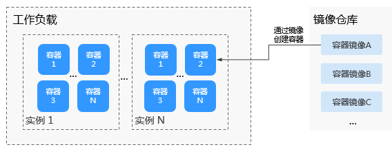

# 工作负载概述

工作负载即Kubernetes对一组Pod的抽象模型，用于描述业务的运行载体，包括Deployment、Statefulset、Daemonset、Job、CronJob等多种类型。

云容器引擎CCE提供基于Kubernetes原生类型的容器部署和管理能力，支持容器工作负载部署、配置、监控、扩容、升级、卸载、服务发现及负载均衡等生命周期管理。

## 基本概念

-   **无状态工作负载：**即kubernetes中的“Deployments“，无状态工作负载支持弹性伸缩与滚动升级，适用于实例完全独立、功能相同的场景，如：nginx、wordpress等。创建无状态工作负载请参见[创建无状态工作负载\(Deployment\)](创建无状态工作负载(Deployment).md)。
-   **有状态工作负载：**即kubernetes中的“StatefulSets“，有状态工作负载支持实例有序部署和删除，支持持久化存储，适用于实例间存在互访的场景，如ETCD、mysql-HA等。创建有状态工作负载请参见[创建有状态工作负载\(StatefulSet\)](创建有状态工作负载(StatefulSet).md)。
-   **创建守护进程集：**即kubernetes中的“DaemonSet“，守护进程集确保全部（或者某些）节点都运行一个Pod实例，支持实例动态添加到新节点，适用于实例在每个节点上都需要运行的场景，如ceph、fluentd、Prometheus Node Exporter等。创建创建守护进程集请参见[创建守护进程集\(DaemonSet\)](创建守护进程集(DaemonSet).md)。
-   **普通任务：**即kubernetes中的“Job“，普通任务是一次性运行的短任务，部署完成后即可执行。使用场景为在创建工作负载前，执行普通任务，将镜像上传至镜像仓库。创建普通任务请参见[创建普通任务\(Job\)](创建普通任务(Job).md)。
-   **定时任务：**即kubernetes中的“CronJob“，定时任务是按照指定时间周期运行的短任务。使用场景为在某个固定时间点，为所有运行中的节点做时间同步。创建定时任务请参见[创建定时任务\(CronJob\)](创建定时任务(CronJob).md)。

## 工作负载与容器间的关系

如[图1](#fig1801862479)所示，一个工作负载由一个或多个实例（Pod）组成。一个实例由一个或多个容器组成，每个容器都对应一个容器镜像。对于无状态工作负载，实例都是完全相同的。

**图 1**  工作负载与容器的关系  

## 工作负载生命周期说明

**表 1**  状态说明

<table><thead align="left"><tr id="row13888105212343"><th class="cellrowborder" valign="top" width="25%" id="mcps1.2.3.1.1">
状态

</th>
<th class="cellrowborder" valign="top" width="75%" id="mcps1.2.3.1.2">
说明

</th>
</tr>
</thead>
<tbody><tr id="row14889152173415"><td class="cellrowborder" valign="top" width="25%" headers="mcps1.2.3.1.1 ">
运行中

</td>
<td class="cellrowborder" valign="top" width="75%" headers="mcps1.2.3.1.2 ">
所有实例都处于运行中才是运行中。

</td>
</tr>
<tr id="row12889195263417"><td class="cellrowborder" valign="top" width="25%" headers="mcps1.2.3.1.1 ">
未就绪

</td>
<td class="cellrowborder" valign="top" width="75%" headers="mcps1.2.3.1.2 ">
所有容器处于pending状态。

</td>
</tr>
<tr id="row12889195213419"><td class="cellrowborder" valign="top" width="25%" headers="mcps1.2.3.1.1 ">
升级中

</td>
<td class="cellrowborder" valign="top" width="75%" headers="mcps1.2.3.1.2 ">
触发升级动作后，工作负载会处于升级中。

</td>
</tr>
<tr id="row2088975211346"><td class="cellrowborder" valign="top" width="25%" headers="mcps1.2.3.1.1 ">
已停止

</td>
<td class="cellrowborder" valign="top" width="75%" headers="mcps1.2.3.1.2 ">
触发停止操作后，工作负载会处于停止状态，实例数变为0。

</td>
</tr>
<tr id="row172011222121114"><td class="cellrowborder" valign="top" width="25%" headers="mcps1.2.3.1.1 ">
可用

</td>
<td class="cellrowborder" valign="top" width="75%" headers="mcps1.2.3.1.2 ">
当多实例无状态工作负载运行过程中部分实例异常，可用实例不为0，工作负载会处于可用状态。

</td>
</tr>
<tr id="row1280465420481"><td class="cellrowborder" valign="top" width="25%" headers="mcps1.2.3.1.1 ">
删除中

</td>
<td class="cellrowborder" valign="top" width="75%" headers="mcps1.2.3.1.2 ">
触发删除操作后，工作负载会处于删除中状态。

</td>
</tr>
</tbody>
</table>

## 相关操作

由于社区pod结构体中没有ExtendPathMode，用户使用client-go调用创建pod或者deployment的api接口时，创建的pod中没有ExtendPathMode。为了与社区的client-go兼容，CCE提供了相关解决方案，详情请参见[Pod接口ExtendPathMode: PodUID与社区client-go兼容](https://support.huaweicloud.com/bestpractice-cce/cce_bestpractice_0043.html)。

