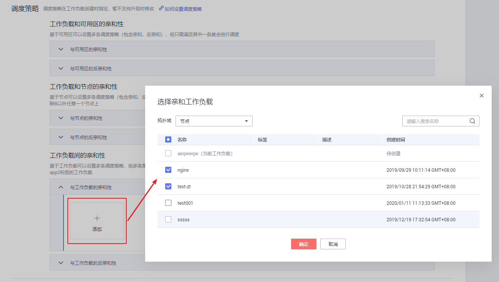
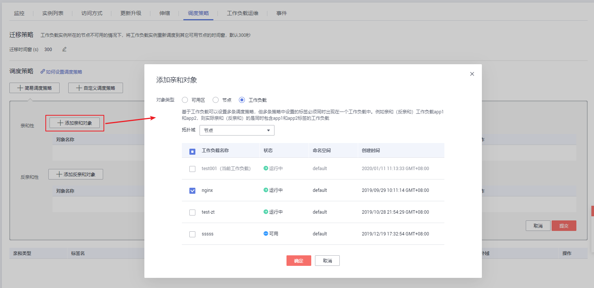

# 工作负载间的亲和性<a name="cce_01_0220"></a>

-   [通过控制台设置](#section152331930174616)
-   [通过kubectl命令行设置](#section5140193643912)
-   [工作负载创建完成后设置](#section5234830134613)

## 通过控制台设置<a name="section152331930174616"></a>

1.  参照[创建无状态负载\(Deployment\)](创建无状态负载(Deployment).md)或[创建有状态负载\(StatefulSet\)](创建有状态负载(StatefulSet).md)，在“高级设置“的“调度策略“下，单击“工作负载间的亲和性 \> 与工作负载的亲和性”下的“添加“。

    **图 1**  与工作负载的亲和性<a name="fig010475911163"></a>  
    

2.  勾选希望部署到相同节点的工作负载，单击“确定“。

    当前创建的工作负载会和已勾选的工作负载部署在相同节点上。


## 通过kubectl命令行设置<a name="section5140193643912"></a>

本节以nginx为例，说明kubectl命令创建工作负载的方法。

**前提条件**

请参见[通过kubectl或web-terminal插件操作CCE集群](通过kubectl或web-terminal插件操作CCE集群.md)配置kubectl命令，使弹性云服务器连接集群。

**操作步骤**

参见[通过kubectl命令行创建无状态工作负载](创建无状态负载(Deployment).md#section155246177178)或[通过kubectl命令行创建有状态工作负载](创建有状态负载(StatefulSet).md#section113441881214)，工作负载间亲和性的yaml示例如下：

```
apiVersion: extensions/v1beta1
kind: Deployment
metadata:
  name: nginx
spec:
  replicas: 1
  selector:
    matchLabels:
      app: nginx
  strategy:
    type: RollingUpdate
  template:
    metadata:
      labels:
        app: nginx
    spec:
      containers:
      - image: nginx 
        imagePullPolicy: Always
        name: nginx
      imagePullSecrets:
      - name: default-secret
      affinity:
        podAffinity:
          requiredDuringSchedulingIgnoredDuringExecution:
            nodeSelectorTerms:
            - matchExpressions:
              - key: app          #工作负载中lable的key
                operator: In        
                values:
                - test     #工作负载中对应lable的value
```

## 工作负载创建完成后设置<a name="section5234830134613"></a>

1.  登录[CCE控制台](https://console.huaweicloud.com/cce2.0/?utm_source=helpcenter)，在左侧导航栏中选择“工作负载 \> 无状态负载 Deployment”或“工作负载 \> 有状态负载 StatefulSet”。
2.  单击工作负载名称进入详情页，单击“调度策略 \> 简易调度策略 \> 添加亲和对象”。
3.  对象类型选择“工作负载”，勾选希望部署到相同节点上的工作负载，设置完成后当前工作负载会和已勾选的工作负载部署在相同节点上。

    **图 2**  添加亲和对象-工作负载<a name="fig47062017102218"></a>  
    

    > **说明：** 
    >该方法可新增、编辑和删除调度策略。


