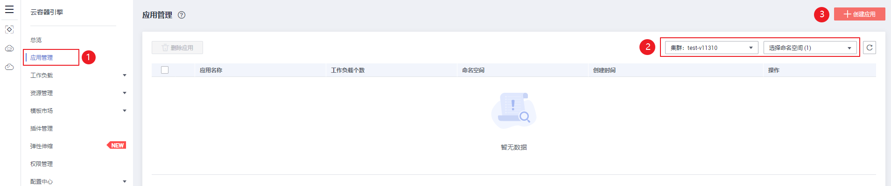
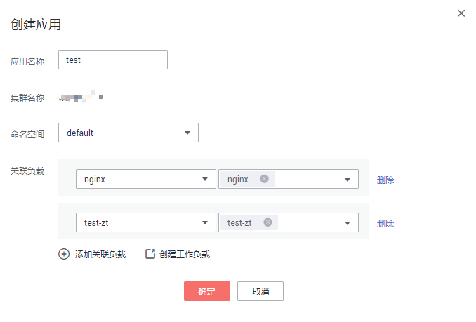
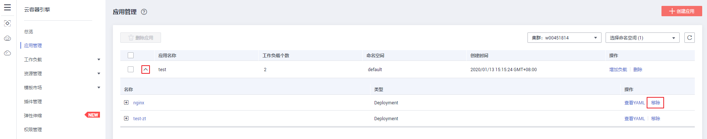
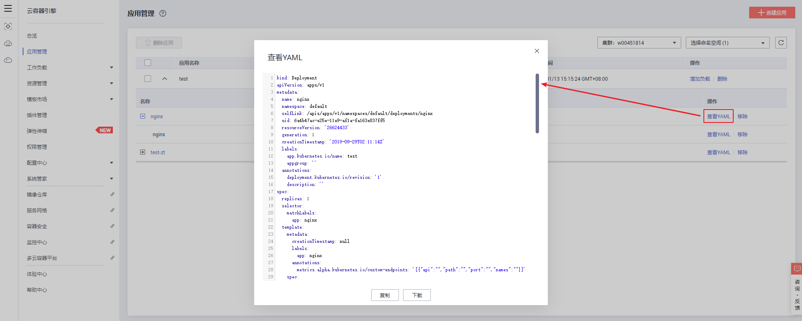
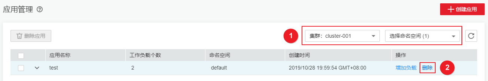

# 应用管理

应用管理提供工作负载和网络管理Service资源的封装，便于用户统一管理应用。

## 准备工作

-   在创建应用前，您需要存在一个可用集群。若没有可用集群 ，请参照[购买混合集群](购买混合集群.md)中内容创建。
-   您需要创建至少一个无状态或有状态工作负载，且状态为“运行中“。若没有可用工作负载，请参照[创建无状态负载\(Deployment\)](创建无状态负载(Deployment).md)或[创建有状态负载\(StatefulSet\)](创建有状态负载(StatefulSet).md)创建。
-   在使用应用管理功能之前，平台会检测您是否已安装应用组件，若显示未安装，请单击进行安装。

## 创建应用

本节以创建一个管理Nginx和WordPress的应用为例演示相关操作步骤。

1.  登录[CCE控制台](https://console.huaweicloud.com/cce2.0/?utm_source=helpcenter)，单击左侧栏目树的“应用管理“，在“应用管理“页面选择要创建应用的集群和命名空间，单击右上角的“创建应用“。

    **图 1**  创建应用  
    

2.  在弹出的“创建应用“窗口中设置如下参数：

    **图 2**  设置应用参数  
    

    -   应用名称：自定义应用名称。
    -   集群名称：此处默认为[步骤一](#li136571149356)中选择的集群。
    -   命名空间：选择应用所在的命名空间。
    -   关联负载：单击“添加关联负载“选择要关联的工作负载和网络管理Service，再次单击“添加关联负载“可添加多个工作负载。单击后方的“创建工作负载“可以创建新的工作负载。

3.  设置完成后，单击“确定“。

    在应用管理列表即可看到新创建的应用，以及其关联的工作负载和Service。

    **图 3**  创建的应用  
    

## 增加工作负载

1.  登录[CCE控制台](https://console.huaweicloud.com/cce2.0/?utm_source=helpcenter)，单击左侧栏目树的“应用管理“，在“应用管理“页面选择应用所在的集群和命名空间，单击要操作的应用右侧“操作“栏中的“增加负载“。
2.  在弹出的“创建应用“窗口中，单击“添加关联负载“选择要关联的工作负载和网络管理Service。
3.  单击“确定“，完成工作负载添加。

## 移除工作负载

1.  登录[CCE控制台](https://console.huaweicloud.com/cce2.0/?utm_source=helpcenter)，单击左侧栏目树的“应用管理“，在“应用管理“页面选择应用所在的集群和命名空间。
2.  单击应用前的，展开应用下的工作负载列表。
3.  单击要移除的工作负载后方“操作“栏中的“移除“。

    **图 4**  移除负载  
    

4.  在弹出的“移除关联负载“窗口中单击“确定“，即完成负载的移除。

    > **说明：** 
    >-   移除关联负载将解绑负载和应用，但不会删除负载资源。
    >-   删除操作不可恢复，请谨慎操作。

## 查看YAML

1.  登录[CCE控制台](https://console.huaweicloud.com/cce2.0/?utm_source=helpcenter)，单击左侧栏目树的“应用管理“，在“应用管理“页面选择应用所在的集群和命名空间。
2.  单击应用前面的，展开应用下的工作负载列表。
3.  单击要查看YAML的工作负载后方“操作“栏中的“查看YAML“。
4.  在弹出的“查看YAML“窗口中可以查看、复制或下载YAML。

    **图 5**  查看YAML  
    

## 删除应用

本节介绍如何删除创建的应用。

1.  登录[CCE控制台](https://console.huaweicloud.com/cce2.0/?utm_source=helpcenter)，单击左侧栏目树的“应用管理“，在“应用管理“页面选择要删除应用的集群和命名空间。
2.  在应用列表中找到要删除的应用，单击应用后方“操作“栏中的“删除“。

    **图 6**  删除应用  
    

3.  在弹出的“删除应用“窗口中单击“确定“，即完成删除。

    > **说明：** 
    >-   删除应用不会删除关联的负载资源，关联的负载资源将和应用解绑。
    >-   删除操作不可恢复，请谨慎操作。

