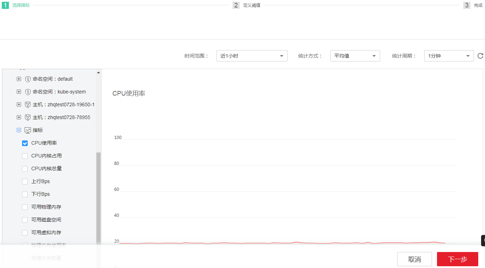
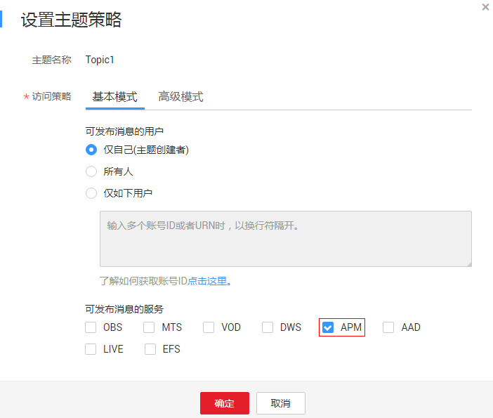
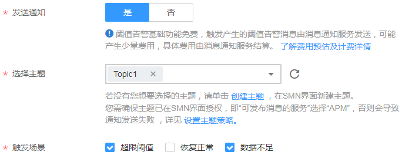
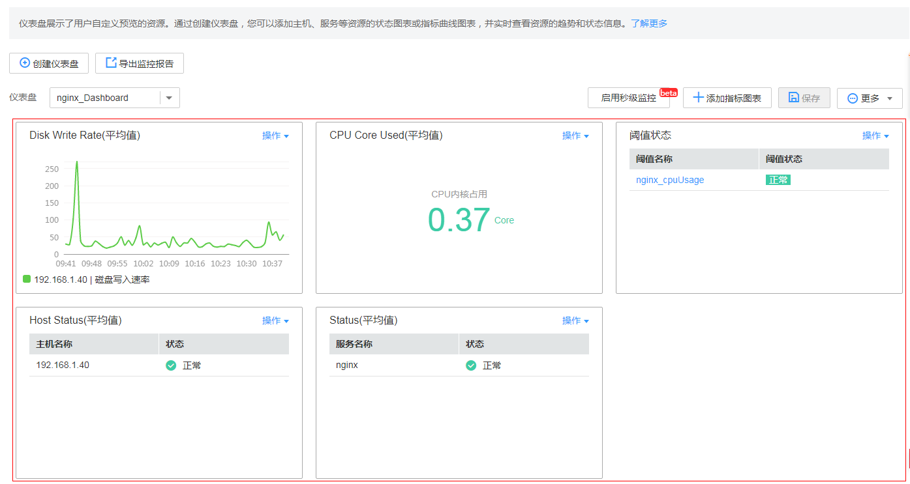
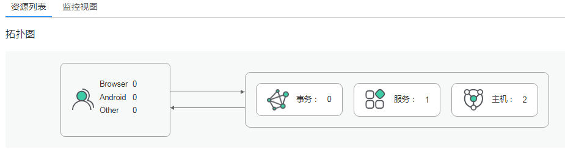

# 应用运维

在CCE上创建工作负载后，可以使用AOM进行运维。本章以nginx为例介绍AOM运维的几个场景。

创建工作负载时，建议在AOM侧配置监控告警，以便异常时能及时收到告警。若未配置监控告警，工作负载异常时无法及时收到告警，需要人工巡检环境。

AOM为运维人员提供一站式立体运维平台，实时监控应用、资源运行状态，通过数十种指标、告警与日志关联分析，快速锁定问题根源，保障业务顺畅运行。

-   当您想要关注某些资源的变更信息时，可对这些资源的指标创建阈值规则，具体操作详见[-创建阈值规则](#s1a7b730238e6482d8bcd4cb8c139e806)。
-   在日常运维中，通过仪表盘可实时掌握全局。您可以创建并添加关注的内容到仪表盘，具体操作详见[-创建仪表盘](#s7420764408d64b3bb53988496d77b7dc)。
-   日常巡检应用，具体操作详见[-监控应用](#sa1fd4acfff494b1c8f5dfc73dee773be)。

## -创建阈值规则

阈值规则通过检测已定义的指标设定的上下限，如果达到触发条件，则AOM产生阈值告警，同时支持将资源的变更信息以短信或邮件的形式发送，以便您在第一时间发现异常并进行处理，保障资源正常运行。

1.  在左侧导航栏中选择“告警中心 \> 阈值规则”，单击“添加单条阈值”。
2.  在左侧指标树上选择一个待监控的资源及其指标，设置指标的参数信息后，单击“下一步”，如下图所示。

    **图 1**  设置指标基本信息  
    

3.  设置静态阈值规则名称、阈值条件、连续周期、告警级别等基本参数。

    > **说明：**   
    >-   阈值条件：阈值告警的触发条件，由判断条件（\>=、<=、\>、<）和阈值组成。例如，阈值条件设置为“\>=80”，表示指标的实际值大于已设置的阈值80时，系统将产生阈值告警。  
    >-   连续周期：连续多少个周期满足阈值条件后，发送阈值告警。  

4.  设置通知策略。如果您不需要接收短信或邮件通知，请跳过该步骤。

    1.  在设置通知策略前您需先创建一个主题并设置主题策略，然后再为主题添加相关的订阅者。

        AOM已对接消息通知服务（Simple Message Notification，简称SMN），单击“创建主题”进入SMN界面。您首先需在SMN界面创建一个主题，并参考[图2](#zh-cn_topic_0093970170_fig1496810115426)设置主题策略，否则会导致通知发送失败，然后再为这个主题添加相关的订阅者，即通知的接收人（短信或邮件），详细操作请分别参见《消息通知服务用户指南》的[创建主题](https://support.huaweicloud.com/usermanual-smn/zh-cn_topic_0043961401.html)、[设置主题策略](https://support.huaweicloud.com/usermanual-smn/zh-cn_topic_0043394891.html)、[订阅主题](https://support.huaweicloud.com/usermanual-smn/zh-cn_topic_0043961402.html)页面。这样在某一个资源发生异常时，AOM可以实时地将阈值规则状态变更信息以广播的方式通知这些订阅者，以便您及时获取资源运行状态等信息并采取相应措施，避免因资源问题造成业务损失。

        设置完成后，您在“选择主题”下拉列表框选择已创建的主题即可。

    2.  设置触发场景，即发送通知的触发条件。

        触发场景您可以选择多个。例如，当阈值状态由正常变为其他状态时，您需要收到通知，则触发场景可以同时选择超限阈值和数据不足；只要阈值状态发生变化时，您都需要收到通知，则触发场景可以全选。

    **图 2**  设置主题策略  
    

    **图 3**  设置通知策略  
    

5.  单击“添加”，完成设置。

## -创建仪表盘

在日常运维中，可以通过创建仪表盘并将集群、应用的指标、状态图放到仪表盘中，以便实时掌握全局。对于例行运维需要查看的指标，您可以添加到自定义仪表盘中，再次打开系统时无需重新选择指标，通过仪表盘就可以进行例行检查。

仪表盘支持展示指标数据和状态数据，对于不同的指标数据根据需要添加不同的图标。如果需要监控变化趋势或多个指标对比，可创建曲线图。如果需要了解最新数值，可创建数字图。创建仪表盘操作步骤如下：

1.  在左侧导航栏中选择“视图管理 \> 仪表盘”。单击“创建仪表盘”，在弹出的“创建仪表盘”对话框中输入仪表盘名称，然后单击“确定”。
2.  按照需要为该仪表盘分别添加指标曲线图、指标数字图、阈值状态、主机状态、服务状态。下面以添加1个曲线图为例：

    1.  选择指标图表添加方式：在“选择添加方式”对话框中，单击“指标数据”下的“添加”。
    2.  选择指标图表展现形式：在“添加指标图表”对话框中选择曲线图，单击“下一步”。
    3.  选择指标并设置指标的统计方式，单击“确定”。

    > **说明：**   
    >如果需要创建多个同类型图表（例如不同指标的多个曲线图表），可以单击图表右上角的“操作”选择复制，将该图表复制一份。然后单击“操作”选择“编辑”修改指标。这样可以快速创建多个图表。  

3.  图表添加完成后单击页面右侧的“保存”。

    **图 4**  仪表盘示意图  
    

## -监控应用

应用监控关联了应用的拓扑图、事务、服务、主机，在界面上就可以直接得知各层关系及健康状态。

1.  在左侧导航栏中选择“应用监控”。
2.  在应用列表中单击需要查看的应用或设置搜索条件搜索要查看的应用。单击应用名称，进入“应用详情”页面。
3.  在“资源列表”页签中单击服务、事务或主机查看资源详情。

    

4.  单击“监控视图”页签，查看应用的指标详情。

