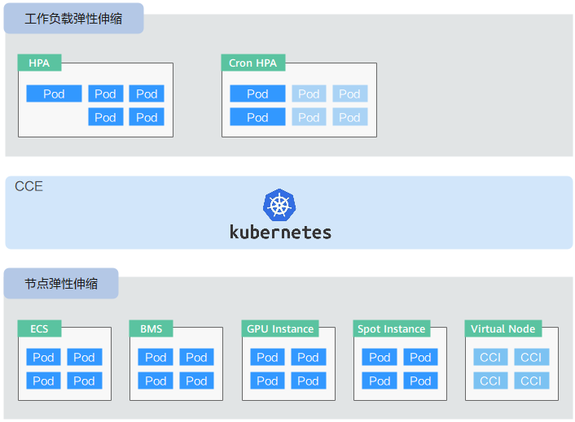
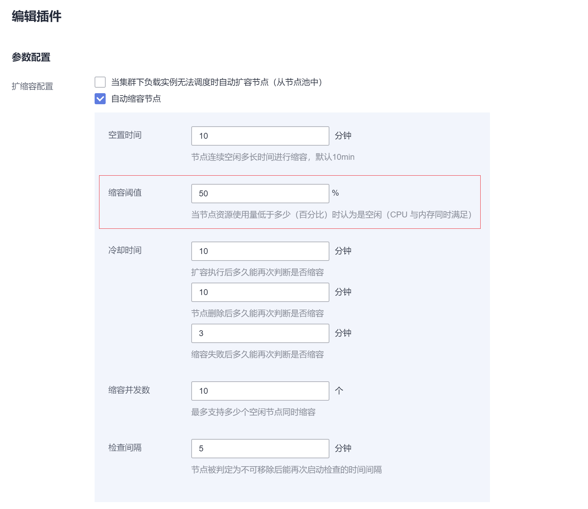

# 弹性伸缩概述

-   [背景介绍](#section13921711133718)
-   [CCE弹性伸缩组件介绍](#section17204104010413)
-   [CCE支持的两种弹性伸缩对比](#section16904357946)

弹性伸缩是根据业务需求和策略，经济地自动调整弹性计算资源的管理服务。

## 背景介绍

随着Kubernetes已经成为云原生应用编排、管理的事实标准，越来越多的应用选择向Kubernetes迁移，用户也越来越关心在Kubernetes上应用如何快速扩容面对业务高峰，以及如何在业务低谷时快速缩容节约资源与成本。

在Kubernetes的集群中，“弹性伸缩”一般涉及到扩缩容Pod个数以及Node个数。Pod代表应用的实例数（每个Pod包含一个或多个容器），当业务高峰的时候需要扩容应用的实例个数。所有的Pod都是运行在某一个节点（虚机或裸机）上，当集群中没有足够多的节点来调度新扩容的Pod，那么就需要为集群增加节点，从而保证业务能够正常提供服务。

弹性伸缩在CCE上的使用场景非常广泛，典型的场景包含在线业务弹性、大规模计算训练、深度学习GPU或共享GPU的训练与推理、定时周期性负载变化等。

**弹性伸缩分为如下两个维度：**

-   **[工作负载弹性伸缩](工作负载伸缩原理.md)：**即调度层弹性，主要是负责修改负载的调度容量变化。例如，HPA是典型的调度层弹性组件，通过HPA可以调整应用的副本数，调整的副本数会改变当前负载占用的调度容量，从而实现调度层的伸缩。
-   **[节点弹性伸缩](节点伸缩原理.md)：**即资源层弹性，主要是集群的容量规划不能满足集群调度容量时，会通过弹出ECS或CCI等资源的方式进行调度容量的补充。

两个维度的弹性组件与能力可以分开使用，也可以结合在一起使用，并且两者之间可以通过调度层面的容量状态进行解耦。

## CCE弹性伸缩组件介绍

## CCE支持的两种弹性伸缩对比

**表 1**  CCE支持的两种弹性伸缩对比

<table><thead align="left"><tr id="row13114122717420"><th class="cellrowborder" valign="top" width="12.711271127112711%" id="mcps1.2.4.1.1">
弹性伸缩

</th>
<th class="cellrowborder" valign="top" width="41.42414241424143%" id="mcps1.2.4.1.2">
基于Kubernetes插件实现<strong id="b3302558194916">（推荐）</strong>

</th>
<th class="cellrowborder" valign="top" width="45.86458645864587%" id="mcps1.2.4.1.3">
基于AOM服务实现

</th>
</tr>
</thead>
<tbody><tr id="row611414278412"><td class="cellrowborder" valign="top" width="12.711271127112711%" headers="mcps1.2.4.1.1 ">
实现方式

</td>
<td class="cellrowborder" valign="top" width="41.42414241424143%" headers="mcps1.2.4.1.2 ">
基于CCE提供的插件<a href="cce-hpa-controller.md">cce-hpa-controller</a>实现工作负载弹性伸缩

基于CCE提供的插件<a href="autoscaler.md">autoscaler</a>实现节点弹性伸缩

</td>
<td class="cellrowborder" valign="top" width="45.86458645864587%" headers="mcps1.2.4.1.3 ">
基于AOM服务实现弹性伸缩，伸缩指标和触发伸缩均由AOM服务提供

</td>
</tr>
<tr id="row11114102715414"><td class="cellrowborder" valign="top" width="12.711271127112711%" headers="mcps1.2.4.1.1 ">
使用入口

</td>
<td class="cellrowborder" valign="top" width="41.42414241424143%" headers="mcps1.2.4.1.2 ">
<strong id="b11471102429">工作负载伸缩</strong><ol id="ol61643409413"><li>在CCE左侧导航栏中选择“弹性伸缩”，进入“工作负载伸缩”。</li><li>在左侧导航栏中选择“工作负载 &gt; 无状态负载 Deployment/有状态负载 StatefulSet”，进入工作负载详情页，在“伸缩”页签下“弹性伸缩 - HPA”。</li></ol>

<strong id="b039671294218">节点伸缩</strong>

在CCE左侧导航栏中选择“弹性伸缩”，进入“节点伸缩”。

</td>
<td class="cellrowborder" valign="top" width="45.86458645864587%" headers="mcps1.2.4.1.3 ">
<strong id="b14723164816427">工作负载伸缩</strong>

在CCE左侧导航栏中选择“工作负载 &gt; 无状态负载 Deployment/有状态负载 StatefulSet”，单击工作负载名称进入工作负载详情页，在“伸缩”页签下选择“弹性伸缩 - AOM”。详情请参见<a href="工作负载弹性伸缩.md#section1656965814562">弹性伸缩-AOM</a>。

<strong id="b17954650144219">节点扩容</strong>

在CCE左侧导航栏中选择“资源管理 &gt; 集群管理”，进入集群详情页，选择“弹性扩容”页签。详情请参见<a href="集群弹性扩容.md">集群弹性扩容</a>。

</td>
</tr>
<tr id="row1111417271947"><td class="cellrowborder" valign="top" width="12.711271127112711%" headers="mcps1.2.4.1.1 ">
约束与限制

</td>
<td class="cellrowborder" valign="top" width="41.42414241424143%" headers="mcps1.2.4.1.2 "><ul id="ul155428331438"><li>请在使用的集群中安装对应的插件，详情请参见<a href="创建工作负载弹性伸缩（HPA）.md">创建工作负载弹性伸缩（HPA）</a>、<a href="创建节点伸缩策略.md">创建节点伸缩策略</a>。</li><li>节点伸缩仅针对节点池下的节点，使用弹性伸缩的节点池需开启弹性扩缩容功能（在创建/编辑节点池时指定）。</li></ul>
</td>
<td class="cellrowborder" valign="top" width="45.86458645864587%" headers="mcps1.2.4.1.3 ">
当前区域的AOM服务支持伸缩功能，并且CCE集群版本低于v1.17。

</td>
</tr>
<tr id="row211442711410"><td class="cellrowborder" valign="top" width="12.711271127112711%" headers="mcps1.2.4.1.1 ">
使用须知

</td>
<td class="cellrowborder" valign="top" width="41.42414241424143%" headers="mcps1.2.4.1.2 "><ul id="ul132631626183014"><li>支持监控指标伸缩和定时伸缩两种策略的负载伸缩。</li><li>支持调度扩容（在负载实例无法调度时自动从节点池中扩容节点）、监控指标扩容、定时扩容三种节点扩容策略。</li><li>节点缩容仅支持资源分配率缩容机制，当集群下CPU和内存分配率低于用户设置的门限（在安装/编辑<a href="autoscaler.md">autoscaler插件</a>时设置）时将对节点池下节点启动缩容（该功能可以关闭），如<a href="#fig9643195391116">图1</a>。
<b>图1 </b>自动缩容设置 

</li><li>defaultpool仅用于兼容非节点池创建的节点。</li></ul>
</td>
<td class="cellrowborder" valign="top" width="45.86458645864587%" headers="mcps1.2.4.1.3 "><ul id="ul198091297311"><li>支持监控指标伸缩和定时伸缩两种策略的负载伸缩。</li><li>支持监控指标和定时两种策略的节点扩容，不支持节点缩容。</li><li>节点仅支持设置一个节点配置（在集群详情页的“弹性扩容”页签下进行设置），且节点模板支持的节点可配参数较少。</li></ul>
</td>
</tr>
</tbody>
</table>

