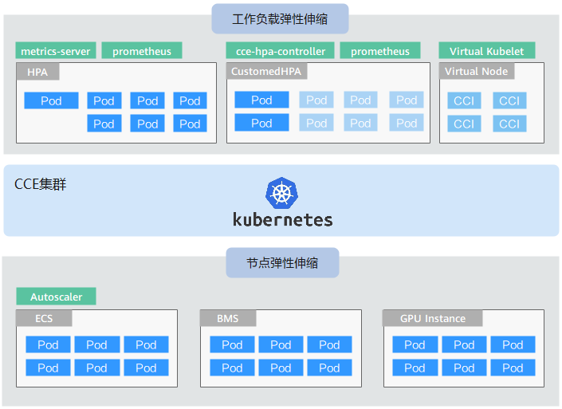

# 弹性伸缩概述

弹性伸缩是根据业务需求和策略，经济地自动调整弹性计算资源的管理服务。

## 背景介绍

随着Kubernetes已经成为云原生应用编排、管理的事实标准，越来越多的应用选择向Kubernetes迁移，用户也越来越关心在Kubernetes上应用如何快速扩容面对业务高峰，以及如何在业务低谷时快速缩容节约资源与成本。

在Kubernetes的集群中，“弹性伸缩”一般涉及到扩缩容Pod个数以及Node个数。Pod代表应用的实例数（每个Pod包含一个或多个容器），当业务高峰的时候需要扩容应用的实例个数。所有的Pod都是运行在某一个节点（虚机或裸机）上，当集群中没有足够多的节点来调度新扩容的Pod，那么就需要为集群增加节点，从而保证业务能够正常提供服务。

弹性伸缩在CCE上的使用场景非常广泛，典型的场景包含在线业务弹性、大规模计算训练、深度学习GPU或共享GPU的训练与推理、定时周期性负载变化等。

## CCE弹性伸缩

**CCE的弹性伸缩能力分为如下两个维度：**

-   **[工作负载弹性伸缩](工作负载伸缩原理.md)：**即调度层弹性，主要是负责修改负载的调度容量变化。例如，HPA是典型的调度层弹性组件，通过HPA可以调整应用的副本数，调整的副本数会改变当前负载占用的调度容量，从而实现调度层的伸缩。
-   **[节点弹性伸缩](节点伸缩原理.md)：**即资源层弹性，主要是集群的容量规划不能满足集群调度容量时，会通过弹出ECS或CCI等资源的方式进行调度容量的补充。CCE容器实例弹性到CCI服务的方法请参见[CCE容器实例弹性伸缩到CCI服务](CCE容器实例弹性伸缩到CCI服务.md)。

两个维度的弹性组件与能力可以分开使用，也可以结合在一起使用，并且两者之间可以通过调度层面的容量状态进行解耦，详情请参见[使用HPA+CA实现工作负载和节点联动弹性伸缩](使用HPA+CA实现工作负载和节点联动弹性伸缩.md)。

## 组件介绍

**工作负载弹性组件介绍**

**表 1**  工作负载弹性组件

<table><thead align="left"><tr id="row247171517229"><th class="cellrowborder" valign="top" width="15.86%" id="mcps1.2.5.1.1">
类型

</th>
<th class="cellrowborder" valign="top" width="21.14%" id="mcps1.2.5.1.2">
组件名称

</th>
<th class="cellrowborder" valign="top" width="40.31%" id="mcps1.2.5.1.3">
组件介绍

</th>
<th class="cellrowborder" valign="top" width="22.689999999999998%" id="mcps1.2.5.1.4">
参考文档

</th>
</tr>
</thead>
<tbody><tr id="row74711815182218"><td class="cellrowborder" valign="top" width="15.86%" headers="mcps1.2.5.1.1 ">
HPA

</td>
<td class="cellrowborder" valign="top" width="21.14%" headers="mcps1.2.5.1.2 ">
<a href="metrics-server.md">metrics-server</a>

</td>
<td class="cellrowborder" valign="top" width="40.31%" headers="mcps1.2.5.1.3 ">
Kubernetes内置组件，实现Pod水平自动伸缩的功能，即Horizontal Pod Autoscaling。在kubernetes社区HPA功能的基础上，增加了应用级别的冷却时间窗和扩缩容阈值等功能。

</td>
<td class="cellrowborder" valign="top" width="22.689999999999998%" headers="mcps1.2.5.1.4 ">
<a href="创建工作负载弹性伸缩（HPA）.md">创建工作负载弹性伸缩（HPA）</a>

</td>
</tr>
<tr id="row20471101518229"><td class="cellrowborder" rowspan="2" valign="top" width="15.86%" headers="mcps1.2.5.1.1 ">
CustomedHPA

</td>
<td class="cellrowborder" valign="top" width="21.14%" headers="mcps1.2.5.1.2 ">
<a href="cce-hpa-controller.md">cce-hpa-controller</a>

</td>
<td class="cellrowborder" valign="top" width="40.31%" headers="mcps1.2.5.1.3 ">
华为云自研的弹性伸缩增强能力，主要面向无状态工作负载进行弹性扩缩容。能够基于指标（CPU利用率、内存利用率）或周期（每天、每周、每月或每年的具体时间点）。

</td>
<td class="cellrowborder" rowspan="2" valign="top" width="22.689999999999998%" headers="mcps1.2.5.1.4 ">
<a href="创建工作负载弹性伸缩（CustomedHPA）.md">创建工作负载弹性伸缩（CustomedHPA）</a>

</td>
</tr>
<tr id="row147661935162519"><td class="cellrowborder" valign="top" headers="mcps1.2.5.1.1 ">
<a href="prometheus.md">prometheus</a>

</td>
<td class="cellrowborder" valign="top" headers="mcps1.2.5.1.2 ">
一套开源的系统监控报警框架，负责采集kubernetes集群中kubelet的公开指标项（CPU利用率、内存利用率）。

</td>
</tr>
</tbody>
</table>

**节点弹性伸缩组件介绍**

**表 2**  节点弹性组件

<table><thead align="left"><tr id="row13422181411283"><th class="cellrowborder" valign="top" width="17.98%" id="mcps1.2.5.1.1">
组件名称

</th>
<th class="cellrowborder" valign="top" width="33.45%" id="mcps1.2.5.1.2">
组件介绍

</th>
<th class="cellrowborder" valign="top" width="32.89%" id="mcps1.2.5.1.3">
适用场景

</th>
<th class="cellrowborder" valign="top" width="15.68%" id="mcps1.2.5.1.4">
参考文档

</th>
</tr>
</thead>
<tbody><tr id="row842251417289"><td class="cellrowborder" valign="top" width="17.98%" headers="mcps1.2.5.1.1 ">
<a href="autoscaler.md">autoscaler</a>

</td>
<td class="cellrowborder" valign="top" width="33.45%" headers="mcps1.2.5.1.2 ">
Kubernetes社区开源组件，节点水平伸缩组件，华为云提供了独有的调度、弹性优化、成本优化的功能。

</td>
<td class="cellrowborder" valign="top" width="32.89%" headers="mcps1.2.5.1.3 ">
全场景支持，适合在线业务、深度学习、大规模成本算力交付等。

</td>
<td class="cellrowborder" valign="top" width="15.68%" headers="mcps1.2.5.1.4 ">
<a href="创建节点伸缩策略.md">节点自动伸缩</a>

</td>
</tr>
</tbody>
</table>

