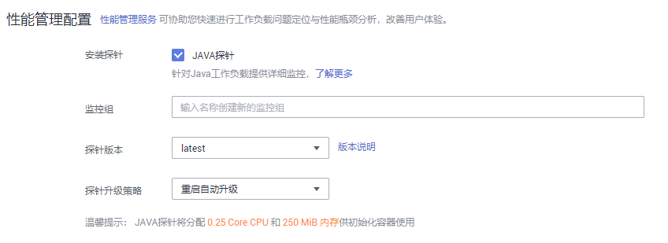
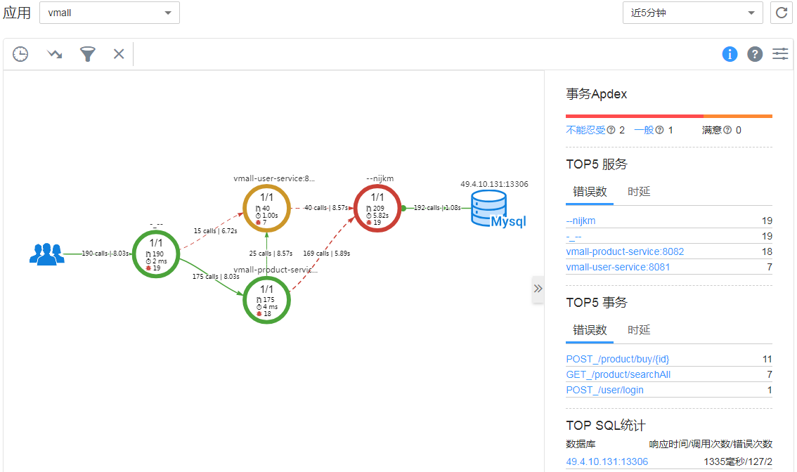

# 性能管理配置（性能瓶颈分析）

## 操作场景

当前支持给Java类工作负载提供调用链、拓扑等监控能力，若您为Java类工作负载，并且需要监控状态，请勾选“APM探针”选项，并输入监控组名称。

工作负载创建时和创建后，均可以对Java类工作负载监控进行设置。

> **说明：** 
>-   如果您已经使用CCE部署了容器应用，您需要应用性能管理时，需要将容器服务上的Java应用通过Pinpoint探针接入到APM，详细介绍请参见[华为云容器应用接入APM](https://support.huaweicloud.com/qs-apm/apm_00_0005.html)。
>-   若您还未开通应用性能管理服务，请单击界面中的[点击开通](https://console.huaweicloud.com/apm/#/buy)，参照界面提示购买应用实例数，单击“立即购买“，查看订单无误后，参照界面提示单击“提交订单“。

## 操作步骤

1.  登录CCE管理控制台，在左侧导航栏中选择“工作负载 \> 无状态负载 Deployment“或“工作负载 \> 有状态负载 StatefulSet“，单击“创建无状态工作负载”或“创建有状态工作负载”。
2.  在创建工作负载时，在“高级设置“中找到“性能管理配置“，在“安装探针“处勾选“APM探针“，将会启用应用性能管理服务并在节点上安装探针。

    > **说明：** 
    >当前支持APM1.0探针和APM2.0探针，建议您选择APM2.0探针。
    >安装探针会产生少量资源消耗，主要作用是可对java工作负载提供应用调用链、拓扑、SQL分析、堆栈追踪等监控能力。

3.  填写探针相关参数。

    **图 1**  设置性能管理配置  
    

    -   监控组（仅APM1.0需要填写）：输入监控组名称，如testapp。若已有监控组，可下拉选择。
    -   探针版本：选择探针的版本。
    -   “探针升级策略“，默认为“重启自动升级“。
        -   重启自动升级：每次都尝试重新下载镜像。
        -   手动升级：如果本地有该镜像，则使用本地镜像，本地不存在时下载镜像。

    -   APM环境（仅APM2.0需要填写）：在APM中创建的环境。
    -   APM业务（仅APM2.0需要填写）：选择APM中创建的业务和子业务。
    -   接入密钥（仅APM2.0需要填写）：接入密钥会自动获取。

4.  应用启动后，等待约3分钟，应用数据就会呈现在APM界面中，此时登录APM，您可以在APM上通过拓扑、调用链等进行应用性能优化，详细操作请参考[用户指南](https://support.huaweicloud.com/usermanual-apm/apm_02_0007.html)。

    

