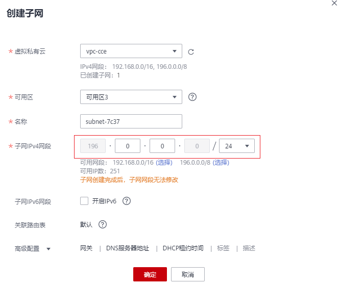

# 扩展集群VPC网段

## 操作场景

在创建集群时会选择集群位于某个VPC内，如果VPC规划太小出现没有足够可用IP时，您可以采用VPC扩展网段满足业务扩容需求。本文介绍如何使用VPC扩展网段扩充集群网段。

## 约束与限制

仅支持1.21及以上版本的CCE集群和CCE Turbo集群。

## 扩展网段规划说明

在添加扩展网段前，需做好网段规划，避免造成网段冲突。注意以下几点：

1.  集群所在VPC下所有子网（包括扩展网段子网）不能和容器网段、服务网段冲突。
2.  扩展网段选择10.0.0.0/8、172.16.0.0/12、192.168.0.0/16可能与集群Master分配的IP冲突，尽量避免选择这三个网段作为扩展网段。
3.  同VPC的非集群内ECS，如果需要和集群互访，访问会做SNAT， Pod源地址是节点IP而非Pod IP。
4.  如果扩展网段没添加过集群节点，那扩展网段的ECS不能访问集群内Pod；扩展网段添加集群节点后，扩展网段的ECS可以访问集群内Pod。

## 添加拓展VPC网段

1.  登录VPC控制台，选择集群所属VPC, 单击编辑网段，单击添加IPv4扩展网段。

    **图 1**  添加IPv4扩展网段  
    

2.  在扩展网段下创建子网，供集群使用。

    

## 使用扩展网段

扩展网段子网创建完成后，您可以在创建节点或节点池时选择扩展网段子网。

