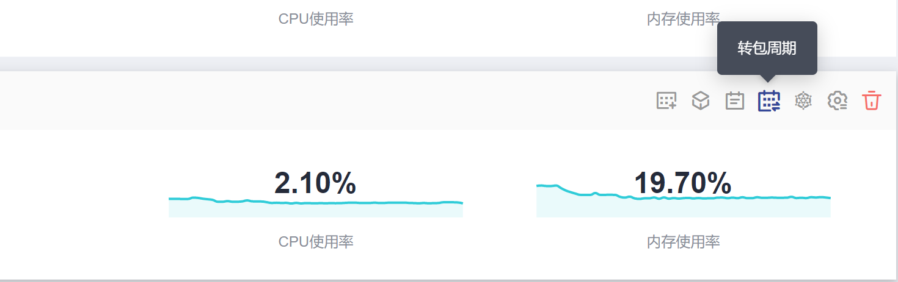

# 按需转包周期

当前在CCE中购买集群时支持“按需计费“和“包年/包月“（按周期）两种计费方式。按需计费的购买的集群可以转成按周期计费的集群。

## 约束与限制

-   不建议在ECS控制台对节点进行操作，在ECS控制台操作会将PVC与节点绑定，造成该PVC无法再被别的节点使用。
-   仅支持默认节点池DefaultPool内节点转成按包周期计费，其他创建的节点池中节点不支持转包周期。
-   转成包周期的节点不支持弹性缩容。

## 转包周期

如果您在购买按需计费集群后，想更换为包周期计费，可按如下步骤进行操作：

1.  登录CCE控制台，单击“资源管理 \> 集群管理“，在集群列表中单击需要变更计费方式的集群下方的“转包周期“按钮。

    **图 1**  转包周期  
    

2.  在转包周期页面中，选择需要转包周期的集群控制节点和工作节点。

    **图 2**  集群及集群下的工作节点转包周期  
    

3.  单击“确定“，等待生成订单并完成支付即可。

