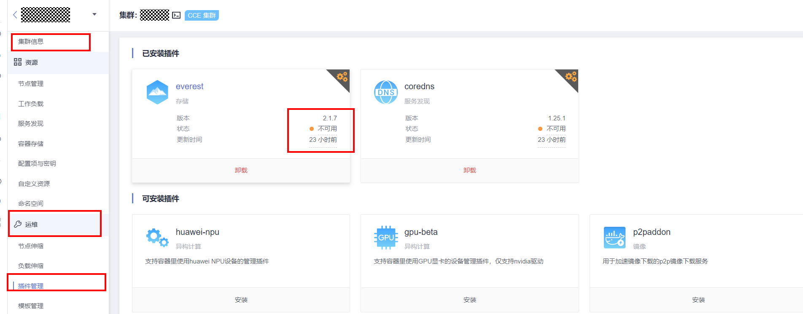

# 插件检查

## 检查项内容

当前检查项包括以下内容：

-   检查插件状态是否正常
-   检查插件是否支持目标版本

## 解决方案

-   **问题场景一：插件状态异常**

    请登录CCE控制台，前往“集群信息-\>运维-\>插件管理”处查看并处理处于异常状态的插件。

    

-   **问题场景二：目标集群版本不支持当前插件版本**

    检查到该插件由于兼容性等问题无法随集群自动升级，请您登陆CCE控制台，在“集群信息-\>运维-\>插件管理”处进行手动升级。

    

