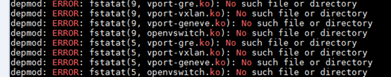

# 操作系统内核升级<a name="cce_01_0179"></a>

CCE集群依赖系统内核版本，升级集群节点的操作系统内核有一定的风险，请谨慎操作。

强烈建议您在升级前备份节点中的数据，如果升级后导致节点和集群不可用、网络异常等问题，您可以选择重置节点，具体请参见[重置节点](重置节点.md)。

> **须知：**   
>-   **Centos系统（7.4/7.6）：正在适配新内核，近期将发布新版本修复**  
>-   Euleros2.2支持升级内核到3.10.0-327.62.59.83.h162.x86\_64  
>-   Euleros2.5支持升级内核到3.10.0-862.14.1.0.h197.eulerosv2r7.x86\_64  
>-   节点需绑定EIP，内核升级完成后，需重启系统  
>-   升级过程中，下列报错不影响功能，为正常现象  
>  

1.  连接集群master操作，驱逐受影响节点上的pod，pod会在其他节点进行重建以满足副本数要求。如何连接集群master，请参见[通过kubectl或web-terminal插件连接CCE集群](通过kubectl或web-terminal插件连接CCE集群.md)。

    执行以下命令：

    ```
    kubectl drain <node name> --ignore-daemonsets
    ```

2.  root用户使用如下命令更新内核（保证节点拥有EIP）并重启系统。
    1.  EulerOS 2.2系统执行以下命令：

        ```
        bash /var/paas/kubernetes/canal/openvswitch/can_ovs.sh uninstall
        yum update kernel -y
        reboot
        ```

    2.  EulerOS 2.5系统执行以下命令：

        ```
        bash /var/paas/kubernetes/canal/openvswitch/can_ovs.sh uninstall
        wget http://obs.cn-east-2.myhwclouds.com/cce-east/cce-openvswitch/kernel-3.10.0-862.14.1.0.h197.eulerosv2r7.x86_64.rpm
        rpm -ihv kernel-3.10.0-862.14.1.0.h197.eulerosv2r7.x86_64.rpm
        reboot
        ```

3.  root用户下执行以下命令升级cce组件适配新内核：
    1.  EulerOS 2.2执行以下命令

        ```
        bash /var/paas/kubernetes/canal/openvswitch/can_ovs.sh install
        su paas; monit restart ovsdb-server ovs-vswitchd
        ```

    2.  EulerOS 2.5执行以下脚本

        ```
        function upgrade_ovs()
        {
        	wget http://obs.cn-east-2.myhwclouds.com/cce-east/cce-openvswitch/openvswitch-1.0.RC10.SPC100.B050.tar.gz
        	mv /var/paas/kubernetes/canal/openvswitch /var/paas/kubernetes/canal/openvswitch.bak
        	tar zxvf openvswitch-1.0.RC10.SPC100.B050.tar.gz -C /var/paas/kubernetes/canal/
        	bash /var/paas/kubernetes/canal/openvswitch/can_ovs.sh install
        	systemctl restart  ovsdb-server ovs-vswitchd 
        }
        upgrade_ovs
        ```

4.  恢复节点调度。

    执行以下命令：

    ```
    kubectl uncordon <node name>
    ```


