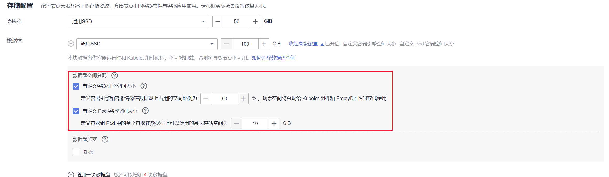
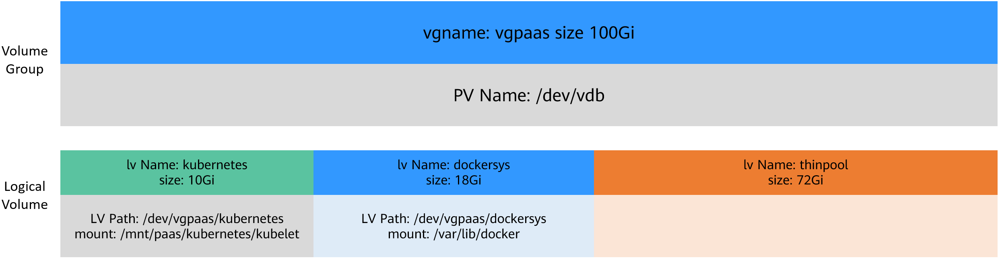
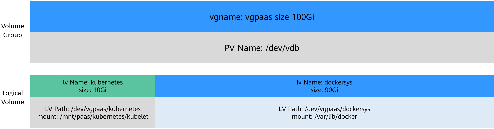
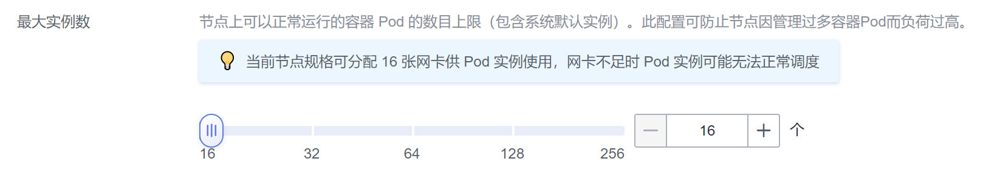

# 数据盘空间分配说明<a name="cce_10_0341"></a>

本章节将详细介绍节点数据盘空间分配的情况，以便您根据业务实际情况配置数据盘大小。

在创建节点时，您需要配置节点数据盘，且数据盘容量不小于100G。您可“单击展开高级配置“，自定义节点数据盘的空间分配。



-   [自定义容器引擎空间大小说明](#section10653143445411)：CCE 将数据盘空间划分为两块：一块用于存放容器引擎 \(Docker/Containerd\) 工作目录、容器镜像的数据和镜像元数据；另一块用于Kubelet组件和EmptyDir临时存储等。容器引擎空间的剩余容量将会影响镜像下载和容器的启动及运行。
    -   容器引擎和容器镜像空间（默认占90%）：用于容器运行时工作目录、存储容器镜像数据以及镜像元数据。
    -   Kubelet组件和EmptyDir临时存储（默认占10%）：用于存储Pod配置文件、密钥以及临时存储EmptyDir等挂载数据。

-   [自定义Pod容器空间大小](#section12119191161518)：即容器的basesize设置，每个工作负载下的容器组 Pod 占用的磁盘空间设置上限（包含容器镜像占用的空间）。合理的配置可避免容器组无节制使用磁盘空间导致业务异常。建议此值不超过容器引擎空间的 80%。该参数与节点操作系统和容器存储Rootfs相关，部分场景下不支持设置。

## 自定义容器引擎空间大小<a name="section10653143445411"></a>

数据盘根据容器存储Rootfs不同具有两种划分方式（以100G大小为例）：**DeviceMapper类型**和**OverlayFS类型**。

您可以登录到节点通过docker info命令查看存储引擎类型，如下所示。

```
# docker info
Containers: 20
 Running: 17
 Paused: 0
 Stopped: 3
Images: 16
Server Version: 18.09.0
Storage Driver: devicemapper
```

-   **Device Mapper类型存储Rootfs**

    其中默认占90%的容器引擎和容器镜像空间又可分为以下两个部分：

    -   其中/var/lib/docker用于Docker工作目录，默认占比20%，其空间大小 =  **数据盘空间 \* 90% \* 20%**
    -   thinpool用于存储容器镜像数据、镜像元数据以及容器使用的磁盘空间，默认占比为80%，其空间大小 =  **数据盘空间 \* 90% \* 80%**

        thinpool是动态挂载，在节点上使用**df -h**命令无法查看到，使用**lsblk**命令可以查看到。

    


-   **OverlayFS类型存储Rootfs**

    相比Device Mapper存储引擎，没有单独划分thinpool，容器引擎和容器镜像空间（默认占90%）都在/var/lib/docker目录下。

    


容器存储Rootfs情况如下：

-   CCE集群：EulerOS 2.5操作系统使用Device Mapper，Ubuntu 18.04和EulerOS 2.9使用OverlayFS。CentOS 7.x 在1.19.16以下版本集群中使用Device Mapper，1.19.16及以上版本集群使用OverlayFS。EulerOS 2.8系统在集群版本v1.19.16-r2前使用Device Mapper, v1.19.16-r2及之后版本使用OverlayFS。
-   CCE Turbo集群：BMS节点使用Device Mapper，ECS节点（CentOS 7.6和Ubuntu 18.04）使用OverlayFS。

## 自定义Pod容器空间大小<a name="section12119191161518"></a>

自定义Pod容器空间（basesize）设置与节点操作系统和容器存储Rootfs相关（容器存储Rootfs可登录到节点通过**docker info**命令查看）：

-   Device Mapper模式下支持自定义Pod容器空间（basesize）配置，默认值为10G。
-   OverlayFS模式默认不限制Pod容器空间大小。在最新版本（1.19集群1.19.16版本，1.21集群1.21.3版本，1.23集群1.23.3版本及之后版本）中EulerOS 2.9操作系统使用docker引擎时开始支持basesize配置，其余操作系统不支持basesize配置。

    > **说明：** 
    >使用EulerOS 2.9 的docker basesize设置时，若容器配置CAP\_SYS\_RESOURCE权限或privileged的特权，basesize限制Pod容器空间不起作用。


配置Pod容器空间（basesize）时，需要同时考虑节点的最大实例数配置。理想情况下，容器引擎空间需要大于容器使用的磁盘总空间，即：**容器引擎和容器镜像空间（默认占90%）**  \>  **容器数量 \* Pod容器空间（basesize）**。否则，可能会引起节点分配的容器引擎空间不足，从而导致容器启动失败。



对于支持配置basesize的节点，尽管可以限制单个容器的主目录大小（开启时默认为10GB），但节点上的所有容器还是共用节点的thinpool磁盘空间，并不是完全隔离，当一些容器使用大量thinpool空间且总和达到节点thinpool空间上限时，也会影响其他容器正常运行。

另外，在容器的主目录中创删文件后，其占用的thinpool空间不会立即释放，因此即使basesize已经配置为10GB，而容器中不断创删文件时，占用的thinpool空间会不断增加一直到10GB为止，后续才会复用这10GB空间。如果节点上的容器数量\*basesize \> 节点thinpool空间大小，理论上有概率出现节点thinpool空间耗尽的场景。

## 镜像回收策略说明<a name="section1926415516193"></a>

当容器引擎空间不足时，会触发镜像垃圾回收。

镜像垃圾回收策略只考虑两个因素：HighThresholdPercent 和 LowThresholdPercent。 磁盘使用率超过上限阈值（HighThresholdPercent，默认值为85%）将触发垃圾回收。 垃圾回收将删除最近最少使用的镜像，直到磁盘使用率满足下限阈值（LowThresholdPercent，默认值为80%）。

## 容器引擎空间大小配置建议<a name="section41701981545"></a>

-   容器引擎空间需要大于容器使用的磁盘总空间，即：**容器引擎空间**  \>  **容器数量 \* Pod容器空间（basesize）**
-   容器业务的创删文件操作建议在容器挂载的本地存储（如emptyDir、hostPath）或云存储的目录中进行，这样不会占用thinpool空间。其中Emptydir使用的是kubelet空间，需要规划好kubelet空间的大小。
-   容器运行时使用OverlayFS存储模式，当前CCE Turbo集群中ECS节点（CentOS 7.6和Ubuntu 18.04），以及CCE集群中Ubuntu 18.04节点容器已默认使用OverlayFS存储模式，1.19.16版本及以上集群CentOS 7.6使用OverlayFS模式，可将业务部署在此类节点上，避免容器内创删文件后占用的磁盘空间不立即释放问题。

## 常见问题<a name="section20342155412254"></a>

[如何扩容容器的存储空间？](https://support.huaweicloud.com/cce_faq/cce_faq_00224.html)

[CCE集群中的节点磁盘扩容](https://support.huaweicloud.com/bestpractice-cce/cce_bestpractice_00198.html)

