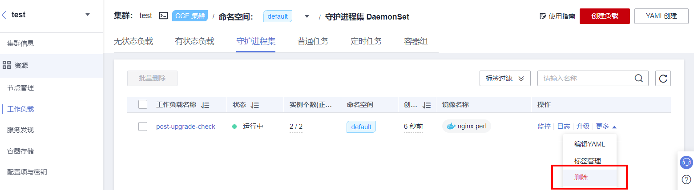

# 新建Pod检查<a name="cce_10_0566"></a>

## 检查内容<a name="section357419312215"></a>

-   检查集群升级后，存量节点是否能新建Pod。
-   检查集群升级后，新建节点是否能新建Pod。

## 检查步骤<a name="section109817185576"></a>

基于[新建节点检查](新建节点检查.md)创建了新节点后，通过创建daemonset类型工作负载，在每个节点上创建Pod。

请登录CCE控制台，前往“资源-\>工作负载-\>守护进程集”，单击右上角“创建负载”或“YAML创建”。


建议您使用日常测试的镜像作为基础镜像。您可参照如下yaml部署最小应用Pod。

> **说明：** 
>该测试YAML将DaemonSet部署在default命名空间下，使用ngxin:perl为基础镜像，申请10m CPU，10Mi内存，限制100m CPU 50Mi内存。

```
apiVersion: apps/v1
kind: DaemonSet
metadata:
  name: post-upgrade-check
  namespace: default
spec:
  selector:
    matchLabels:
      app: post-upgrade-check
      version: v1
  template:
    metadata:
      labels:
        app: post-upgrade-check
        version: v1
    spec:
      containers:
        - name: container-1
          image: nginx:perl
          imagePullPolicy: IfNotPresent
          resources:
            requests:
              cpu: 10m
              memory: 10Mi
            limits:
              cpu: 100m
              memory: 50Mi
```

负载创建完毕后请检查该工作负载的Pod状态是否正常。

检查完毕后请登录CCE控制台，前往“资源-\>工作负载-\>守护进程集”，选择“post-upgrade-check”工作负载并单击“更多-\>删除”删除该测试用工作负载。



## 解决方案<a name="section4404132201910"></a>

若Pod无法新建，或状态异常，请联系技术支持人员，并说明异常发生的范围为新建节点还是存量节点。

