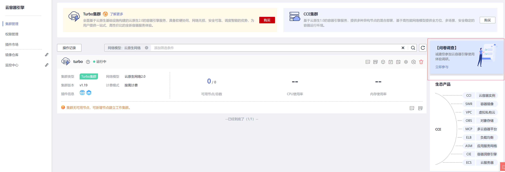

# 新版本控制台功能说明

CCE推出全新改版控制台，更加贴合用户使用Kubernetes的习惯。访问地址为[https://console.huaweicloud.com/cce](https://console.huaweicloud.com/cce)。

使用新老版本控制台创建的集群本身没有区别，使用[kubectl](访问集群.md)操作是完全一样的。

新版本控制台与老版本控制台功能绝大部分相同，当前二者存在如[表1](#table1368316341928)所示的差异，“√“表示支持，“ד表示不支持。

**表 1**  新老版本控制台功能对比

<table><thead align="left"><tr id="row1968418341220"><th class="cellrowborder" valign="top" width="43.54%" id="mcps1.2.4.1.1">
功能

</th>
<th class="cellrowborder" valign="top" width="26.279999999999998%" id="mcps1.2.4.1.2">
新版本

</th>
<th class="cellrowborder" valign="top" width="30.18%" id="mcps1.2.4.1.3">
老版本

</th>
</tr>
</thead>
<tbody><tr id="row1868418341422"><td class="cellrowborder" valign="top" width="43.54%" headers="mcps1.2.4.1.1 ">
创建节点

<ul id="ul1773264352518"><li>支持新的LVM管理模式，可添加最多5块数据盘，并指定挂载路径</li><li>支持K8S标签、污点等高级设置</li></ul>
</td>
<td class="cellrowborder" valign="top" width="26.279999999999998%" headers="mcps1.2.4.1.2 ">
√

</td>
<td class="cellrowborder" valign="top" width="30.18%" headers="mcps1.2.4.1.3 ">
×

</td>
</tr>
<tr id="row1612482261115"><td class="cellrowborder" valign="top" width="43.54%" headers="mcps1.2.4.1.1 ">
创建CCE Turbo集群时支持同时选择多个容器网段，组网更灵活

</td>
<td class="cellrowborder" valign="top" width="26.279999999999998%" headers="mcps1.2.4.1.2 ">
√

</td>
<td class="cellrowborder" valign="top" width="30.18%" headers="mcps1.2.4.1.3 ">
×

</td>
</tr>
<tr id="row452814121211"><td class="cellrowborder" valign="top" width="43.54%" headers="mcps1.2.4.1.1 ">
节点池支持包周期，节点池能力更全面

</td>
<td class="cellrowborder" valign="top" width="26.279999999999998%" headers="mcps1.2.4.1.2 ">
√

</td>
<td class="cellrowborder" valign="top" width="30.18%" headers="mcps1.2.4.1.3 ">
×

</td>
</tr>
<tr id="row23011122121119"><td class="cellrowborder" valign="top" width="43.54%" headers="mcps1.2.4.1.1 ">
支持web登录容器，调试更方便

</td>
<td class="cellrowborder" valign="top" width="26.279999999999998%" headers="mcps1.2.4.1.2 ">
√

</td>
<td class="cellrowborder" valign="top" width="30.18%" headers="mcps1.2.4.1.3 ">
×

</td>
</tr>
<tr id="row13254204517239"><td class="cellrowborder" valign="top" width="43.54%" headers="mcps1.2.4.1.1 ">
新的存储管理模式，支持PVC\PV管理

</td>
<td class="cellrowborder" valign="top" width="26.279999999999998%" headers="mcps1.2.4.1.2 ">
√

</td>
<td class="cellrowborder" valign="top" width="30.18%" headers="mcps1.2.4.1.3 ">
×

</td>
</tr>
<tr id="row1139210438263"><td class="cellrowborder" valign="top" width="43.54%" headers="mcps1.2.4.1.1 ">
重置节点-支持批量重置和使用私有镜像重置

</td>
<td class="cellrowborder" valign="top" width="26.279999999999998%" headers="mcps1.2.4.1.2 ">
√

</td>
<td class="cellrowborder" valign="top" width="30.18%" headers="mcps1.2.4.1.3 ">
×

</td>
</tr>
<tr id="row568112416258"><td class="cellrowborder" valign="top" width="43.54%" headers="mcps1.2.4.1.1 ">
nginx ingress插件-支持独享型ELB

</td>
<td class="cellrowborder" valign="top" width="26.279999999999998%" headers="mcps1.2.4.1.2 ">
√

</td>
<td class="cellrowborder" valign="top" width="30.18%" headers="mcps1.2.4.1.3 ">
×

</td>
</tr>
<tr id="row1345316221115"><td class="cellrowborder" valign="top" width="43.54%" headers="mcps1.2.4.1.1 ">
其他：

<ul id="ul194011231172819"><li>创建集群时支持添加TMS服务中设置的标签</li><li>创建工作负载时支持设置镜像拉取策略</li><li>创建对象存储卷和对象存储声明时支持挂载密钥</li></ul>
</td>
<td class="cellrowborder" valign="top" width="26.279999999999998%" headers="mcps1.2.4.1.2 ">
√

</td>
<td class="cellrowborder" valign="top" width="30.18%" headers="mcps1.2.4.1.3 ">
×

</td>
</tr>
<tr id="row42311248224"><td class="cellrowborder" valign="top" width="43.54%" headers="mcps1.2.4.1.1 ">
<a href="系统管家.md">系统管家</a>

</td>
<td class="cellrowborder" valign="top" width="26.279999999999998%" headers="mcps1.2.4.1.2 ">
×

</td>
<td class="cellrowborder" valign="top" width="30.18%" headers="mcps1.2.4.1.3 ">
√

</td>
</tr>
<tr id="row557212432219"><td class="cellrowborder" valign="top" width="43.54%" headers="mcps1.2.4.1.1 ">
<a href="权限管理.md">模板市场</a>

</td>
<td class="cellrowborder" valign="top" width="26.279999999999998%" headers="mcps1.2.4.1.2 ">
×

</td>
<td class="cellrowborder" valign="top" width="30.18%" headers="mcps1.2.4.1.3 ">
√

</td>
</tr>
<tr id="row87672418229"><td class="cellrowborder" valign="top" width="43.54%" headers="mcps1.2.4.1.1 ">
<a href="启用istio.md">启用istio</a>

</td>
<td class="cellrowborder" valign="top" width="26.279999999999998%" headers="mcps1.2.4.1.2 ">
×

</td>
<td class="cellrowborder" valign="top" width="30.18%" headers="mcps1.2.4.1.3 ">
√

</td>
</tr>
<tr id="row1374221917221"><td class="cellrowborder" valign="top" width="43.54%" headers="mcps1.2.4.1.1 ">
<a href="设置命名空间级的网络策略.md">命名空间网络隔离策略</a>

</td>
<td class="cellrowborder" valign="top" width="26.279999999999998%" headers="mcps1.2.4.1.2 ">
×

</td>
<td class="cellrowborder" valign="top" width="30.18%" headers="mcps1.2.4.1.3 ">
√

</td>
</tr>
<tr id="row196513217246"><td class="cellrowborder" valign="top" width="43.54%" headers="mcps1.2.4.1.1 ">
<a href="网络平面(NetworkAttachmentDefinition).md">网络平面</a>

</td>
<td class="cellrowborder" valign="top" width="26.279999999999998%" headers="mcps1.2.4.1.2 ">
×

</td>
<td class="cellrowborder" valign="top" width="30.18%" headers="mcps1.2.4.1.3 ">
√

</td>
</tr>
</tbody>
</table>

还有更多功能改进欢迎您的体验，可以在界面调查问卷入口填写您的建议，我们会及时改进。

