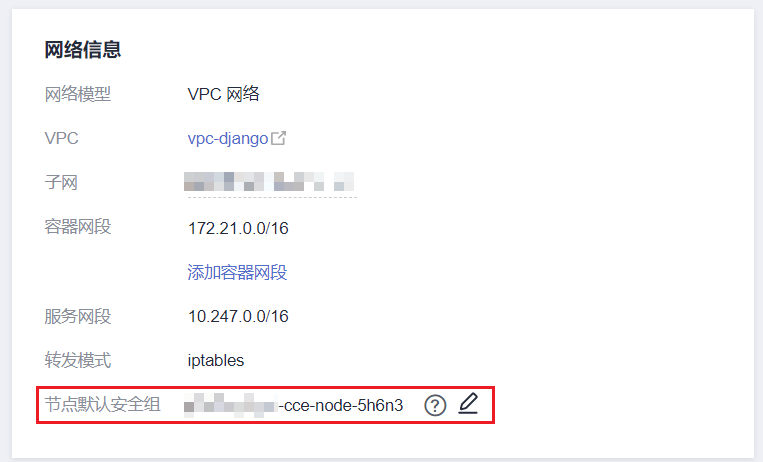
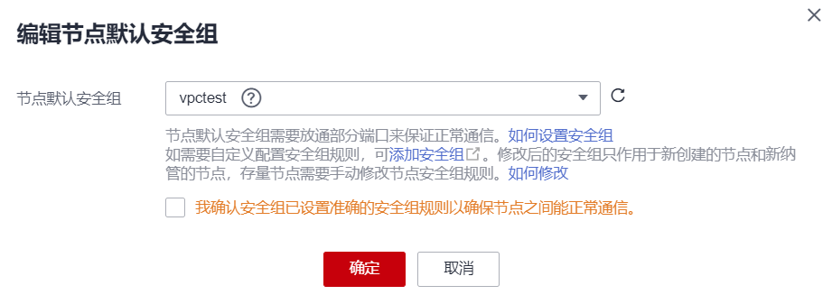

# 更改集群节点的默认安全组

## 操作场景

集群在创建时可指定自定义节点安全组，方便统一管理节点的网络安全策略。对于已创建的集群，支持修改集群默认的节点安全组。

## 约束与限制

-   一个安全组关联的实例数量建议不超过1000个，否则可能引起安全组性能下降。更多关于安全组的限制请参考[安全组限制](https://support.huaweicloud.com/usermanual-vpc/zh-cn_topic_0073379079.html#zh-cn_topic_0073379079__section1795142593815)。
-   不支持指定Master节点的安全组，同时请谨慎修改集群Master节点的安全组规则，详情请参见[集群安全组规则配置](https://support.huaweicloud.com/cce_faq/cce_faq_00265.html)。

## 操作步骤

1.  登录CCE控制台，在左侧导航栏中选择“集群管理“。
2.  单击集群名称，查看“集群信息“页面。
3.  在“网络信息“中单击“节点默认安全组“后的按钮。

    

4.  选择一个已有的安全组，并确认安全组规则满足集群要求后，单击“确定“。

    > **须知：** 
    >-   请确认选择的安全组设置了正确的端口规则，否则将无法成功创建节点。安全组需要满足的端口规则根据集群类别存在差异，详情请参见[集群安全组规则配置](https://support.huaweicloud.com/cce_faq/cce_faq_00265.html)。
    >-   新安全组只对新创建或纳管的节点生效，存量节点需要手动修改节点安全组规则，即时对存量节点进行重置，也仍会使用原安全组。如需批量修改存量节点的安全组设置，请参考[如何批量修改集群node节点安全组？](https://support.huaweicloud.com/cce_faq/cce_faq_00392.html)。

    

