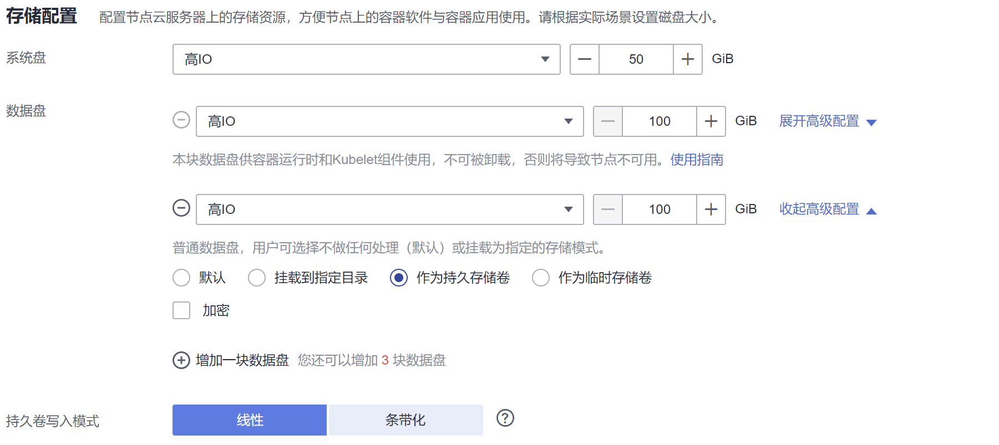
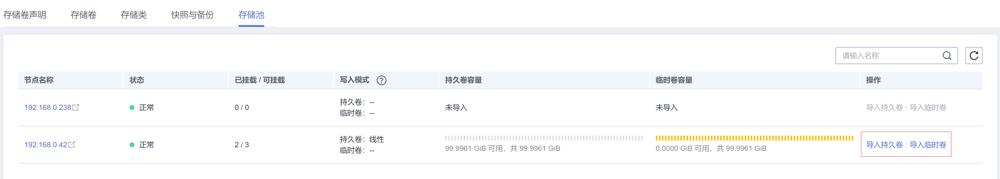
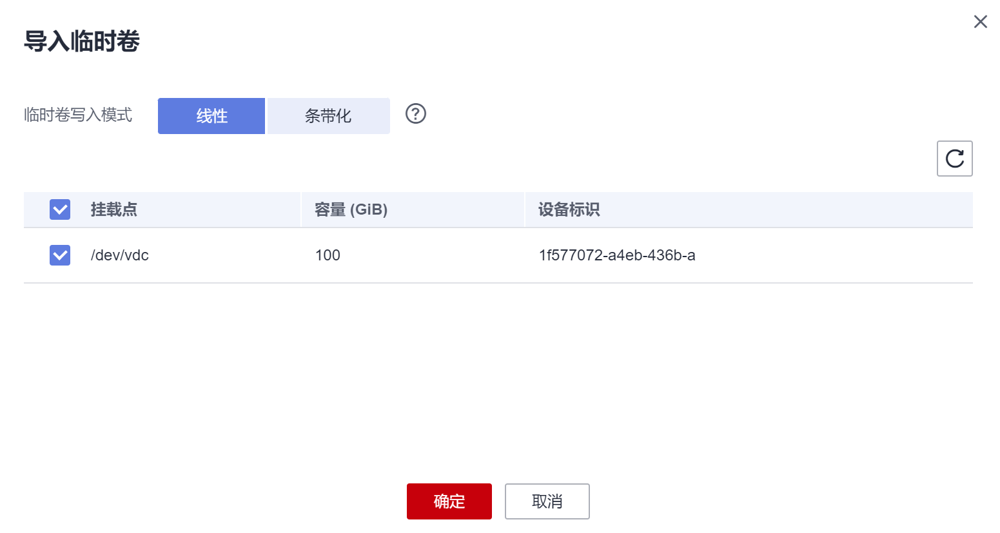

# 本地持久存储卷和临时存储卷<a name="cce_10_0391"></a>

> **说明：** 
>持久存储卷和临时存储卷仅在集群版本 \>= v1.21.2-r0 时支持创建，且临时存储卷需要Everest插件版本\>=1.2.29，持久存储卷需要Everest插件版本\>=1.2.31。

## 持久存储卷和临时存储卷<a name="section1148013494281"></a>

CCE支持将节点上数据盘设置为持久存储卷和临时存储卷。

-   持久存储卷通过LVM组成存储池（VolumeGroup），然后划分LV给容器挂载使用。使用持久存储卷作为存储介质的PV的类型可称之为Local PV。
-   临时存储卷可以作为EmptyDir的存储介质。临时存储卷通过LVM组成存储池（VolumeGroup），然后划分LV给容器挂载使用，相比原生EmptyDir默认的存储介质类型性能更好。

持久存储卷和临时存储卷支持如下两种写入模式。

-   线性：线性逻辑卷是将一个或多个物理卷整合为一个逻辑卷，实际写入数据时会先往一个基本物理卷上写入，当存储空间占满时再往另一个基本物理卷写入。
-   条带化：创建逻辑卷时指定条带化，当实际写入数据时会将连续数据分成大小相同的块，然后依次存储在多个物理卷上，实现数据的并发读写从而提高读写性能。多块卷才能选择条带化。

## 约束与限制<a name="section665211718111"></a>

-   [移除节点](移除节点.md)、[删除节点](删除节点.md)、[重置节点](重置节点.md)和[缩容节点](集群-节点弹性伸缩.md)会导致与节点关联的本地持久存储卷类型的PVC/PV数据丢失，无法恢复，且PVC/PV无法再正常使用。移除节点、删除节点、重置节点和缩容节点时使用了本地持久存储卷的Pod会从待删除、重置的节点上驱逐，并重新创建Pod，Pod会一直处于pending状态，因为Pod使用的PVC带有节点标签，由于冲突无法调度成功。节点重置完成后，Pod可能调度到重置好的节点上，此时Pod会一直处于creating状态，因为PVC对应的底层逻辑卷已经不存在了。
-   持久存储卷或临时存储卷创建后，请勿在节点上手动删除对应的存储池或卸载数据盘，否则会导致数据丢失等异常情况。
-   如果要使用临时存储卷，请确保节点上Pod不要挂载/var/lib/kubelet/pods/目录，否则可能会导致使用了临时存储卷的Pod无法正常删除。

## 添加持久存储卷或临时存储卷<a name="section677694102713"></a>

有两种方法可以添加持久存储卷或临时存储卷。

-   在[创建节点](创建节点.md)时，可以为节点添加数据盘作为持久存储卷或临时存储卷，如下所示。

    

-   如果创建节点时没有添加持久存储卷或临时存储卷，或当前存储卷容量不够，可以去ECS中为节点添加磁盘，然后在CCE的存储池中导入。

    > **说明：** 
    >-   条带化模式的存储池不支持扩容，条带化扩容后可能造成碎片空间，无法使用。
    >-   存储池不支持缩容和删除。
    >-   如果删除节点上存储池的磁盘，会导致存储池异常。

    

    导入时可以选择写入模式。

    


## 使用持久存储卷<a name="section1365547327"></a>

本地持久存储卷支持使用StorageClass动态创建PVC，StorageClass名称为csi-local-topology。csi-local-topology的行为相比csi-disk等他类型StorageClass有较大差异，使用csi-local-topology行为如下。

添加了本地持久存储卷的节点会自动加上node.kubernetes.io/local-storage-persistent的标签。如果Pod使用csi-local-topology类型的PVC，调度器会将Pod调度到拥有node.kubernetes.io/local-storage-persistent标签的节点上，也就是拥有本地持久存储卷的节点上。

-   单独创建PVC，PVC创建后，状态会一直为Pending，不会立即创建PV。等有Pod使用PVC，调度器将Pod调度到节点后，everest再创建localpv所需的逻辑卷，并返回PV，PVC完成与PV的绑定。待挂载成功后，Pod启动。
-   创建应用时选择动态创建PVC，此时动态创建PVC后，调度器将Pod调度到节点，everest再创建逻辑卷，并返回PV，PVC完成与PV的绑定。待挂载成功后，Pod启动。
-   删除应用时，可选择不删除使用的PVC。这样在下一次创建应用时可以使用使用过的PVC，这样Pod会被调度到PVC关联的节点上。

```
apiVersion: v1
kind: PersistentVolumeClaim
metadata:
  name: pvc-local-example
  namespace: default
spec:
  accessModes:
  - ReadWriteOnce               # 必须为ReadWriteOnce
  resources:
    requests:
      storage: 10Gi             # 本地持久存储卷大小
  storageClassName: csi-local-topology    # StorageClass类型为csi-local-topology
```

## 使用临时存储卷<a name="section985733292918"></a>

创建工作负载时，EmptyDir的磁盘介质选择为LocalVolume，表示使用临时存储卷。

```
apiVersion: apps/v1
kind: Deployment
metadata:
  name: nginx
  namespace: default
spec:
  replicas: 2
  selector:
    matchLabels:
      app: nginx
  template:
    metadata:
      labels:
        app: nginx
    spec:
      containers:
        - name: container-1
          image: nginx:alpine
          resources:
            requests:
              cpu: 250m
              memory: 512Mi
            limits:
              cpu: 250m
              memory: 512Mi
          volumeMounts:
            - name: vol-164284390917275733
              mountPath: /tmp
      imagePullSecrets:
        - name: default-secret
      volumes:
        - name: vol-164284390917275733
          emptyDir:
            medium: LocalVolume          # emptyDir磁盘介质选择LocalVolume，表示使用临时存储卷
            sizeLimit: 1Gi
```

## 临时存储卷异常处理说明<a name="section352331695517"></a>

用户如果手动从ECS侧卸盘、手动执行vgremove两种误操作致临时卷存储池异常。可以先将节点设置为不可调度，具体方法请参见[节点调度设置](管理节点污点（taint）.md#section15643100155)，然后通过重置节点进行恢复。

