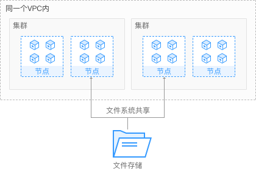

# 极速文件存储卷概述

CCE支持将极速文件存储（SFS Turbo）创建的存储卷挂载到容器的某一路径下，以满足数据持久化的需求，极速文件存储具有按需申请，快速供给，弹性扩展，方便灵活等特点，适用于DevOps、容器微服务、企业办公等应用场景。

**图 1**  CCE挂载极速文件存储卷  

## 使用说明

-   **符合标准文件协议：**用户可以将文件系统挂载给服务器，像使用本地文件目录一样。
-   **数据共享：**多台服务器可挂载相同的文件系统，数据可以共享操作和访问。
-   **私有网络：**数据访问必须在数据中心内部网络中。
-   **安全隔离：**直接使用云上现有IAAS服务构建独享的云文件存储，为租户提供数据隔离保护和IOPS性能保障。
-   **应用场景：**适用于多读多写（ReadWriteMany）场景下的各种工作负载（Deployment/StatefulSet）、守护进程集（DaemonSet）和普通任务（Job）使用，主要面向高性能网站、日志存储、DevOps、企业办公等场景。

