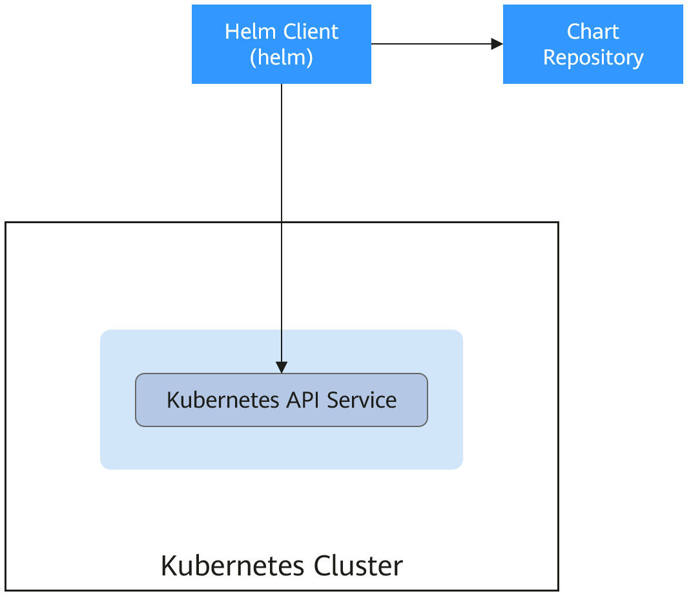

# 概述

CCE提供了管理Helm Chart（模板）的控制台，能够帮助您方便的使用模板部署应用，并在控制台上管理应用。CCE使用的Helm版本为v3.8.2，支持上传Helm v3语法的模板包，具体请参见[通过模板部署应用](通过模板部署应用.md)。

您也可以直接使用Helm客户端直接部署应用，使用Helm客户端部署应用不受版本控制，可以使用Helm v2或v3，具体请参见[通过Helm v2客户端部署应用](通过Helm-v2客户端部署应用.md)及[通过Helm v3客户端部署应用](通过Helm-v3客户端部署应用.md)。

## Helm

[Helm](https://helm.sh/)是Kubernetes的包管理器，主要用来管理Charts。Helm Chart是用来封装Kubernetes原生应用程序的一系列YAML文件。可以在您部署应用的时候自定义应用程序的一些Metadata，以便于应用程序的分发。对于应用发布者而言，可以通过Helm打包应用、管理应用依赖关系、管理应用版本并发布应用到软件仓库。对于使用者而言，使用Helm后不用需要编写复杂的应用部署文件，可以以简单的方式在Kubernetes上查找、安装、升级、回滚、卸载应用程序。

Helm和Kubernetes之间的关系可以如下类比：

-   Helm <–\> Kubernetes
-   Apt <–\> Ubuntu
-   Yum <–\> CentOS
-   Pip <–\> Python

Helm的整体架构如下图：

Kubernetes的应用编排存在着一些问题，Helm可以用来解决这些问题，如下：

-   管理、编辑与更新大量的Kubernetes配置文件。
-   部署一个含有大量配置文件的复杂Kubernetes应用。
-   分享和复用Kubernetes配置和应用。
-   参数化配置模板支持多个环境。
-   管理应用的发布：回滚、diff和查看发布历史。
-   控制一个部署周期中的某一些环节。
-   发布后的测试验证。

