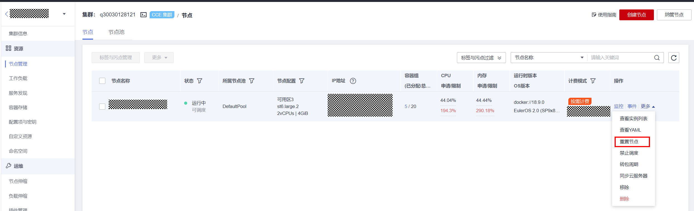

# 残留待迁移节点检查

## 检查项内容

检查节点是否需要迁移。

## 解决方案

由1.13滚动升级而来的1.15集群，需要将所有节点迁移（重置或新建替换）后，才允许再次进行升级。

**解决方案一**

请登录CCE控制台，单击集群名称进入集群控制台，前往“集群信息-\>资源-\>节点管理”，单击对应节点的“更多-\>重置节点”，详情请参见[重置节点](重置节点.md)。节点重置完毕后，重试检查任务。

> **说明：** 
>重置节点会重置所有节点标签，可能影响工作负载调度，请在重置节点前检查并保留您手动为该节点打上的标签。

**解决方案二**

新建节点后，删除问题节点。

