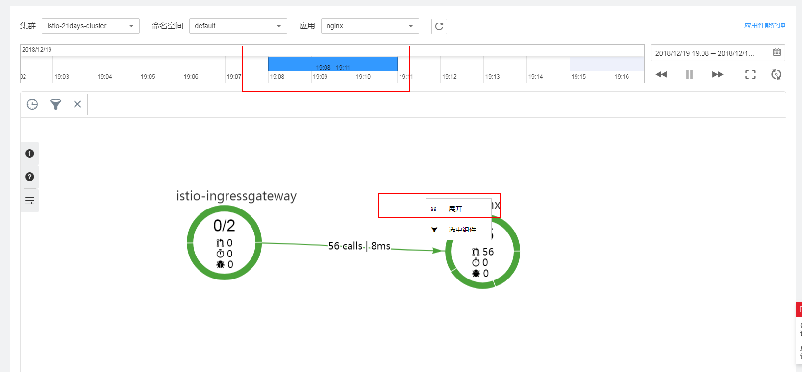
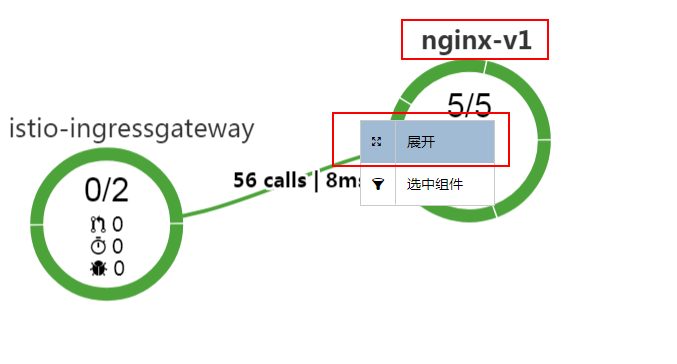
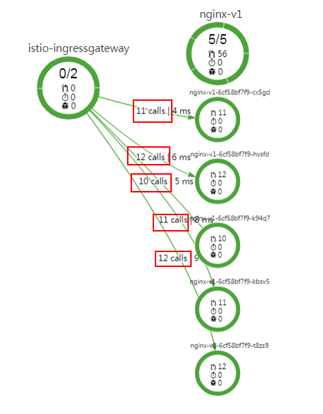
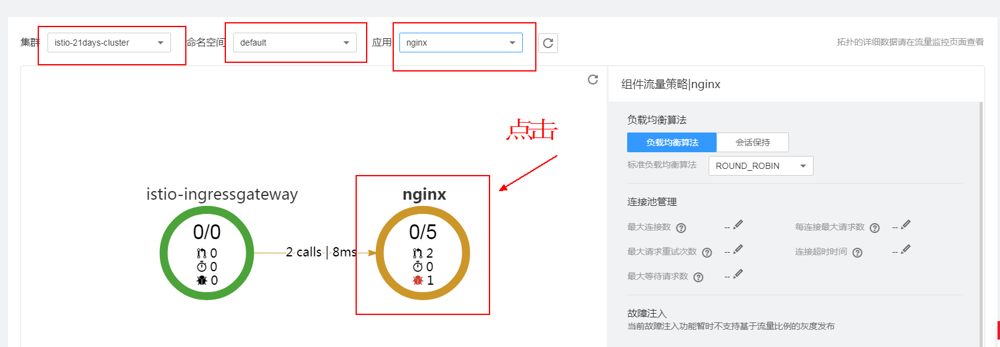
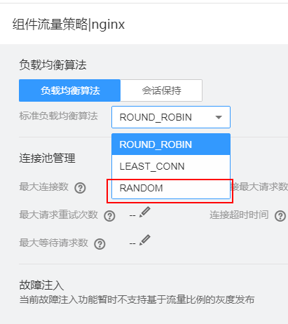
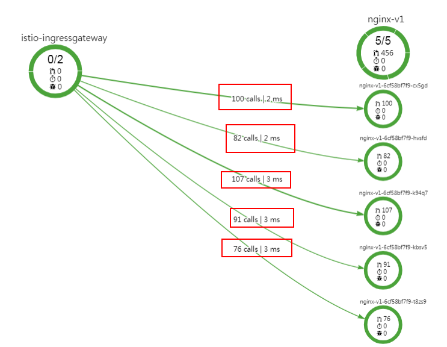

# 流量治理

通过修改负载均衡方式，进行故障注入测试及配置基本连接池管理。

## 配置流量策略

1.  在CCE左侧导航栏中选择“应用治理“，打开[应用服务网格控制台](https://console.huaweicloud.com/istio/)，单击左侧导航栏中的“流量治理“。
2.  选择组件所在的集群、命名空间和应用。
3.  在拓扑图中，单击组件名称下的圆形图标。在负载均衡算法中，进行流量策略配置。

    **表 1**  负载均衡算法

    
    <table><thead align="left"><tr id="row17470155511523"><th class="cellrowborder" valign="top" width="30.37%" id="mcps1.2.3.1.1">
参数

    </th>
    <th class="cellrowborder" valign="top" width="69.63000000000001%" id="mcps1.2.3.1.2">
参数说明

    </th>
    </tr>
    </thead>
    <tbody><tr id="row947045514524"><td class="cellrowborder" valign="top" width="30.37%" headers="mcps1.2.3.1.1 ">
负载均衡算法

    </td>
    <td class="cellrowborder" valign="top" width="69.63000000000001%" headers="mcps1.2.3.1.2 "><ul id="ul7632346152617"><li>ROUND_ROBIN：轮询，默认负载均衡算法。</li><li>LEAST_CONN：随机选取两个健康的主机，再从所选取的两个主机中选择一个链接数较少的主机。</li><li>RANDOM：从所有健康的主机中，随机选取一个。</li></ul>
    </td>
    </tr>
    <tr id="row947065511523"><td class="cellrowborder" valign="top" width="30.37%" headers="mcps1.2.3.1.1 ">
会话保持

    </td>
    <td class="cellrowborder" valign="top" width="69.63000000000001%" headers="mcps1.2.3.1.2 ">
<strong id="b56869532308">根据HTTP header中的内容获取哈希：</strong>

    <ul id="ul0282446112815"><li>选择Cookie：将以HTTP请求中的所有Cookie计算哈希，哈希相同的请求将会转发至同一个实例进行处理。</li><li>选择User-Agent：将以HTTP请求中的User_agent来计算哈希，UA哈希值相同的请求将会转发至同一个实例进行处理。</li><li>流量治理也支持用户使用自定义Key来计算哈希，只需选择自定义模式并且输入键的名称。</li></ul>
    
<strong id="b61741572308">根据Cookie中的内容获取哈希：</strong>

    
支持用户输入Cookie键的名称，转发方式则由设定的Cookie键对应的值来计算哈希，哈希相同的请求则会转发至同一个实例中。例如我们设定Cookie中的User为键，则通过计算User对应的值的哈希来确认转发规则。

    </td>
    </tr>
    </tbody>
    </table>

4.  连接池管理。

    **表 2**  连接池管理

    
    <table><thead align="left"><tr id="row972151919478"><th class="cellrowborder" valign="top" width="30.72%" id="mcps1.2.3.1.1">
参数

    </th>
    <th class="cellrowborder" valign="top" width="69.28%" id="mcps1.2.3.1.2">
参数说明

    </th>
    </tr>
    </thead>
    <tbody><tr id="row17219199475"><td class="cellrowborder" valign="top" width="30.72%" headers="mcps1.2.3.1.1 ">
最大连接数

    </td>
    <td class="cellrowborder" valign="top" width="69.28%" headers="mcps1.2.3.1.2 ">
到目标主机HTTP1或TCP连接的最大数量。

    </td>
    </tr>
    <tr id="row57211219194719"><td class="cellrowborder" valign="top" width="30.72%" headers="mcps1.2.3.1.1 ">
每连接最大请求数

    </td>
    <td class="cellrowborder" valign="top" width="69.28%" headers="mcps1.2.3.1.2 ">
对后端连接中最大的请求数量若设为1则会禁止keep alive特性。

    </td>
    </tr>
    <tr id="row872151912478"><td class="cellrowborder" valign="top" width="30.72%" headers="mcps1.2.3.1.1 ">
最大请求重试次数

    </td>
    <td class="cellrowborder" valign="top" width="69.28%" headers="mcps1.2.3.1.2 ">
在指定时间内对目标主机最大重试次数。

    </td>
    </tr>
    <tr id="row0722101914718"><td class="cellrowborder" valign="top" width="30.72%" headers="mcps1.2.3.1.1 ">
连接超时时间

    </td>
    <td class="cellrowborder" valign="top" width="69.28%" headers="mcps1.2.3.1.2 ">
TCP连接超时时间。

    </td>
    </tr>
    <tr id="row127221819134716"><td class="cellrowborder" valign="top" width="30.72%" headers="mcps1.2.3.1.1 ">
最大等待请求数

    </td>
    <td class="cellrowborder" valign="top" width="69.28%" headers="mcps1.2.3.1.2 ">
等待列队的长度，默认为1024。

    </td>
    </tr>
    </tbody>
    </table>

5.  熔断配置。在流量策略中选择进行熔断策略配置

    **表 3**  熔断策略配置

    
    <table><thead align="left"><tr id="row123031916134819"><th class="cellrowborder" valign="top" width="30.72%" id="mcps1.2.3.1.1">
参数

    </th>
    <th class="cellrowborder" valign="top" width="69.28%" id="mcps1.2.3.1.2">
参数说明

    </th>
    </tr>
    </thead>
    <tbody><tr id="row634120465212"><td class="cellrowborder" valign="top" width="30.72%" headers="mcps1.2.3.1.1 ">
连续错误响应个数

    </td>
    <td class="cellrowborder" valign="top" width="69.28%" headers="mcps1.2.3.1.2 ">
再一个检查周期内，连续出现500及以上错误的个数，例502、503状态码。

    </td>
    </tr>
    <tr id="row930313161489"><td class="cellrowborder" valign="top" width="30.72%" headers="mcps1.2.3.1.1 ">
检查周期

    </td>
    <td class="cellrowborder" valign="top" width="69.28%" headers="mcps1.2.3.1.2 ">
将会对检查周期内的响应码进行筛选。

    </td>
    </tr>
    <tr id="row430301617485"><td class="cellrowborder" valign="top" width="30.72%" headers="mcps1.2.3.1.1 ">
隔离实例比例

    </td>
    <td class="cellrowborder" valign="top" width="69.28%" headers="mcps1.2.3.1.2 ">
上游实例中，允许被隔离的最大比例。采用向上取整，若10个实例，设为13%则最多会隔离2个实例

    </td>
    </tr>
    <tr id="row3303191674817"><td class="cellrowborder" valign="top" width="30.72%" headers="mcps1.2.3.1.1 ">
最短隔离时间

    </td>
    <td class="cellrowborder" valign="top" width="69.28%" headers="mcps1.2.3.1.2 ">
实例第一次被隔离的时间，之后每次隔离时间为隔离次数与最短隔离时间的乘积

    </td>
    </tr>
    </tbody>
    </table>

6.  故障注入。在故障类型中选择时延故障或中断故障。

    当前版本仅支持基于请求内容策略。

    **表 4**  时延故障

    
    <table><thead align="left"><tr id="row598425120134"><th class="cellrowborder" valign="top" width="30.930000000000003%" id="mcps1.2.3.1.1">
参数

    </th>
    <th class="cellrowborder" valign="top" width="69.07%" id="mcps1.2.3.1.2">
参数说明

    </th>
    </tr>
    </thead>
    <tbody><tr id="row998405120139"><td class="cellrowborder" valign="top" width="30.930000000000003%" headers="mcps1.2.3.1.1 ">
故障版本

    </td>
    <td class="cellrowborder" valign="top" width="69.07%" headers="mcps1.2.3.1.2 ">
故障所作用的版本。

    </td>
    </tr>
    <tr id="row0984115119131"><td class="cellrowborder" valign="top" width="30.930000000000003%" headers="mcps1.2.3.1.1 ">
故障类型

    </td>
    <td class="cellrowborder" valign="top" width="69.07%" headers="mcps1.2.3.1.2 ">
时延故障对通往组件的请求有延迟。

    </td>
    </tr>
    <tr id="row19984115115137"><td class="cellrowborder" valign="top" width="30.930000000000003%" headers="mcps1.2.3.1.1 ">
故障百分比

    </td>
    <td class="cellrowborder" valign="top" width="69.07%" headers="mcps1.2.3.1.2 ">
故障按比例发生。

    </td>
    </tr>
    <tr id="row1498435141310"><td class="cellrowborder" valign="top" width="30.930000000000003%" headers="mcps1.2.3.1.1 ">
延时

    </td>
    <td class="cellrowborder" valign="top" width="69.07%" headers="mcps1.2.3.1.2 ">
设定的时间延迟单位。

    </td>
    </tr>
    </tbody>
    </table>

    **表 5**  中断故障

    
    <table><thead align="left"><tr id="row1075165216497"><th class="cellrowborder" valign="top" width="30.42%" id="mcps1.2.3.1.1">
参数

    </th>
    <th class="cellrowborder" valign="top" width="69.58%" id="mcps1.2.3.1.2">
参数说明

    </th>
    </tr>
    </thead>
    <tbody><tr id="row147845294920"><td class="cellrowborder" valign="top" width="30.42%" headers="mcps1.2.3.1.1 ">
故障版本

    </td>
    <td class="cellrowborder" valign="top" width="69.58%" headers="mcps1.2.3.1.2 ">
故障所作用的版本。

    </td>
    </tr>
    <tr id="row181952124915"><td class="cellrowborder" valign="top" width="30.42%" headers="mcps1.2.3.1.1 ">
故障类型

    </td>
    <td class="cellrowborder" valign="top" width="69.58%" headers="mcps1.2.3.1.2 ">
中断故障会中断该组件的服务并返回预设状态码。

    </td>
    </tr>
    <tr id="row08819526492"><td class="cellrowborder" valign="top" width="30.42%" headers="mcps1.2.3.1.1 ">
故障百分比

    </td>
    <td class="cellrowborder" valign="top" width="69.58%" headers="mcps1.2.3.1.2 ">
故障按比例发生。

    </td>
    </tr>
    <tr id="row39095224919"><td class="cellrowborder" valign="top" width="30.42%" headers="mcps1.2.3.1.1 ">
Http状态码

    </td>
    <td class="cellrowborder" valign="top" width="69.58%" headers="mcps1.2.3.1.2 ">
终止故障时返回的http状态码，默认返回500。

    </td>
    </tr>
    </tbody>
    </table>

7.  （可选）取消故障注入。

    如若不需要继续触发故障，可单击故障类型中的“不启用”来删除已配置的故障。

## 查看流量监控

轮询算法为默认负载均衡算法。即当组件有多个实例时，访问基本接近于平均分配给每一个实例。组件流量策略设置完成后，通过连续不中断的访问应用，产生访问数据。

1.  在应用服务网格控制台，单击左侧导航栏中的“流量监控“。
2.  在右侧时间轴区域选择对应的时间范围，在所需要查看的组件区域右键单击“展开“，将其展开为版本。

    **图 1**  选择时间轴并展开组件  
    

3.  右键单击展开的版本，选择“展开“，将其展开为实例。

    > **说明：**   
    >Report模式下，不提供实例展开功能。  

    **图 2**  展开组件为版本  
    

4.  在拓扑图区域，可以看到各个流量分发到各个实例的情况。

    **图 3**  轮询算法请求分发  
    

## 更改流量策略算法

流量策略设置完成后，支持更改流量策略算法。如将标准负载均衡的算法轮询转为随机（RANDOM）。

1.  在应用服务网格控制台，单击左侧导航栏中的“流量治理“。
2.  在“流量治理“界面中选择并单击目标组件。

    **图 4**  流量治理选择  
    

3.  在“标准负载均衡算法”中选择“RANDOM“算法，单击“保存“。

    **图 5**  负载均衡算法选择随机  
    

4.  重复先前的操作，在流量监控里观察请求分发情况。

    可以发现流量分发没有什么固定规律，各个实例差距也比较大，说明随机算法已经生效。

    **图 6**  随机算法结果  
    

