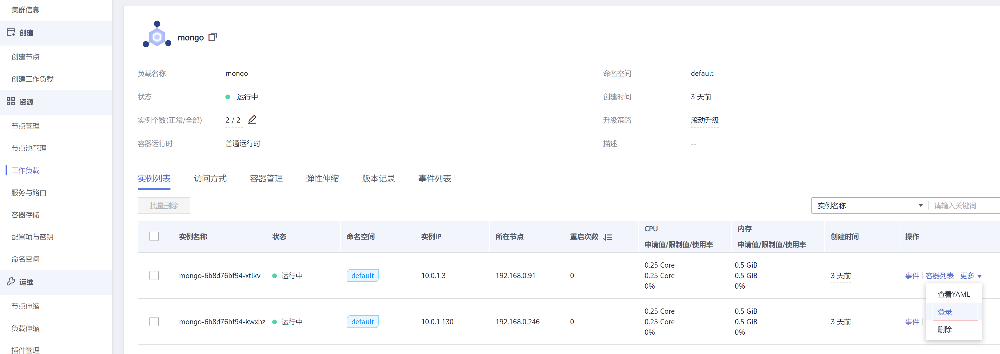
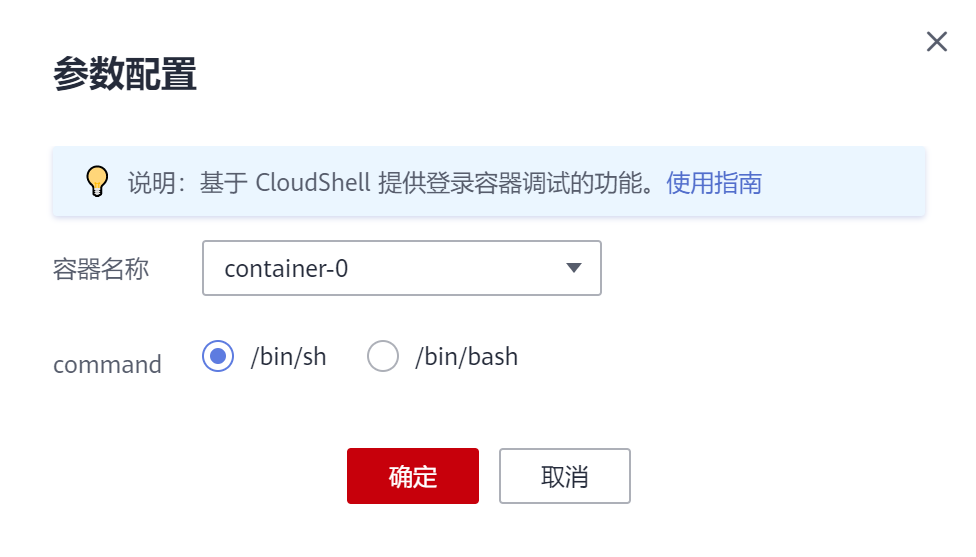
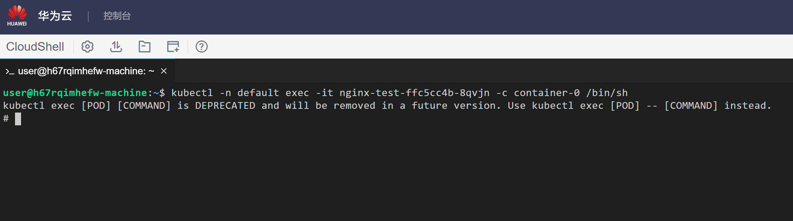

# 登录容器

## 操作场景

登录容器的功能会启动一个CloudShell，并初始化启动kubectl，然后会自动执行kubectl exec命令登录到容器中。

## 约束与限制

-   CloudShell基于VPCEP实现，在CloudShell中使用kubectl访问集群需要在集群控制节点的安全组（安全组名称：集群名称-cce-control-随机数）中放通如下网段访问5443端口。5443端口默认对所有网段放通，如果您对安全组做过加固，当出现在CloudShell中无法访问集群时，请检查5443端口是否放通了198.19.128.0/17网段。
-   当前仅北京一、北京四、上海一、上海二、广州和乌兰察布一支持使用CloudShell登录容器。

## 登录容器

您可以在工作负载的实例列表处找到登录入口，如下所示。

**图 1**  登录容器  

单击登录后，会弹出如下窗口。请选择要登录的容器以及命令，然后单击“确定“。

跳转到CloudShell，如下图所示。在这里可以看到登录容器就是启动了一个CloudShell，并初始化启动kubectl，然后自动执行了kubectl exec命令登录到容器。

> **说明：** 
>请等待kubectl exec 命令自动执行后再操作，此命令出现需要一段时间 5-10秒。

## 退出\(关闭\)容器

退出时建议单击右上角关闭按钮，否则下次登录时依然是上次关闭的cloudshell界面。

**图 2**  退出容器  

